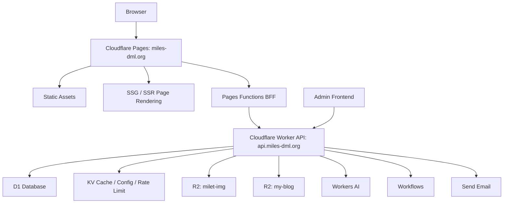

# Echoes of milet 网站功能文档

最后更新：2026-05-25

## 1. 项目概要

Echoes of milet 是围绕 milet 内容整理、展示和互动体验构建的网站系统。系统基于 Cloudflare 平台运行，主要使用 Cloudflare Pages、Pages Functions、Workers、D1、R2、KV、Workers AI、Workflows、Email Routing/Send Email 等能力。

系统分为三部分：

- 公开端：面向访问用户的数据展示、内容浏览、互动小游戏和 SEO 页面。
- 管理端：面向管理员的数据录入、内容维护、资源上传、缓存清理和系统配置。
- 服务端：Cloudflare Worker API，负责路由、鉴权、来源校验、业务 API、缓存、数据库、文件上传、静态资源代理、异步任务和自动备份。

数据库结构单独维护在《echoes of milet数据库.md》中，本文只记录业务功能、模块边界和系统流程。

## 2. 项目仓库与职责

当前系统由三个主要工程组成：

| 工程 | 路径 | 主要职责 |
| --- | --- | --- |
| 公开端 | `D:\CODE\front\tailwindCSS\echoes of milet` | Vue 公开站点、SSR/SSG/CSR、Pages Functions BFF、SEO、公开页面交互 |
| 管理端 | `D:\CODE\front\tailwindCSS\data-admin` | Vue 管理后台、数据维护、资源上传、富文本编辑、系统配置 |
| 服务端 | `D:\CODE\node\worker\milet-worker-ts` | Worker API、D1/R2/KV/AI/Workflows、权限、安全、缓存、静态资源 |

## 3. 总体架构



公开端优先由 Pages 提供静态资源和页面渲染。公开端浏览器的 `/api/*` 请求不直接访问 Worker，而是先进入 Pages Functions BFF。BFF 只允许转发配置中声明过的 API 路径，并注入 `X-Milet-Source-Token` 之类的来源校验 header。Worker 再执行 CORS、来源校验、管理员鉴权、模块权限和业务处理。

## 4. 公开端

### 4.1 技术栈与渲染模式

公开端使用 Vue 3、Vue Router、Vite、Tailwind CSS。当前采用混合渲染：

| 路由 | 渲染模式 | 说明 |
| --- | --- | --- |
| `/:lang` | SSG | 首页，语言前缀为 `zh` / `ja` |
| `/:lang/milet` | SSR | milet 综合信息页，首屏数据服务端注入 |
| `/:lang/milet/about` | SSG | 关于本站与反馈页面 |
| `/:lang/milet/anniversary` | SSR | 周年入口和归档，依赖当前月份和最新发布数据 |
| `/:lang/milet/pilgrimage` | SSR | 圣地巡礼地图入口，首屏需要 SEO 与地区概要 |
| 其他功能页 | CSR | 相册、时间线、新闻、发布物、互动游戏等 |

渲染入口由 Pages Function 接管。处理顺序为：

1. 静态资源请求直接交给 Pages Assets。
2. `/` 按 Cookie 或 `Accept-Language` 重定向到 `/zh` 或 `/ja`。
3. 短链接和旧无语言前缀路径重定向到标准语言路径。
4. `/api/*` 和 `/other/*` 进入 BFF 白名单转发。
5. SSG 路由优先读取预构建 HTML。
6. 其他页面动态导入 `dist/server/entry-server.js` 进行 SSR。

### 4.2 语言与 URL

公开端 URL 固定使用语言前缀：

- 中文：`/zh/...`
- 日文：`/ja/...`

站内语言选择会影响菜单、文案、SEO 和业务数据展示。旧路径会根据用户语言偏好重定向到带语言前缀的新路径。短链接由 `shortLinks` 配置统一转发，避免散落在页面逻辑中。

### 4.3 页面布局

桌面端基础布局：

- 顶部 Header：站点标题、语言切换。
- 左侧菜单：公开端模块导航。
- 中间主内容：页面业务内容。
- 右侧留白/装饰区：背景视觉与人物图。

移动端布局：

- 顶部标题居中。
- 右侧汉堡菜单打开导航。
- 语言切换移动到展开菜单中。
- 宽页面模块可设置 `widePage`，例如圣地巡礼地图。

### 4.4 首页 `/:lang`

首页是公开站点入口，主要承担导航和站点主题展示：

- 站点品牌与入口。
- milet 内容入口。
- 公开模块的聚合导航。
- SEO 标题、描述、Open Graph 信息。

首页为 SSG，优先保证加载速度和搜索收录稳定性。

### 4.5 MILET 综合页 `/:lang/milet`

MILET 页面是公开端核心介绍页，当前使用 SSR。页面内容包括：

- Hero 区和 milet 简要介绍。
- Why milet 文案区。
- 官方 SNS / 官方站点链接。
- 精选时间线预览。
- Highlight 推荐内容。
- 精选 Gallery。
- Echo Room / CTA 等首页重构后的模块。

SSR 阶段会请求首页数据并注入 initial state，客户端 hydrate 后避免首屏重复请求。

### 4.6 Timeline `/:lang/milet/timeline`

时间线展示 milet 相关事件，支持：

- 分页获取时间线数据。
- 按时间排序展示事件卡片。
- 多语言标题和正文。
- 事件链接跳转，区分站内链接和外部链接。
- 滚动监听当前画面中心 item。

管理端维护时间线基础事件和多语言内容，公开端读取公开 API。

### 4.7 Release `/:lang/milet/release`

发布物页面展示专辑、EP、单曲、BD/Live 等音乐发布信息。功能包括：

- 按发行类型分类展示。
- 一个 Release 下包含多个 Edition。
- 一个 Edition 下包含多张 Disc。
- Disc 内展示收录 Track。
- 点击歌曲打开详情弹窗。
- 歌曲详情弹窗展示歌词、歌曲元信息和试听链接。
- 试听链接支持多平台来源，后台可解析、校验和维护。

音乐模型区分 `work`、`track`、`release`、`edition`、`disc`、`disc track`、`lyric`，数据库细节见数据库文档。

### 4.8 Gallery `/:lang/milet/galleryList`

相册页面展示公开图片系列，功能包括：

- 置顶相册和普通相册。
- 第一个置顶入口可作为全部照片入口。
- 相册卡片展示标题、描述、封面、照片数量。
- 相册详情页 `/:lang/milet/galleryDetail/:galleryId` 展示图片列表。
- 图片列表使用懒加载和无限滚动。
- 图片大图查看使用 `@fancyapps/ui`。
- 相册支持公开/非公开区分，非公开相册可被巡礼地点等内部业务复用。

图片文件存储在 R2，元信息存储在 D1。公开端通过 `/static/milet/img/*` 访问。

### 4.9 News `/:lang/milet/news`

新闻收藏页面展示管理端录入并标记公开的新闻链接：

- 分页获取新闻。
- 按 topic 主题分类。
- 展示标题、摘要、封面、来源站点、发布时间。
- 只展示 `is_public = 1` 且未软删除的数据。

后台支持通过新闻 URL 解析标题、摘要、封面和发布时间，也允许人工修正。

### 4.10 Anniversary `/:lang/milet/anniversary`

周年模块用于按年份生成和展示 milet 出道周年庆祝页面。

入口规则：

- 周年月份时，菜单可直接指向最新年份记录。
- 非周年月份时，进入 Anniversary Archive，用户选择有记录的年份。
- 显式年份路径：`/:lang/milet/anniversary/:year`。

页面内容结构：

- Greeting：周年祝福和页面引导。
- Year Notes：本年度重要活动或时间线。
- Songs：本年度发布作品。
- Photos：精选 12 张 milet の日 照片。
- Archive：可用年份列表。

数据由管理端选择素材后调用 Workers AI 生成 draft，再经人工编辑后发布到 KV。公开端接口：

- `GET /api/milet/anniversary`
- `GET /api/milet/anniversary/:year`

### 4.11 Interactive / Song Guess

互动模块当前落地了猜歌小游戏：

- 入口：`/:lang/milet/interactive/song-guess`
- 游戏页：`/:lang/milet/interactive/song-guess/play/:challengeId`
- 结果页：`/:lang/milet/interactive/song-guess/result/:challengeId`

功能包括：

- 获取游戏配置。
- 创建 challenge。
- 获取题目和音频片段。
- 提交答案。
- 计算并展示结果。
- 管理端维护题库、题目、音频资源和题库生成。

音频文件通过通用资源文件表和 R2 文件体系管理。

### 4.12 Pilgrimage `/:lang/milet/pilgrimage`

圣地巡礼模块用于地图化展示地点和路线。当前使用 Leaflet + Stadia/OpenMapTiles 兼容瓦片服务。

公开端能力：

- 按城市和区划组织地点。
- 加载地区树、区划点位、地点详情。
- 地图 marker 展示地点。
- 支持 marker 个性化皮肤。
- 支持封面气泡、拥挤避让和高 zoom 展示策略。
- 支持底部装饰贴图。
- 支持路线选择、polyline 绘制和路线人物动画。
- 点击地点后显示详情面板，包含照片、描述、地址、标签、外部链接和导航入口。
- 地点照片复用现有相册体系，一个 spot 关联一个 `img_series`。
- 公开端接口返回中文/日文双语整体结构，前端按当前语言选择并做缺失回退。

公开接口：

- `GET /api/milet/pilgrimage/region-tree`
- `GET /api/milet/pilgrimage/districts/:districtId/spots`
- `GET /api/milet/pilgrimage/spots/:spotId`

缓存 key：

- `pilgrimage:region-tree`
- `pilgrimage:spots:{district_id}`
- `pilgrimage:spot:{spot_id}`

### 4.13 About `/:lang/milet/about`

关于本站页面为 SSG，包含：

- 站点介绍。
- 内容反馈表单。
- 版权和固定说明。

反馈表单安全措施：

- Cloudflare Turnstile。
- Honeypot 字段。
- 邮箱、标题、正文长度和格式校验。
- 简单机械内容/垃圾内容评分。
- 可疑内容标记。
- 非垃圾反馈通过 Cloudflare Email 发送通知。
- 后台可查看反馈列表和详情。

### 4.14 静态资源与 SEO

公开端维护：

- `robots.txt`
- `sitemap.xml`
- favicon
- Open Graph 图片
- 百度验证文件

Pages Function 对百度验证路径做特殊响应。静态资源请求优先级最高，避免 SSR 接管导致 CSS、JS、图片偶发加载失败。

## 5. 管理端

### 5.1 技术栈

管理端使用 Vue 3、Vue Router、Pinia、Tailwind CSS、shadcn-vue 风格组件、lucide 图标、Tiptap 富文本编辑器。UI 组件主要在 `src/components/ui` 下按 shadcn-vue 方式生成和维护。

管理端路由按模块拆分：

- `auth`：登录。
- `content`：内容管理。
- `system`：资源与系统配置。

后台统一使用 `AppShell` 布局、`PageHeader`、Toast、确认弹窗、帮助文档按钮和模块权限。

### 5.2 登录与会话

登录页路径：`/login`。

服务端返回：

```json
{
  "token": "access token",
  "expiresInSec": 0,
  "refreshToken": "refresh token",
  "refreshExpiresInSec": 0
}
```

管理端保存 token，并在 access token 失效后使用 refresh token 自动续期。服务端对登录和 refresh 做 IP 级限流。登录失败超过阈值会进入临时锁定。

### 5.3 模块权限

管理员用户和模块授权来自 `ADMIN_USERS_JSON` secret，未配置时回退读取 KV 的 `ADMIN_USERS`。access token 不直接保存模块列表，而是保存 `username` 和 `permissionHash`。每次受保护请求服务端重新读取用户配置并校验权限 hash。

支持模块 key：

- `card`
- `timeline`
- `music`
- `articles`
- `news`
- `anniversary`
- `pilgrimage`
- `gallery`
- `image-upload`
- `special`
- `system-config`
- `*`

共享图片选择 API 可被 `gallery`、`articles`、`card`、`music`、`pilgrimage` 使用。图片上传需要额外的 `image-upload` 权限。

### 5.4 Dashboard `/dashboard`

登录后的默认工作台，展示常用管理入口和模块导航。所有未知路由重定向到 Dashboard。

### 5.5 Card 内容 `/card`

用于维护首页和公开端卡片类内容：

- 多语言标题、正文和结构化 JSON。
- 封面/图片资源选择。
- Home 数据模块帮助说明。
- 保存后由公开端首页和 MILET 页面消费。

### 5.6 Timeline `/timeline`

用于维护时间线数据：

- 事件基础信息。
- 日期和事件类型。
- 中文/日文标题与正文。
- 可选跳转链接。
- 新增和修改。
- 缓存清理。

### 5.7 发布物 `/music`

发布物管理分为歌曲管理和发行物管理。

歌曲管理：

- `music_work`：歌曲作品层，维护标题、演唱者、作词、作曲、编曲、是否歌曲。
- `music_track`：录音版本层，维护录音室版、Live、Remix、Acoustic 等版本。
- `music_lyric`：歌词，可绑定 work，也可绑定具体 track 覆盖。
- 试听链接：维护 track 的 Spotify、Apple Music、页面解析来源等多平台试听链接。

发行物管理：

- `music_release`：发行物基础信息。
- `music_release_edition`：初回、通常、限定等形态。
- `music_edition_disc`：CD、DVD、BD、Streaming 等碟片。
- `music_disc_track`：碟片内曲目和展示名。
- 缓存重置。

### 5.8 文章管理 `/articles`

文章管理基于 Tiptap 3.22.5，当前公开端文章列表和详情页尚未完全接入，但管理端、API、数据库和 R2 发布产物已经预留。

功能：

- 文章列表：类型、状态、关键字筛选。
- 状态：draft、published、archived。
- 类型：note、blog、public_article。
- 默认语言：zh / ja。
- 可按需启用多语言。
- 封面图选择。
- 标题、摘要、正文编辑。
- 保存草稿。
- 保存并发布。
- 预览、归档、删除。

正文存储：

- D1 保存 Tiptap JSON 主数据。
- 发布时 Worker 生成 HTML 并写入 BLOG_BUCKET。
- 管理端预览优先读取 R2 HTML，缺失时由 JSON 临时渲染。

富文本能力：

- 标题、段落、加粗、斜体、删除线。
- 有序/无序/任务列表。
- 引用、分割线。
- 链接、行内代码、代码块。
- 表格。
- 图文混排组件。
- 双栏内容组件。

### 5.9 新闻链接 `/news`

用于收藏并维护新闻外链：

- 输入 URL 后服务端解析标题、摘要、发布时间、封面图、来源 host。
- 支持语言。
- 支持 topic 主题。
- 支持公开/不公开。
- 支持软删除。
- 公开端只展示公开且未删除的新闻。

### 5.10 Anniversary `/anniversary`

周年管理包括完整的素材选择、AI 生成、人工编辑和发布流程：

1. 年份配置：年份、出道日期、周年序号、月份、标题、生成上下文。
2. 素材选择：从 timeline、release、photo 中选择年度素材。
3. 生成 Draft：选择 Workers AI 模型并启动异步任务。
4. 编辑 Draft：按语言和内容类型编辑 JSON。
5. 发布年份：组装最终 payload 写入 KV，清理周年缓存。

生成任务通过 Workflow 或后台任务方式执行，管理端轮询 job 状态。

### 5.11 圣地巡礼 `/pilgrimage`

圣地巡礼管理负责地区、地点、路线、marker 和缓存：

- 地区管理：城市、区划、中心点、默认 zoom、排序、状态、多语言名称。
- 地点管理：所属城市/区划、经纬度、坐标体系、导航坐标、地图来源、外部链接、相册、marker skin、状态、多语言标题/描述/地址/标签。
- 路线管理：区划下多条路线、路线颜色、多语言标题和说明、路线内 spot 顺序。
- Marker 管理：维护 marker skin 注册表，包括 id、label、图片 URL、显示尺寸、锚点、状态和排序。
- 地图链接解析：解析 Google Maps、高德、OSM 或纯经纬度文本。
- 批量导入：管理端粘贴 TSV，预览校验后导入 regions、spots、routes。
- 缓存清理：删除全部巡礼缓存或相关缓存。

首次批量录入建议使用 TSV 分段：

- `[regions]`
- `[spots]`
- `[routes]`

单条维护用于后续精修坐标、补充相册和发布状态。

### 5.12 图片资源 `/gallery`

图片资源管理负责图片、相册和图片选择流程：

- 图片系列/相册列表。
- 相册标题、描述、多语言信息。
- 相册类型和公开状态。
- 设置封面图。
- 相册内图片排序。
- 从图库选择图片。
- 批量上传图片。
- 管理端图片选择器支持按存储位置和图片类型筛选。

图片上传流程：

1. 前端计算图片基本信息、宽高和内容 hash。
2. 调用 `/admin/images/init` 获取上传计划和 R2 预签名 URL。
3. 如需 WebP 预览图，前端 Web Worker 转换后上传。
4. 上传原图或 WebP 文件。
5. 调用 `/admin/images/complete` 完成状态。

上传并发通过前端 pool 控制，避免同时打开过多上传链接。

### 5.13 特殊操作 `/special`

特殊操作用于一次性维护或风险操作入口，例如：

- 旧数据图片 hash 补齐。
- 特定缓存重建。
- 历史数据修复。

此类能力应限制权限，只给 owner 或明确授权管理员。

### 5.14 系统配置 `/system-config`

系统配置按 `code` + `ckey` 管理配置项：

- 列表查看。
- 新增配置。
- 修改配置。
- 排序。
- 描述。

周年 AI 模型、周年年份配置等都复用 `system_config`。

### 5.15 帮助文档体系

管理端支持页面级和模块级帮助文档：

- 页面级：`src/help/page/{routeName}.json`
- 模块级：`src/help/module/{routeName}/{moduleKey}.json`

使用统一 JSON schema，由 `PageHeader` 和 `HelpButton` 渲染为帮助弹窗。

## 6. 服务端 Worker

### 6.1 技术栈与绑定资源

服务端为 Cloudflare Worker TypeScript 工程，使用自研 TrieRouter 和中间件组合。绑定资源包括：

- D1：`DB`
- R2：`MILET_IMG_BUCKET`、`BLOG_BUCKET`
- KV：`MILET_KV`、`BLOG_KV`
- Assets：`SQL_FILES`
- Workers AI：`AI`
- Workflows：`D1_BACKUP_WORKFLOW`、`ANNIVERSARY_GENERATION_WORKFLOW`
- Send Email：`ABOUT_FEEDBACK_EMAIL_SENDER`

生产环境 API 域名为 `https://api.miles-dml.org`，公开站点为 `https://miles-dml.org`。

### 6.2 路由结构

顶层路由：

- `/static`：静态图片资源。
- `/api/milet`：公开端 milet API。
- `/api/articles`：公开文章 API。
- `/admin`：管理端 API。

路由器支持：

- HTTP method 匹配。
- 路径参数。
- `*` 通配路径。
- 参数正则校验。

### 6.3 中间件

请求处理顺序：

1. CORS。
2. Error boundary。
3. Source guard。
4. Admin auth。
5. Admin permission。
6. 业务 handler。

#### CORS

根据 `ALLOWED_ORIGINS` 校验来源。生产环境允许站点、API、管理端等域名。静态图片路径可配置为不需要 CORS。

#### Source Guard

除公开放行路径外，Worker 要求请求带有来源校验 header：

- header 名称：默认 `X-Milet-Source-Token`
- token 来源：Worker secret
- Pages Functions BFF 转发时注入

这样可以避免浏览器或第三方直接滥用公开 API。

#### Admin Auth

`/admin` 下除 `/admin/login` 和 `/admin/refresh` 外都需要管理员 token。access token 过期后使用 refresh token 换新。

#### Admin Permission

对管理端 API 进行模块级权限判断，防止已登录用户访问未授权模块。

### 6.4 公开端 API

`/api/milet` 当前公开 API：

- `POST /homedata`
- `GET /piclist/current/:current/:galleryId`
- `POST /piclist/current/:current`
- `GET /timelinedata/:page`
- `GET /news`
- `GET /news/topics`
- `GET /release/type/:type`
- `GET /release/worker/detail/:id`
- `GET /interactive/song-guess/config`
- `POST /interactive/song-guess/challenges`
- `GET /interactive/song-guess/challenges/:challengeId`
- `POST /interactive/song-guess/challenges/:challengeId/answers`
- `GET /interactive/song-guess/challenges/:challengeId/result`
- `GET /interactive/song-guess/challenges/:challengeId/questions/:questionId/audio`
- `GET /gallery/:istop/:page`
- `GET /anniversary`
- `GET /anniversary/:year`
- `GET /pilgrimage/region-tree`
- `GET /pilgrimage/districts/:districtId/spots`
- `GET /pilgrimage/spots/:spotId`
- `POST /feedback`

`/api/articles` 当前公开 API：

- `GET /api/articles/:lang/:slug`

### 6.5 管理端 API

`/admin` 当前管理端 API 覆盖：

- 登录、刷新 token、当前用户。
- 文章列表、详情、保存、删除、发布、归档。
- 音乐 work、track、lyric、release、edition、disc、disc track。
- 试听链接获取、修改、删除、解析、校验。
- 周年状态、配置、素材选择、生成、生成任务查询、draft 更新、发布、缓存清理。
- 圣地巡礼状态、marker skin、region、spot、route、导入、地图链接解析、缓存删除。
- 相册列表、保存、图片列表、缓存重置。
- 图片上传初始化、完成、列表。
- 猜歌音频上传、题目导入、题库生成。
- 时间线新增、修改、详情。
- Card 列表。
- 旧数据 hash 修复。
- 新闻解析、列表、保存、删除。
- 反馈邮件列表和详情。
- 系统配置列表、新增、修改。

### 6.6 静态资源 API

静态资源入口：

- `GET /static/milet/img/*`
- `GET /static/blog/img/*`

`milet` 图片来自 `MILET_IMG_BUCKET`，文章图片和文章 HTML 来自 `BLOG_BUCKET`。图片响应头包含内容类型、缓存、nosniff、frame deny、referrer policy 等安全和缓存设置。

### 6.7 数据访问层

服务端封装了 D1 访问：

- `DBClient`：单例 DB client，支持单条查询、列表查询、执行 SQL、批量执行。
- `BaseRepository`：提供单表新增、更新、删除、简单查询、分页和排序。
- `SQLLoader`：从绑定的静态 assets 读取 `.sql` 文件，并按 `-- name:` 片段解析和缓存 SQL。

复杂查询优先写入 SQL 文件，避免业务代码中散落长 SQL。

### 6.8 缓存

缓存主要使用 KV：

- 公开端列表类数据缓存。
- milet 时间线、card、图片分页、新闻主题等缓存。
- 巡礼地区树、区划点位、地点详情缓存。
- 周年发布数据和接口缓存。
- 管理端登录限流和失败锁定状态。

缓存原则：

- 公开端高频读、低频写的数据缓存。
- 管理端保存/发布/删除后主动清理相关缓存。
- 缓存 key 要稳定、可定向删除。
- 兜底 TTL 可长一些，但正常一致性依赖主动删除。

### 6.9 文件上传

图片和音频上传通过 Worker 生成预签名 URL：

- 前端先提交文件元信息和 hash。
- 服务端判断重复和目标存储位置。
- 服务端生成 R2 上传 URL。
- 前端直传 R2。
- 完成后服务端更新 D1 状态。

图片类型示例：

- `M`：milet 公开图库。
- `B`：文章图片，默认 WebP，存入 blog bucket。
- `spot`：圣地巡礼照片，可通过相册关联到 spot。

### 6.10 反馈处理

About 反馈流程：

1. 公开端提交反馈。
2. Worker 校验字段、Turnstile、honeypot。
3. 写入 `about_feedback_email`。
4. 使用 `ctx.waitUntil` 异步执行内容评分和邮件发送。
5. 管理端可查看反馈列表和详情。

垃圾内容根据重复字符、重复模式、低字符多样性、过多 URL、垃圾关键词等规则评分。

### 6.11 Workflows 与定时任务

Worker 配置每周一 03:00 触发 D1 备份：

- cron 触发 `scheduled`。
- `triggerD1BackupWorkflow` 启动 `D1_BACKUP_WORKFLOW`。
- 通过 Cloudflare D1 API 导出或备份。
- 备份文件保存到 R2，前缀由 `D1_BACKUP_PREFIX` 控制。

周年 AI 生成使用 `ANNIVERSARY_GENERATION_WORKFLOW`，避免 AI 调用时间过长导致管理端请求超时。

### 6.12 Worker 异步注意事项

Worker 中函数返回后，未等待的异步任务可能被终止。需要在响应后继续处理的任务必须通过 `ctx.waitUntil()` 提交，例如：

- 反馈邮件发送。
- 缓存写入。
- 后台导入。
- Workflow 触发。

## 7. Pages Functions BFF

公开端 Pages Function 负责：

- 静态资源优先返回。
- 根路径和旧路径语言重定向。
- 短链接重定向。
- 百度验证文件特殊响应。
- SSG HTML 优先读取。
- SSR 动态渲染。
- `/api/*` API 白名单代理。
- `/other/*` 特殊资源代理，例如猜歌二维码。

API 白名单来自 `api-proxy.config.json`，生产环境 upstream 为 `https://api.miles-dml.org`。BFF 会：

- 校验请求路径是否在允许列表中。
- 注入来源 header。
- 设置 `origin`、`referer`、`x-forwarded-*`。
- 去掉不适合代理透传的响应头。

## 8. 数据与存储边界

详细表结构见《echoes of milet数据库.md》。

简要边界：

- D1：业务结构化数据、元信息、配置、文章 JSON、反馈、异步 job。
- R2 `milet-img`：milet 图片、图库图片、巡礼 marker 和相关图片。
- R2 `my-blog`：文章图片、文章发布 HTML。
- KV `MILET_KV`：milet 公开数据缓存、系统临时状态、限流、发布型数据。
- KV `BLOG_KV`：博客/文章相关缓存。
- Worker Assets `SQL_FILES`：内部 SQL 文件，不作为公开静态资源。

## 9. 安全设计

当前安全措施：

- 管理端 access token + refresh token。
- 登录和 refresh IP 限流。
- 登录失败锁定。
- 管理端模块权限。
- Source Guard 防止绕过 Pages BFF 直接调用 Worker。
- CORS origin 白名单。
- 图片和 JSON 安全响应头。
- Turnstile + honeypot + 内容评分防止反馈刷垃圾。
- 后台特殊操作独立模块权限。
- 公开 API 路径在 Pages BFF 层做白名单。

需要继续注意：

- secret 不写入仓库。
- 管理端用户配置优先放 secret。
- 特殊操作必须保持最小权限。
- R2 预签名 URL 只用于指定对象和短时有效。
- AI 生成内容发布前必须人工审核。

## 10. 当前已完成事项

- about me 反馈入库、邮件通知和反垃圾处理。
- timeline card 链接跳转和滚动监听修复。
- D1 自动备份 Workflow。
- 登录相关 IP 次数限制。
- 图片静态资源响应头优化。
- 公开页面转混合 SSR/SSG/CSR。
- URL 语言前缀和 SEO 路由优化。
- BFF 层 API 安全校验和来源 header。
- 周年庆祝模块。
- 新闻公开展示和 topic 分类。
- 猜歌互动模块。
- 圣地巡礼地图、路线、marker 个性化、批量导入和缓存。
- 文章管理数据结构、编辑器、发布 HTML 和公开 API 预留。

## 11. 后续待完善

- 公开端文章列表和文章详情页正式接入。
- 文章公开端复用管理端 `.article-content` 与 mixed-media 样式。
- 巡礼模块根据访问量评估瓦片服务配额和商业授权。
- 巡礼点位重复检测、坐标质量评分和更完善的导入进度。
- Marker skin 图片上传和锚点可视化编辑。
- 管理端特殊操作进一步收口和审计。
- 缓存 key 与清理策略继续文档化，避免新增模块产生不可控缓存。

## 12. 重要功能点技术概要

本节记录当前系统中最容易遗忘实现细节的功能链路。代码片段是说明性摘录，完整实现以对应仓库源码为准。

### 12.1 Pages Functions 请求接管顺序

公开端部署在 Cloudflare Pages 上，`functions/[[path]].ts` 会接管所有非静态请求。这里最重要的是优先级：静态资源必须最先返回，API 代理必须在 SSR 之前处理，SSG 路由应优先读取预构建 HTML。

```ts
export const onRequest = async (context: FunctionContext) => {
  const { request, env } = context
  const url = new URL(request.url)
  const pathname = normalizeUrl(url.pathname)

  if (isAssetRequest(pathname)) {
    return env.ASSETS.fetch(createStaticAssetRequest(request, pathname))
  }

  if (pathname === '/') {
    return createRedirectResponse(`/${resolvePreferredLang(request)}`, 302)
  }

  const shortLinkRedirect = buildShortLinkRedirect(pathname, request)
  if (shortLinkRedirect) return createRedirectResponse(shortLinkRedirect, 302)

  const barePathRedirect = buildBarePathRedirect(pathname, request)
  if (barePathRedirect) return createRedirectResponse(barePathRedirect, 302)

  if (pathname.startsWith('/api/')) return proxyApiRequest(request, env)
  if (pathname.startsWith('/other/')) return proxyOtherRequest(request, env)

  if (isSsgRoute(pathname)) {
    const staticAssetResponse = await env.ASSETS.fetch(createStaticAssetRequest(request, pathname))
    if (staticAssetResponse.ok) return staticAssetResponse
  }

  const { render } = await import('../dist/server/entry-server.js')
  const rendered = await render(`${pathname}${url.search}`, {
    headers: Object.fromEntries(request.headers.entries()),
  })
  const template = await getTemplate(request, env)
  return new Response(injectHtml(template, rendered), {
    status: rendered.status || 200,
    headers: { 'content-type': 'text/html; charset=utf-8' },
  })
}
```

注意点：

- 静态资源判断依赖路径扩展名，不能让 CSS/JS/图片进入 SSR。
- `/api/*` 只能代理白名单路径，不能做全量透明代理。
- SSR 模板必须包含 `<!--app-html-->`、`<!--app-head-->`、`<!--app-state-->` 等占位。
- preview host 可以返回错误堆栈，生产域名只返回 `Internal Server Error`。

### 12.2 BFF 白名单代理与来源校验

公开端浏览器请求 `/api/*` 时，先进入 Pages Function，再由 BFF 转发到 Worker。BFF 的职责是限制路径和注入来源校验 token。

```ts
const allowedApiPrefixes = Object.values(apiProxyConfig.routes) as string[]
const upstreamOrigin = apiProxyConfig.origins.production.backend

function isPathUnder(pathname: string, prefix: string) {
  return prefix.endsWith('/') ? pathname.startsWith(prefix) : pathname === prefix || pathname.startsWith(`${prefix}/`)
}

function isAllowedApiPath(pathname: string) {
  return allowedApiPrefixes.some((prefix) => isPathUnder(pathname, prefix))
}

function buildProxyHeaders(request: Request, env?: PagesFunctionEnv | null) {
  const requestOrigin = getRequestOrigin(request)
  const headers = new Headers(request.headers)
  headers.set('origin', requestOrigin)
  headers.set('referer', headers.get('referer') || `${requestOrigin}/`)
  headers.set('accept-encoding', 'identity')
  headers.set('x-forwarded-host', new URL(request.url).host)
  headers.set('x-forwarded-proto', new URL(request.url).protocol.replace(':', ''))
  headers.set('x-forwarded-origin', requestOrigin)

  if (env?.MILET_SOURCE_GUARD_TOKEN) {
    headers.set('X-Milet-Source-Token', env.MILET_SOURCE_GUARD_TOKEN)
  }
  return headers
}

async function proxyApiRequest(request: Request, env: PagesFunctionEnv) {
  const url = new URL(request.url)
  if (!isAllowedApiPath(url.pathname)) {
    return new Response('Forbidden', { status: 403 })
  }
  const targetUrl = new URL(url.pathname + url.search, upstreamOrigin)
  const response = await fetch(targetUrl.toString(), {
    method: request.method,
    headers: buildProxyHeaders(request, env),
    body: ['GET', 'HEAD'].includes(request.method) ? undefined : request.body,
  })
  return new Response(response.body, {
    status: response.status,
    headers: stripProxyResponseHeaders(response.headers),
  })
}
```

Worker 侧再通过 source guard 校验 header：

```ts
export const sourceGuardMiddleware: Middleware = async ({ request, env }, next) => {
  const pathname = new URL(request.url).pathname
  if (matchesPath(pathname, env.SOURCE_GUARD_PUBLIC_PATHS || ['/static'])) {
    return next()
  }

  const headerName = env.SOURCE_GUARD_HEADER || 'X-Milet-Source-Token'
  if (!env.SOURCE_GUARD_TOKEN || request.headers.get(headerName) !== env.SOURCE_GUARD_TOKEN) {
    return new Response(JSON.stringify({ code: 'FORBIDDEN_SOURCE' }), { status: 403 })
  }

  return next()
}
```

### 12.3 Worker 路由与中间件组合

Worker 入口只做两件事：把请求交给中间件链，然后交给 TrieRouter。

```ts
const router = createRouter()

async function afterCorsCheck(request: Request, env: Env, ctx: ExecutionContext) {
  return router.router(request, env, ctx)
}

export default {
  async fetch(request, env, ctx) {
    return handleCors({ request, env, ctx, callBack: afterCorsCheck })
  },
  async scheduled(controller, env, ctx) {
    ctx.waitUntil(triggerD1BackupWorkflow(controller, env))
  },
}
```

路由注册集中在 `src/routes/index.ts`：

```ts
export function createRouter(): TrieRouter {
  const router = new TrieRouter()
  router.route('/static', createStaticRoutes())
  router.route('/api/milet', createMiletRoutes())
  router.route('/api/articles', createArticleRoutes())
  router.route('/admin', createAdminRoutes())
  return router
}
```

中间件顺序：

```ts
const handler = composeMiddleware(
  [corsMiddleware, errorBoundaryMiddleware, sourceGuardMiddleware, adminAuthMiddleware, adminPermissionMiddleware],
  finalHandler,
)
```

顺序不能随意调整。`errorBoundary` 应尽早包住后续逻辑；`sourceGuard` 在 admin auth 前面，避免绕过 Pages BFF 的请求进入鉴权逻辑；权限校验必须在 token 校验之后。

### 12.4 管理端鉴权和模块权限

登录返回 access token 与 refresh token。access token 用于普通请求，refresh token 用于无感续期。token 中不直接保存模块列表，只保存用户和权限 hash；每次请求重新读取 secret/KV 中的用户配置，避免权限变更后旧 token 长期保留旧权限。

权限文档中的用户配置格式：

```json
{
  "owner": {
    "password": "plain-password",
    "modules": ["*"]
  },
  "limited_news": {
    "password": "plain-password",
    "modules": ["news"]
  }
}
```

权限模块与管理端路由 `meta.module` 保持一致。新增管理页面时需要同步做三件事：

1. 管理端路由配置 `meta.module`。
2. Worker 权限映射中允许对应 API。
3. 文档中记录新模块 key。

### 12.5 KV 缓存装饰器

列表缓存通过高阶函数包装业务查询。缓存 key 由业务前缀、tag、page 拼接。

```ts
function WithCachePaga<T, TKey extends string | number | null>(
  env: KVNamespace,
  cacheKey: string,
  fn: (page: number, tag: TKey, ...args: any[]) => Promise<{ res: T; maxPage: number }>,
) {
  return async function (page: number, tag: TKey, ...args: any[]) {
    const keyTag = tag ?? 'ALL'
    const key = `${cacheKey}:tag&${keyTag}&page&${page}`
    const kvCache = await env.get<{ res: T; maxPage: number }>(key, { type: 'json' })
    if (kvCache) return kvCache

    const result = await fn(page, tag, ...args)
    await env.put(key, JSON.stringify(result))
    return result
  }
}
```

固定 key 缓存使用 `WithCacheKey`。注意写入类操作必须主动删除相关 key，否则公开端会继续命中旧数据。

### 12.6 图片和音频上传链路

上传采用“先登记、再直传 R2、最后完成”的三段式。这样可以做 hash 去重、上传中状态恢复、R2 object 校验。

通用文件上传管理器核心逻辑：

```ts
async initUpload(items: FileUploadInitItem[]): Promise<FileUploadInitResult[]> {
  for (const item of items) {
    const targetPrefix = item.r2Prefix || uploadDatePrefix()
    const existing = await new FileResource()
      .where({ file_hash: item.contentHash, r2_prefix: targetPrefix, uploading: 0 })
      .findOne(this.env.DB)

    if (existing && await this.env.MILET_IMG_BUCKET.get(joinR2Key(existing.r2_prefix, existing.r2_name))) {
      results.push({ alreadyExists: true, fileId: existing.file_id, objectKey: joinR2Key(existing.r2_prefix, existing.r2_name) })
      continue
    }

    const objectKey = joinR2Key(r2Prefix, r2Name)
    const putUrl = await generateR2PutUrl(this.env, objectKey, item.mime || 'application/octet-stream')
    // D1 中创建 uploading=1 的资源记录
  }
  return results
}

async completeUpload(items: FileUploadCompleteItem[]) {
  for (const item of items) {
    const object = await this.env.MILET_IMG_BUCKET.get(item.objectKey)
    if (!object) throw new Error(`FILE_OBJECT_NOT_FOUND:${item.objectKey}`)

    const existing = await new FileResource().where({ file_id: item.fileId }).findOne(this.env.DB)
    if (!existing) throw new Error(`FILE_RECORD_NOT_FOUND:${item.fileId}`)

    existing.uploading = 0
    await new FileResource().update(this.env.DB, [existing])
  }
}
```

前端批量上传必须限制并发：

```ts
export async function runPool<T>(items: T[], concurrency: number, handler: (item: T) => Promise<void>) {
  const q = items.slice()
  const n = Math.max(1, Math.min(concurrency, q.length))
  const runners = Array.from({ length: n }, async () => {
    while (q.length) await handler(q.shift()!)
  })
  await Promise.all(runners)
}
```

### 12.7 文章发布链路

文章正文以 Tiptap JSON 为主数据，HTML 是发布产物。这样可以保留可编辑能力，同时让公开端 SSR 读取 HTML 更快。

核心规则：

```text
D1 articles/article_i18n
  -> 保存文章元数据、语言、标题、摘要、Tiptap JSON

BLOG_BUCKET
  -> articles/{slug}/{lang}/content.html
  -> 保存发布时生成的 HTML

公开端读取
  -> 优先读取 R2 HTML
  -> HTML 缺失时用 D1 JSON 临时渲染兜底
```

管理端“保存”只要求 D1 JSON 成功；“保存并发布”必须校验默认语言标题和正文，并写入 R2 HTML。

### 12.8 周年 AI 生成与发布

周年模块把长耗时 AI 生成拆成异步任务，避免管理端请求超时。

```text
管理端保存年份配置和素材选择
  -> POST /admin/milet/anniversary/:year/generate
  -> Worker 创建 async_job_status
  -> Workflow / 后台任务调用 Workers AI
  -> 写入 anniversary_generated_content draft
  -> 管理端轮询 /generate-jobs/:jobId
  -> 管理员编辑 draft JSON
  -> publish 写入 KV 发布数据
  -> 清理周年缓存
```

发布后的公开接口不再临时查询 release、timeline、photo 详情，而是读取已经组装好的年度 payload，保证周年页结构稳定。

### 12.9 圣地巡礼地图缓存与异步竞态

巡礼公开端采用“地区树一次加载 + 区划点位按需加载”的结构。运行时必须记录当前 payload 属于哪个 district，不能只按 spot 数量判断缓存是否可用。

关键状态：

```ts
const regionTree = ref(null)
const spotPayloadCache = shallowReactive<Record<string, DistrictSpotPayload>>({})
const spotsPayload = ref<DistrictSpotPayload | null>(null)
const spotsPayloadDistrictId = ref<string>('')
let districtLoadToken = 0

function applyDistrictSpotPayload(districtId: string, payload: DistrictSpotPayload) {
  spotsPayload.value = payload
  spotsPayloadDistrictId.value = districtId
  spotPayloadCache[districtId] = payload
}
```

地区切换必须处理请求竞态：

```ts
async function loadDistrictSpots(districtId: string) {
  const token = ++districtLoadToken
  const payload = await fetchDistrictSpots(districtId)

  if (selectedDistrictId.value !== districtId || token !== districtLoadToken) {
    return
  }

  applyDistrictSpotPayload(districtId, payload)
}
```

服务端缓存 key 保持少量稳定：

```text
pilgrimage:region-tree
pilgrimage:spots:{district_id}
pilgrimage:spot:{spot_id}
```

新增或修改 spot 时至少删除 `pilgrimage:spot:{spot_id}` 和 `pilgrimage:spots:{district_id}`。修改地区结构时删除 `pilgrimage:region-tree`。

### 12.10 About 反馈异步处理

反馈提交不应等待邮件发送完成。请求内只做校验和入库，后续评分和邮件发送交给 `ctx.waitUntil()`。

```ts
export async function submitAboutFeedback(request: Request, env: Env, ctx: ExecutionContext) {
  const parsed = validateAboutFeedbackPayload(await request.json())
  if (!parsed.ok) return buildFeedbackFailureResponse(env, parsed.message)

  const feedbackId = await createAboutFeedback(env, parsed.data, request.headers.get('user-agent') || undefined)
  ctx.waitUntil(processFeedbackReview(env, feedbackId))

  return buildFeedbackSuccessResponse(env)
}
```

反垃圾评分目前偏轻量，主要识别机械重复、低字符多样性、过多 URL 和常见垃圾关键词。被判定为 spam 的内容不发送邮件，但仍保留记录，方便后台追踪。

### 12.11 D1 自动备份 Workflow

Worker 定时任务只负责创建 workflow instance，真正备份由 Workflow 分步执行。

```ts
async scheduled(controller, env, ctx) {
  ctx.waitUntil(triggerD1BackupWorkflow(controller, env))
}
```

Workflow 步骤：

```ts
const exportResult = await step.do('export-d1-database', async () => this.pollForExport())
const downloadedFile = await step.do('download-exported-sql-file', async () => this.downloadBackupFile(exportResult.signedUrl, backupKey))
const writeResult = await step.do('write-to-r2-and-delete-old-backups', async () => this.writeBackupAndCleanup(downloadedFile))
```

备份文件写入 `BLOG_BUCKET`，key 形如：

```text
d1backup/my-db-2026-05-25T03-00-00-000Z.sql
```

当前实现会删除同前缀下旧备份，只保留本次备份。若未来需要保留多份，应调整 `deleteOldBackups` 策略。

### 12.12 新增公开模块的接入清单

新增公开模块时建议按以下顺序处理：

1. Worker 新增公开 API handler 和 route。
2. 如果 API 要从浏览器访问，加入 `api-proxy.config.json` 白名单。
3. 如果页面需要 SEO，给公开端 route 设置 `seoKey` 和合适的 `renderMode`。
4. 如果页面需要 SSR 初始数据，在 `entry-server.ts` 或对应 composable 中补 SSR 数据加载。
5. 若数据高频读取，设计 KV key 和管理端缓存清理入口。
6. 如果新增表，写 migration 并同步更新数据库文档。
7. 如果管理端要维护数据，新增路由、API、权限模块和帮助文档。
