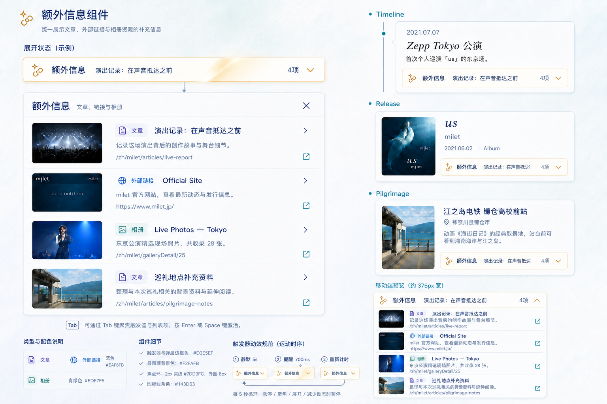

# 统一额外信息关联与展示方案

> 状态：最终设计确认稿
> 确认日期：2026-08-06
> 涉及工程：`milet-worker-ts`、`data-admin`、`echoes-of-milet`
> 本文替代 `article-relation-public-plan.md` 中以文章为中心的旧关联方案。

## 1. 背景与目标

Timeline、发布物、歌曲、圣地巡礼地点、巡礼合集、Live Event 等内容是系统中的“信息主体”。文章、相册和跳转链接不属于主体必填数据，而是用于补充背景、延伸阅读和外部资料的“额外信息资源”。

本方案需要实现：

- 文章、相册、链接使用统一关系模型挂载到信息主体。
- 一个主体可混合关联多个资源，并在三种资源之间统一排序。
- 主体原有查询、缓存和展示不依赖额外信息，额外信息失败时不影响主体返回。
- 公开端使用一个统一组件集中展示三种资源。
- 管理端以信息主体为中心完成添加、移除和排序，同时提供共享链接库进行全局治理。
- 缓存失效不遍历大量 key，不使用高成本的前缀扫描删除。
- 资源类型和主体类型均可继续扩展。

## 2. 已确认的核心决策

1. 文章继续使用现有 `articles/article_i18n`，相册继续使用 `img_series/img_series_i18n`，不复制资源数据。
2. 新增单语言 `external_links` 表保存链接解析快照，不提供人工维护的链接多语言表。
3. 新增一张 `extra_information_relations` 表统一保存三种资源与信息主体的关系。
4. 巡礼地点的 `pilgrimage_spots.image_series_id` 保持不变，它是主体内部一对一相册，不属于额外信息。
5. 公开接口先完成主体查询，再批量查询并附加 `extraInfo`。
6. 管理操作以信息主体为中心；共享链接库只负责全局修改、停用、引用检查和清理，不是创建关联的前置步骤。
7. 外部链接一般不区分语言；站内链接由服务端解析路径和语言规则。
8. 公开端触发器采用现有页面风格的琥珀金边框和低频扫光提醒，展开内容仍使用蓝、紫、青绿资源配色。
9. 缓存使用版本化 key，一次更新版本完成逻辑失效，旧缓存依靠 TTL 回收。

## 3. 术语与边界

### 3.1 信息主体

首期支持：

```text
timeline
release
song
pilgrimage_spot
pilgrimage_collection
live_event
```

主体 ID 统一作为字符串保存，由对应 target provider 负责校验、检索和后台展示。

### 3.2 额外信息资源

首期支持：

```text
article
gallery
external_link
```

每种资源由 resource provider 负责公开过滤、批量解析和管理端搜索。新增资源类型时扩展 provider 注册表，不在 handler 中增加新的分发器。

### 3.3 巡礼地点内部相册

`pilgrimage_spots.image_series_id` 继续用于：

- 地点详情封面。
- 地点照片列表。
- 地点主体内部的一对一组成关系。
- 可选择非公开的 spot 类型相册。

额外信息中的相册则：

- 保存于统一关系表。
- 一个主体可关联多个。
- 与文章和链接统一排序。
- 公开端只解析 `is_public=1` 的公开相册。

两者在数据、管理入口和公开展示上都必须明确区分。

## 4. 数据模型

### 4.1 外部链接资源

建议新增 migration：`0023_extra_information_relations.sql`。

```sql
CREATE TABLE IF NOT EXISTS external_links (
    id INTEGER PRIMARY KEY AUTOINCREMENT,
    url TEXT NOT NULL,
    normalized_url TEXT NOT NULL,
    link_scope TEXT NOT NULL DEFAULT 'external',
    localization_mode TEXT NOT NULL DEFAULT 'none',
    detected_lang TEXT,
    title TEXT NOT NULL DEFAULT '',
    summary TEXT NOT NULL DEFAULT '',
    cover_image_url TEXT NOT NULL DEFAULT '',
    cover_img_id INTEGER,
    source_host TEXT NOT NULL DEFAULT '',
    status TEXT NOT NULL DEFAULT 'published',
    parse_status TEXT NOT NULL DEFAULT '',
    parse_error TEXT NOT NULL DEFAULT '',
    parsed_at TEXT,
    created_at TEXT NOT NULL,
    updated_at TEXT NOT NULL,
    updated_by TEXT,
    FOREIGN KEY (cover_img_id) REFERENCES img_info(id),
    CHECK (link_scope IN ('internal', 'external')),
    CHECK (localization_mode IN ('none', 'path_prefix')),
    CHECK (detected_lang IS NULL OR detected_lang IN ('zh', 'ja')),
    CHECK (status IN ('draft', 'published', 'disabled'))
);

CREATE INDEX IF NOT EXISTS idx_external_links_normalized_url
    ON external_links(normalized_url);

CREATE INDEX IF NOT EXISTS idx_external_links_status_updated
    ON external_links(status, updated_at DESC, id DESC);
```

说明：

- `normalized_url` 只建立普通索引，不建立唯一约束；管理端提示重复，但允许用户创建副本。
- `cover_img_id` 是管理员手动选择的站内封面，优先于解析得到的 `cover_image_url`。
- `detected_lang` 是服务端解析结果，不是需要管理员维护的翻译字段。
- `localization_mode=path_prefix` 表示该站内地址可以根据公开页语言替换 `/zh/`、`/ja/` 前缀。
- 外部链接默认 `localization_mode=none`，所有语言页面显示同一地址和元数据。

### 4.2 统一关系表

```sql
CREATE TABLE IF NOT EXISTS extra_information_relations (
    id INTEGER PRIMARY KEY AUTOINCREMENT,
    target_type TEXT NOT NULL,
    target_id TEXT NOT NULL,
    resource_type TEXT NOT NULL,
    resource_id TEXT NOT NULL,
    sort_no INTEGER NOT NULL DEFAULT 0,
    created_at TEXT NOT NULL,
    updated_at TEXT NOT NULL,
    updated_by TEXT,
    UNIQUE(target_type, target_id, resource_type, resource_id)
);

CREATE INDEX IF NOT EXISTS idx_extra_information_target
    ON extra_information_relations(target_type, target_id, sort_no, id);

CREATE INDEX IF NOT EXISTS idx_extra_information_resource
    ON extra_information_relations(resource_type, resource_id, target_type, target_id);
```

关系表不对 `resource_type` 添加数据库 CHECK，以便以后扩展资源类型；合法类型由 TypeScript 注册表统一校验。多态关系无法依赖单一外键，因此 service 必须负责：

- 保存前验证主体和资源存在。
- 删除资源时检查引用并清理关系。
- 公开解析时过滤孤儿关系和不可公开资源。

### 4.3 主体关系版本表

每个信息主体使用一个 D1 revision，作为管理端并发检查和公开端 KV 缓存版本的共同真源：

```sql
CREATE TABLE IF NOT EXISTS extra_information_relation_sets (
    target_type TEXT NOT NULL,
    target_id TEXT NOT NULL,
    revision INTEGER NOT NULL DEFAULT 0,
    created_at TEXT NOT NULL,
    updated_at TEXT NOT NULL,
    updated_by TEXT,
    PRIMARY KEY (target_type, target_id)
);

CREATE INDEX IF NOT EXISTS idx_extra_information_relation_sets_updated
    ON extra_information_relation_sets(updated_at DESC, target_type, target_id);
```

规则：

- 无关联主体查询时按 revision `0` 处理，不因为公开读取而创建 D1 行。
- 第一次发生有效保存时，在同一个 D1 batch 中先以 `INSERT ... ON CONFLICT DO NOTHING` 建立 revision `0` 的 guard 行，再执行带 `expectedRevision=0` 条件的关系差异写入，最后把 revision 更新为 `1`。
- 即使主体的全部额外信息被移除，也保留 revision 行，避免版本重新退回 `0`。
- 没有 relation set 行的主体可使用 revision `0` 缓存空结果；第一次有效保存后进入 revision `1`。
- 一次关系保存无论新增、删除或排序多少项，只在确有变化时将该主体 revision 增加 `1`。
- 文章、相册或共享链接的公开字段变化时，通过 `idx_extra_information_resource` 找到所有引用主体，并用一次 D1 更新集中增加这些主体的 revision。
- revision 只以 D1 为准；KV、浏览器提交值和关系行上的最大时间或最大 ID 都不能作为版本真源。

## 5. 链接解析与站内语言处理

### 5.1 公共解析服务

将 News handler 中已有的 URL 安全校验、受限抓取、重定向检查、字符集识别和 Open Graph/Twitter Card 解析抽取为共享服务，例如：

```text
src/component/shared/external-link/UrlMetadataService.ts
```

News 和额外信息链接共同调用该服务，不允许新功能通过 HTTP 调用 `/admin/news/parse`。

解析结果包括：

```text
原始 URL
最终 URL
标准化 URL
站内/站外类型
推断语言
标题
简介
封面
来源域名
解析状态和错误代码
```

解析只发生在管理端预览、创建或手动刷新时。公开请求不得实时抓取第三方页面。

### 5.2 解析失败

解析失败仍允许保存：

- 保留经过安全校验的 URL。
- 标题默认使用域名。
- 简介和封面可以为空。
- 管理端显示失败原因，允许手工填写。

### 5.3 站内链接

- 相对地址在进入外部 HTTP 抓取逻辑前直接识别为站内链接；不能原样传入 News 当前只接受绝对 HTTP/HTTPS URL 的安全校验。
- 与公开端域名相同的绝对地址标准化为相对路径，避免保存生产域名。
- 识别 `/zh/`、`/ja/` 前缀并保存 `detected_lang`。
- 只有命中已知可本地化路由时才设置 `localization_mode=path_prefix`，公开端再按当前语言生成地址。
- 不能确认路由可本地化时保留原地址，不做盲目字符串替换。
- 站内域名白名单和用于生成完整资源地址的基础 origin 由 Worker 环境配置提供，不在代码中硬编码。

如果粘贴的站内 URL 可以解析成系统资源，应优先建议转换资源类型：

```text
/milet/articles/:slug       -> article
/milet/galleryDetail/:id    -> gallery
```

避免同一篇文章或相册同时以“系统资源”和“普通链接”重复关联。

### 5.4 重新解析覆盖规则

为降低人工值和解析值并存的复杂度，手动重新解析成功后直接覆盖当前解析结果，不保存另一组 override 字段。

覆盖字段：

```text
url
normalized_url
link_scope
localization_mode
detected_lang
title
summary
cover_image_url
source_host
parse_status
parse_error
parsed_at
```

保留字段：

```text
id
status
created_at
关联关系
updated_by 等审计信息
```

管理端执行前明确提示“重新解析将覆盖当前标题、简介和封面”。解析失败时保留本次经过安全校验的 URL，并按 5.2 的降级规则覆盖解析状态和错误信息。

## 6. Worker 查询设计

### 6.1 查询顺序

公开 handler 保持以下顺序：

1. 按原逻辑查询信息主体。
2. 主体查询成功后收集 target ID。
3. 一次 D1 查询取得所有 target 的 relation set revision。
4. 调用 `listPublicExtraInformation()`，按主体 revision 读取同时包含中文、日文的主体级 KV 缓存。
5. 对缓存未命中的主体批量查询关系和三类资源，一次生成中文、日文结果并回写 KV。
6. 按 `target_id` 和全局 `sort_no` 附加到主体；旧双语言页面把内部 `ja` 结果映射到旧响应的 `jp` 字段。
7. 额外信息查询失败时记录日志并返回空组，不改变主体接口状态。

### 6.2 批量解析

一次页面请求最多执行：

```text
1 次主体 revision 批量查询
缓存全部命中：每个主体 1 次并行 KV get，不查询关系和资源
存在缓存未命中：
  1 次未命中主体的关系查询
  1 次文章批量查询
  1 次相册批量查询
  1 次链接批量查询
```

禁止对缓存未命中的主体逐主体或逐资源查询。关系查询结果按 `resource_type` 分组，交给 resource provider 并行解析，再按原始关系顺序合并。文章和相册 provider 一次取得构建中文、日文结果所需的全部 i18n 数据，不再像旧 Timeline mapper 一样分别执行中文、日文关系查询。

KV 以主体为缓存单位而不是以语言为单位。同一个主体的中文和日文结果放在同一个 value 中，因此 Timeline、巡礼等一次返回全部语言的旧接口只需读取一次主体缓存；Release、Song、Live 等单语言接口也读取同一份缓存，再选择当前请求语言。

列表查询采用阈值保护：主体数量不超过配置阈值时并行读取主体级 KV；超过阈值时跳过逐主体 KV，直接对全部主体执行一次 D1 批量解析，并在响应后按主体异步回填 KV。初始阈值建议为 `20`，上线后根据真实耗时和 KV/D1 指标调整，不能散落硬编码在各 handler 中。

公开过滤规则：

- 文章：`article_type=public_article`、`status=published`、`deleted_flag=0`。
- 相册：`is_public=1`。
- 链接：`status=published`，URL 必须通过协议和站内路径校验。

### 6.3 公开 DTO

```ts
type ExtraInformationResourceType = 'article' | 'gallery' | 'external_link';

type ExtraInformationItem = {
    type: ExtraInformationResourceType;
    id: string;
    title: string;
    summary: string;
    coverImage: string;
    url: string;
    linkScope: 'internal' | 'external';
};

type ExtraInformationGroup = {
    count: number;
    items: ExtraInformationItem[];
};

type ExtraInformationCacheValue = {
    revision: number;
    languages: {
        zh: ExtraInformationGroup;
        ja: ExtraInformationGroup;
    };
};
```

`coverImage` 统一返回公开端可以直接访问的完整 URL；无封面时返回空字符串。文章和相册由 Worker 使用现有图片访问方法生成完整地址，外部链接使用解析后的绝对封面地址。站内图片的域名或基础地址必须来自环境配置，不能在 service 中硬编码生产域名。`linkScope` 用于公开端区分站内路由跳转和新标签页外链。

缓存和统一 resolver 内部只使用 `zh`、`ja`。现有 Timeline、巡礼等旧响应仍使用 `zh`、`jp`，由兼容 mapper 在输出边界执行 `languages.ja -> payload.jp`，不在 KV 中重复保存一份 `jp`。外部链接的单语言标题、简介和封面在两种语言结果中复用；`path_prefix` 站内链接分别生成 `/zh/`、`/ja/` URL。

主体响应新增：

```ts
extraInfo: ExtraInformationGroup
```

过渡期可以继续投影旧 `articles` 和第一条旧链接字段，确保旧公开端与首页 Timeline 预览不立即失效；新组件稳定后再清理兼容字段。

### 6.4 Live 关系与主体缓存切换

Live 当前同时使用 `article_relations`、`gallery_relations`，并把 `relatedArticles`、`relatedGalleries` 放进 `live:detail:*` 整体缓存，因此必须作为单独的兼容切换点处理：

1. `article_relations` 和 `gallery_relations` 中的 Live 数据全部回填到统一关系表，旧数据的 `sort_no` 按统一迁移规则写为 `0`。
2. `/admin/live/events/:eventId/relations` 改为查询统一 relation service，再投影旧的 `relatedArticles`、`relatedGalleries` 响应。
3. `/admin/live/events/:eventId/relations/save` 在兼容期继续接受旧 payload，但只写 `extra_information_relations`；`saveLiveEventRelations()` 停止调用旧文章 relation service 和 `GalleryRelationRepository`。
4. 新管理端使用 `ExtraInformationDialog` 后直接提交统一 payload；旧 Live 弹窗和旧 payload 仅保留一个兼容周期。
5. 关系变化继续更新 Live 的 `draft_revision` 和审计时间，保持现有预览、未发布修改提示和后台状态语义。
6. `live:detail:*` 只缓存 Live 主体及内部组成数据，不再保存额外信息。无论主体缓存命中还是回源，handler 都在主体查询完成后调用统一 resolver 附加 `extraInfo`。
7. 兼容期的 `relatedArticles`、`relatedGalleries` 必须在附加 `extraInfo` 后按资源类型投影，不能从主体缓存或旧关系表读取。
8. 仅修改额外信息时不删除 `live:detail:*`；由额外信息自己的版本化缓存完成刷新。修改 Live 主体和内部元素时仍沿用 Live 原有缓存失效流程。

## 7. 缓存方案

### 7.1 Key 设计

```text
extra-info:v3:{targetType}:{targetId}:r{revision}
```

key 不包含语言。每个主体、每个 D1 revision 对应一个 KV value，value 同时保存 `languages.zh` 和 `languages.ja`。revision `0` 也允许缓存空结果，避免无关联主体反复执行关系查询。

读取流程：

1. 主体查询完成后，对当前页面的全部 target ID 执行一次轻量 D1 revision 查询。
2. 按 `{targetType}:{targetId}:r{revision}` 生成主体级 key，并行读取 KV。
3. 命中且 value 结构、revision 均合法时直接使用其中的双语言结果。
4. 收集所有未命中主体，一次批量查询关系并并行调用三种 resource provider。
5. 同时生成中文、日文结果；当前请求立即返回，KV 写入通过 `ctx.waitUntil` 按主体异步完成。

旧请求即使在关系更新后晚一步写入，也只能写入旧 revision 的 key；新请求从 D1 取得新 revision 后不会再读取旧 key，因此不需要依赖删除顺序解决旧数据回写竞态。

### 7.2 逻辑失效

关系保存时，在同一个 D1 batch 中完成差异写入和主体 revision 更新。一次保存只增加一次版本：

```sql
UPDATE extra_information_relation_sets
SET revision = revision + 1,
    updated_at = ?,
    updated_by = ?
WHERE target_type = ?
  AND target_id = ?
  AND revision = ?
RETURNING revision;
```

文章、相册或共享链接的公开字段变化时，通过一次参数化 D1 更新增加所有引用主体的 revision：

```sql
UPDATE extra_information_relation_sets
SET revision = revision + 1,
    updated_at = ?,
    updated_by = ?
WHERE EXISTS (
    SELECT 1
    FROM extra_information_relations relation
    WHERE relation.target_type = extra_information_relation_sets.target_type
      AND relation.target_id = extra_information_relation_sets.target_id
      AND relation.resource_type = ?
      AND relation.resource_id = ?
);
```

正常业务不需要删除当前主体的旧 revision key；所有缓存写入设置 24 小时 TTL，由 KV 自动回收。忽略删除成本时也只把精确删除作为紧急刷新或迁移清理手段，不能把删除顺序作为并发正确性的基础。

触发主体 revision 更新：

- 新增、移除、重新排序关系。
- 链接 URL、标题、简介、封面、状态变化。
- 已关联文章的公开状态或公开摘要变化。
- 已关联相册的公开状态、标题或封面变化。
- 删除资源。

不触发版本更新：

- 打开管理弹窗。
- URL 解析预览但未保存。
- 拖拽后取消。
- 保存内容与数据库完全一致。
- 只修改不影响公开展示的内部字段。

### 7.3 查询性能和降级策略

- 主体 revision 使用一次 D1 `IN (...)` 批量查询；目标数量超过 D1 参数限制时由 repository 统一分块，handler 不自行循环拼 SQL。
- 主体数量不超过配置阈值时并行读取主体级 KV；超过阈值时跳过逐主体 KV，直接批量查询 D1 并异步回填。
- 文章、相册和链接 provider 都必须对全部未命中主体批量查询，同时取得中文、日文展示所需数据。
- KV value 只保存公开 DTO，不保存 ORM 行、管理字段或无法稳定序列化的数据。
- 缓存正常结果和空结果；解析后不可公开或已成为孤儿的关系不计入 `count`。

- KV 不可用或读取失败：直接查询 D1。
- KV 写入失败：返回当前 D1 结果并记录日志。
- revision 查询失败：额外信息整体降级为空组，不影响主体接口；不能使用可能过期的 KV revision 猜测结果。
- 额外信息整体失败：主体正常返回，`extraInfo={ count: 0, items: [] }`。

## 8. 管理端交互方案

### 8.1 以信息主体为中心

Timeline、发布物、歌曲、巡礼地点、巡礼合集、Live Event 等页面统一放置“管理额外信息”入口。通用弹窗只接收：

```ts
targetType
targetId
targetTitle
```

弹窗打开时才加载关系和候选资源，进入业务页面时不初始化额外候选数据。

桌面端采用双栏：

```text
左侧：当前已关联资源、混合排序、公开状态
右侧：文章 | 外部链接 | 相册候选与创建
```

移动端采用上下结构。左侧列表支持拖拽，同时必须提供键盘可用的上移、下移操作。

弹窗内操作先保存在本地草稿，点击一次“保存额外信息”统一提交。取消弹窗不创建链接、不修改关系、不触发缓存更新。

旧关系迁移时不推断文章、相册和链接之间原本不存在的跨类型顺序，统一写入 `sort_no=0`。公开查询使用 `ORDER BY sort_no ASC, id ASC` 保证未整理数据的展示顺序稳定；弹窗把 `sort_no=0` 标记为“未整理顺序”。维护者第一次保存该主体的关系后，统一重排为连续的 `1, 2, 3...`，后续新增资源默认追加到末尾。

### 8.2 链接添加流程

外部链接页签同时提供：

```text
搜索已有链接
粘贴并解析新 URL
```

新建流程：

1. 粘贴 URL。
2. 标准化并搜索已有 `normalized_url`。
3. 已存在时优先建议复用，也允许创建副本。
4. 不存在时解析 URL，生成与公开端一致的卡片预览。
5. 管理员可调整标题、简介和封面。
6. “加入额外信息”只加入弹窗草稿。
7. 总保存时在同一 service/batch 中创建链接并建立关系。

### 8.3 差异保存和并发保护

保存时不删除全部关系再重新插入。服务端计算差异：

- 保留未变化记录。
- 新增新关系。
- 删除已移除关系。
- 只更新变化的 `sort_no`。
- 完全无变化时不写数据库、不更新缓存版本。

关系查询返回 `extra_information_relation_sets.revision`，保存请求携带该值作为 `expectedRevision`。服务端所有删除、新增、排序 SQL 都以 D1 当前 revision 仍等于 `expectedRevision` 为执行条件，并在同一个 D1 batch 最后执行 revision 条件更新；没有返回新 revision 时整次请求按 `409 Conflict` 处理。

多个管理员同时打开同一主体时，只允许第一个基于当前 revision 完成的保存成功。后续请求不得自动合并，因为完整列表保存同时包含新增、移除和全局排序，自动合并可能恢复另一位管理员已经删除的资源或覆盖其排序。管理端收到 `409` 后提示“关联内容已被其他用户修改”，重新加载最新列表，由用户重新确认操作。

保存成功后响应返回新的 revision；完全无差异时返回原 revision，不执行关系写入、不增加 revision，也不产生新的 KV key。KV 只使用保存后的 D1 revision 生成 key，不参与写入冲突判断。

## 9. 共享链接库

管理端新增：

```text
内容管理
└── 外部链接
```

它是治理入口，不是建立关联的必经步骤。主体弹窗仍可直接创建链接。

共享链接库负责：

- 按标题、域名、URL、状态、解析结果搜索。
- 显示引用数量和引用主体。
- 修改共享标题、简介、封面和 URL。
- 手动重新解析。
- 停用失效链接。
- 清理未使用链接。
- 后续支持重复链接合并和批量替换引用。

修改被引用链接前必须提示影响范围：

```text
该链接正在被 N 个信息主体使用，修改后所有引用位置都会更新。
```

主体弹窗内提供：

- 修改共享链接。
- 复制为新链接并仅替换当前主体。
- 仅解除当前关联。

“移除关联”只删除关系，不删除链接资源。

链接优先软停用：

```text
published -> disabled
```

停用后公开端不显示，但关系保留并可恢复。只有引用数为 0 时允许硬删除；仍被引用时必须先解除或替换所有引用。

## 10. 管理 API 与权限

建议路由：

```text
GET  /admin/extra-information/relations
GET  /admin/extra-information/resources/search
POST /admin/extra-information/links/parse
GET  /admin/extra-information/links
GET  /admin/extra-information/links/:id/usages
POST /admin/extra-information/links/save
POST /admin/extra-information/links/disable
POST /admin/extra-information/links/delete
POST /admin/extra-information/relations/save
```

共享链接库权限：

```text
extraInformation.view
extraInformation.update
extraInformation.delete
```

- `view`：进入共享链接库、查看链接和引用主体。
- `update`：创建链接、修改链接和重新解析。
- `delete`：停用或硬删除共享链接资源。

各信息主体中的关联弹窗沿用现有文章关联的权限和查询组织方式，不额外要求 `extraInformation.update`：

- 查看关系使用该 `target_type` 对应业务模块的 `view` 权限。
- 建立、解除和排序关系使用对应业务模块的 `update` 权限。
- 通用路由可以声明各主体权限的 any-of 集合，但 handler 必须根据请求中的 `targetType` 再校验准确的主体权限，不能因为拥有其他模块权限而操作当前主体。
- 候选文章和相册查询复用现有 relation target/resource provider 的批量检索与公开状态过滤；默认只返回可公开关联的资源，拥有对应文章或相册管理权限时才扩展到草稿或非公开候选。
- 共享链接的全局修改、停用和删除仍只允许通过共享链接库权限执行；主体弹窗中的“仅解除当前关联”只要求主体更新权限。

管理端代理必须同步加入 `/admin/extra-information/`。公开端继续通过现有业务接口返回 `extraInfo`，不新增公开 API，因此通常不需要修改公开代理白名单。

## 11. 公开端最终视觉方案

最终效果图：



### 11.1 统一资源卡

文章、外部链接、相册全部使用相同结构：

```text
封面图 | 类型标签 + 标题
       | 简介
       | 具体链接
```

- 封面固定比例和固定区域，缺失时使用同尺寸类型占位图。
- 三类资源仅通过小图标和淡色标签区分，不改变卡片结构。
- 文章使用淡紫，相册使用薄荷青，外部链接使用雾蓝。
- 桌面端简介最多两行；移动端压缩为一行，URL 截断。
- 图片使用项目现有静态访问方法、懒加载和合适尺寸的预览图。

### 11.2 琥珀金触发器

触发器使用：

```text
标题/图标：#B7791F 与 #143D63
边框：#DDBA63，静默态降低透明度
背景：暖白到极淡琥珀渐变
圆角：8px
```

展开内容不使用金色，继续沿用站内的：

```text
主标题：#143D63
交互蓝绿：#317F8D
正文：#526670
次要文字：#60717A
边框：#D3E5EF
```

### 11.3 动态提醒

- 组件进入视口且处于收起状态时启动计时器，每 5 秒循环执行一次约 700ms 的斜向金色扫光与一次信号点呼吸。
- 提醒循环不设置次数上限，但任意时刻只能存在一个动画实例，不允许扫光重叠。
- 悬停、键盘聚焦、展开、页面隐藏或组件离开视口时暂停并清除当前计时器。
- 暂停条件解除且组件仍处于收起、可见状态时，重新开始一个完整的 5 秒倒计时，不立即补播动画。
- 组件卸载时必须清除计时器、IntersectionObserver 和页面可见性监听。
- 动画只改变光效和透明度，不改变位置、尺寸或缩放。
- `prefers-reduced-motion` 下保留静态金边框，不执行扫光。

### 11.4 响应式与可访问性

- 桌面端使用 Teleport 浮层，并使用统一 z-index token，不使用任意超大值。
- 移动端在触发器原位置展开，避免浮层超出视口。
- 使用语义化 `button`、`a`/`RouterLink`。
- `aria-expanded`、`aria-controls`、资源类型和新窗口行为保持同步。
- 打开后焦点进入面板，关闭后返回触发器；Escape 关闭。
- 触控区域不少于 44px，焦点环清晰可见。

## 12. 迁移与兼容

### 12.1 现有文章关联查询切换

当前文章关联链路包括：

```text
数据表：article_relations
公开查询：ArticleRelationService.listPublicArticleRelations()
公开 DTO：主体上的 articles 字段
公开兼容接口：/api/articles/relations/:targetType/:targetId/:lang
管理接口：/admin/articles/relations、/admin/articles/relations/save
KV 前缀：article-relations:
```

统一模型上线后采用“新关系表单一真源”，不长期双写 `article_relations`：

1. migration 先把 `article_relations` 全量回填到 `extra_information_relations`，其中 `resource_type='article'`、`resource_id=CAST(article_id AS TEXT)`。
2. Worker 切换后，所有新关联写入只进入 `extra_information_relations`。
3. 旧 `/admin/articles/relations*` 接口暂时保留，但内部把 article-centric payload 翻译成统一关系 service 的读写，不再更新旧表。
4. 旧 `/api/articles/relations/*` 接口暂时保留，但从统一额外信息查询结果中过滤 `type='article'` 并返回旧 `RelatedArticleGroup` 结构。
5. `attachTimelineArticles`、`attachReleaseArticles`、`attachSongArticles`、巡礼文章 mapper 等兼容函数内部改为调用统一 resolver；新 handler 直接附加 `extraInfo`。
6. Worker 过渡期同时返回 `extraInfo` 和由其中 article item 投影得到的旧 `articles` 字段，使旧公开端可以继续运行。
7. 文章保存、发布、归档和删除时，不再调用 `clearArticleRelationCachesByArticle()`；改为在公开展示确实变化且文章存在统一关系时，用一次 D1 更新增加所有引用主体的 relation set revision。
8. Live 等业务中显式调用 `clearArticleRelationCachesForTargets()` 的位置同步切换为对应主体的 D1 revision 更新，不保留两套失效流程。

切换期间禁止出现以下状态：

- 新管理端写新表、旧管理端仍直接写旧表。
- 新公开接口读新表、旧兼容接口仍读旧表。
- 同一保存动作同时维护两张关系表并把双写作为长期一致性方案。

旧表只作为维护窗口切换前后的数据核对和人工恢复备份保留，不作为新版开始写入后的旧 Worker 直接回滚数据源。旧管理端即使因浏览器缓存仍调用旧 API，也会由新 Worker 翻译并写入统一关系表。

### 12.2 旧文章关联缓存弃用

现有缓存 key 形式为：

```text
article-relations:{targetId}:{targetType}:{lang}
```

当前旧缓存写入没有 TTL，因此不能只停止读取后永久遗留。弃用过程确定为：

1. 新 Worker 发布后立即停止读取、写入和按主体删除 `article-relations:*`。
2. 新旧兼容 API 都读取统一 `extra-info:v3:{targetType}:{targetId}:r{revision}` 双语言主体缓存或 D1，不再回退旧缓存。
3. 文章或关系修改只更新受影响主体的 D1 relation set revision，不再为了兼容执行旧缓存删除。
4. 保留旧缓存一个稳定发布和回滚观察周期；此时旧 key 即使内容过期也不会再被任何新代码读取。
5. 确认兼容 Worker 已稳定且无需回退到仍读取旧文章缓存的版本后，执行一次受保护、可重复运行的旧缓存清理任务。

一次性清理要求：

- 只允许匹配精确前缀 `article-relations:`。
- 使用 KV `list` cursor 分页直到 `list_complete=true`，不能只处理第一页。
- 每批限制删除并发，例如 50 个 key，避免一次创建过多请求。
- 记录删除数量、失败数量和最后 cursor，失败后可以继续执行。
- 完成后写入标记 `extra-info:migration:legacy-article-cache-cleaned:v1`，重复运行时直接返回已完成。
- 清理只能由部署脚本或受权限保护的管理任务触发，不能放在公开请求、普通保存或定时高频任务中。

这次迁移允许一次集中清理；正常业务运行后仍坚持版本化失效，不恢复前缀扫描删除。

### 12.3 受控维护窗口切换

本功能在三端开发和验证全部完成前不发布。正式上线采用一次受控维护窗口，不安排旧、新关系写入逻辑并行运行：

1. 暂停旧管理端中的文章关联、Live 关联以及旧链接编辑入口。
2. 执行 migration、全量关系回填和旧链接解析。
3. 校验各主体、各资源类型的新旧数量，以及重复关系、孤儿关系和无效链接报告。
4. 部署同时兼容旧 DTO/旧 API 的新版 Worker；从此新关系表成为唯一读写来源。
5. 部署新版管理端和公开端，完成关键页面冒烟验证后恢复关联编辑。

新关系表开始产生写入后，不允许回滚到只认识 `article_relations`、`gallery_relations` 和主体旧链接列的旧 Worker。可回滚的后端版本至少必须已经读取统一关系表并保留旧 DTO 投影能力；因此旧关系表只是迁移核对和人工恢复的数据备份，不作为新版开始写入后的直接代码回滚数据源。

### Phase 1：加表并回填

- 新增 `external_links`、`extra_information_relations`、`extra_information_relation_sets`。
- `article_relations` 回填为 `resource_type=article`。
- `gallery_relations` 回填为 `resource_type=gallery`。
- 按新关系表中的 distinct `(target_type, target_id)` 建立 relation set，迁移初始 revision 统一为 `1`；无关联主体不预建记录，公开查询按 revision `0` 处理。
- 旧文章、相册和链接关系统一写入 `sort_no=0`，不自动推断跨类型顺序；公开端以关系 `id` 作为稳定次级排序，后续由维护者在关联弹窗中人工整理。
- Timeline `timeline_item_i18n.link_url` 中所有非空多语言链接都进入迁移流程：完全相同的 URL 去重；可识别为同一站内本地化路由的 `/zh/`、`/ja/` 地址合并为一个 `path_prefix` 链接；不同外部 URL 分别创建并全部关联，因此会同时出现在中文和日文公开页面。
- 巡礼地点 `pilgrimage_spots.link_url` 解析并回填链接资源。
- 可识别为文章/相册的站内旧链接优先转换成对应资源类型。
- 合法但解析失败的 HTTP/HTTPS 链接按域名降级保存；危险协议和无效 URL 不写入关系表，统一记录迁移报告。
- 回填完成后校验各资源类型的关系数量、重复关系和孤儿资源。

### Phase 2：Worker 切换与兼容

- 建立 target/resource provider 注册表和统一 relation service。
- 新关系表成为唯一读写来源。
- 公开 resolver 先批量读取 D1 主体 revision，再按主体读取同时包含 `zh/ja` 的 `extra-info:v3:*` KV；旧双语言页面只在 mapper 输出边界映射 `ja -> jp`。
- 旧文章管理 API、公开 API 和 mapper 改为统一 service 的兼容适配层。
- 旧 Live 关系查询和保存 API 改为统一 service 的兼容适配层，停止写入 `gallery_relations` 和旧文章关系 service。
- Live 主体缓存移除 `relatedArticles`、`relatedGalleries`，统一在主体缓存查询后附加 `extraInfo`，再投影旧字段。
- 新旧公开字段并存，但旧 `articles` 必须由 `extraInfo` 投影生成。
- 停止所有 `article-relations:*` 缓存读写和常规删除。

### Phase 3：管理端切换

- 新增 `ExtraInformationDialog`。
- 各主体管理页增加入口。
- 主体尚未首次保存、没有稳定 `targetId` 时禁用入口，主体保存成功后再开放。
- 替换现有文章中心的 `ArticleRelationDialog` 和 Live 专用 `LiveRelationsDialog`；旧组件只在兼容周期内保留。
- 新增共享链接库。
- 关联弹窗复用主体模块权限，共享链接库使用 `extraInformation.*`；同步更新权限配置和生产代理白名单。

### Phase 4：公开端切换

- 新增统一 `ExtraInformationList`，替换 `RelatedArticleList` 使用点。
- Timeline、发布物、歌曲、巡礼、Live 等逐步改读 `extraInfo`。
- 首页 Timeline 兼容第一条链接，随后切换到统一模型。
- 验证所有新版页面不再依赖旧 `articles` 字段。

### Phase 5：旧缓存集中清理

- 观察至少一个稳定发布和兼容 Worker 回退周期。
- 运行一次分页、限流的 `article-relations:*` 清理任务。
- 核对完成标记和删除统计。
- 清理后继续保留旧表作为数据核对备份，直到确认不再需要人工恢复。

### Phase 6：旧代码和表清理

- 删除旧 article relation cache util、旧 mapper 实现和兼容 DTO。
- 下线旧文章关系 API，或在确认仍有外部调用时单独延长适配期。
- 停止返回旧 `articles` 字段。
- 评估删除 `article_relations`、`gallery_relations` 和主体旧链接列；D1 重建不作为首期发布前置条件。

## 13. 验证与验收

Worker：

- migration 与回填测试。
- 旧关系统一写入 `sort_no=0`、`id` 稳定次级排序和首次人工排序保存测试。
- Timeline 多语言链接的相同 URL 去重、站内语言路径合并、不同外链全部保留和无效 URL 报告测试。
- 三种 resource provider 的公开过滤、语言和排序测试。
- relation set 初始创建、空关系保留 revision、无差异不增版和资源变更批量增版测试。
- 两个管理员使用同一 `expectedRevision` 保存时只有一个成功、另一个返回 `409` 且不产生关系写入或 KV key 的测试。
- 保存差异、乐观锁、共享链接引用和删除保护测试。
- URL SSRF 防护、重定向、超时、响应大小测试。
- 站内相对路径、站内绝对地址、已知本地化路由和重新解析字段覆盖测试。
- 文章、相册封面统一生成完整公开访问 URL 的测试。
- 主体 revision 只在实际公开变化后更新的测试。
- 单个主体 KV 同时保存 `zh/ja`、旧 mapper 正确映射 `ja -> jp`、单语言接口选择当前语言而不重复回源的测试。
- 缓存全部命中、部分命中、超过阈值直接批量查询 D1、空结果缓存和 KV 失败降级测试。
- 旧 revision 请求晚写只能写入旧 key、不会污染新 revision 缓存的并发测试。
- Live 主体缓存不含额外信息、缓存命中后仍附加最新 `extraInfo`，以及旧 Live DTO 从统一结果投影的测试。
- 关联 API 根据 `targetType` 校验准确主体权限、共享链接库使用独立权限的测试。
- 新旧文章查询结果在回填后的数量、顺序、语言 fallback 和公开过滤一致性测试。
- 旧文章 API/DTO 兼容投影测试，以及新代码不再读写 `article-relations:*` 的测试。
- 旧缓存清理的 cursor 分页、限流、失败续跑和完成标记测试。
- 额外信息失败不影响主体接口的测试。

管理端：

- `npm run type-check`
- `npm run build`
- 验证懒加载、混合排序、取消不落库、共享编辑警告和权限隐藏。

公开端：

- `npm run type-check`
- `npm run build:ssr`
- `npm run verify:ssr:local`
- 验证 375px、768px、1024px、1440px。
- 验证键盘、Escape、焦点恢复、减少动态、图片失败占位和外链安全属性。

## 14. 非目标

首期不包含：

- 自动周期抓取所有链接并监控死链。
- 自动下载外部封面到 R2。
- 链接标题和简介的人工多语言维护。
- 任意主体之间的通用知识图谱。
- 首次发布立即删除所有旧关系表和旧链接字段。
