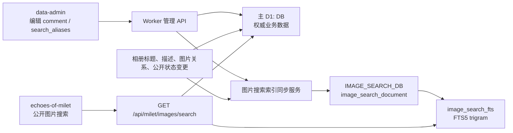

# 图片全文检索一期实施方案

## 1. 文档状态

- 方案日期：2026-08-12
- 实现分支：`feature/image-search`
- 公开端基线：`echoes-of-milet/origin/ssr-cf-dev`，提交 `8effe29b3069ddd5b11710284666cf2953deb795`
- 管理端基线：`data-admin/origin/echoes-room`，提交 `344c9dbe398ef6824b2ce6e8a1ac9bb8ff45162a`
- Worker 基线：`milet-worker-ts/origin/master`，提交 `68673001a1f554ff81018e2c05080d8dc7116741`

本文档描述图片搜索第一期在 `echoes-of-milet`、`data-admin` 和 `milet-worker-ts` 三个工程中的完整实施方案。第一期不引入图片 i18n 表，也不启用目前未实际使用的图片 tag 体系。

## 2. 已确定的产品决策

1. `img_info.comment` 继续作为图片的公开显示名称或说明。
2. `comment` 多数采用“类别 + 时间”等便于展示的内容，因此只作为低权重检索信息。
3. `img_info` 新增 `search_aliases`，集中维护中文、日文、英文、假名、简繁体和常用简称等检索别名。
4. 图片搜索范围由以下内容组成：
   - 图片 `search_aliases`；
   - 图片所属公开相册的所有语言标题和描述；
   - 图片 `comment`。
5. 搜索结果只允许包含至少属于一个公开相册的、已经上传完成的 milet 图片。
6. 公开查询以 SQLite FTS5 为主要检索引擎，中文和日文子串检索使用 `trigram` tokenizer。
7. 第一阶段不让 FTS5 虚拟表进入现有主 D1，搜索索引使用单独的 D1 数据库。
8. 搜索索引收录已经上传完成的 M/B/S 图片；公开端只查询公开 M 图片，管理端可以查询全部类型和非公开图片。
9. B/S 图片没有相册上下文，但同样可以维护并检索 `comment` 和 `search_aliases`。
10. 全量重建和相册级批量同步使用 Cloudflare Workflow，不使用 `ctx.waitUntil()` 承担长任务；任务状态复用主 D1 现有 `async_job_status`。
11. 新建搜索表不使用 `CHECK IN` 或布尔 `CHECK` 约束，枚举和布尔取值由 Worker 写入校验与健康检查保证。

## 3. 第一阶段范围

### 3.1 包含内容

- 管理端分页浏览图片时可以搜索图片。
- 管理端可以为每张图片编辑 `comment` 和 `search_aliases`。
- 公开端相册页面提供图片搜索入口和结果列表。
- Worker 提供图片元数据管理 API、公开搜索 API 和搜索索引重建 API。
- 图片元数据、相册内容和公开状态变化后同步更新对应搜索文档。
- 使用 FTS5 `bm25()` 对不同字段配置相关性权重。

### 3.2 暂不包含

- 图片级多语言 caption/i18n 表。
- 图片 tag 管理及 tag 搜索。
- 图片内容识别、OCR、向量搜索和 AI 自动描述。
- 拼写纠错、模糊编辑距离、自动翻译。
- 独立图片详情页。
- 将搜索词或 `search_aliases` 暴露在公开 API 响应中。

## 4. 总体架构



主 D1 是权威数据源；`IMAGE_SEARCH_DB` 中的普通搜索文档和 FTS5 索引都是派生数据，可以从主库完整重建。

采用独立搜索 D1 的直接原因是当前 Worker 的 `D1BackupWorkflow` 会通过 D1 Export API 导出主库，而 Cloudflare 当前不支持导出包含 FTS5 等虚拟表的数据库。独立搜索库可以避免破坏现有备份流程。

参考资料：

- [Cloudflare D1 支持 FTS5](https://developers.cloudflare.com/d1/sql-api/sql-statements/)
- [Cloudflare D1 虚拟表导出限制](https://developers.cloudflare.com/d1/best-practices/import-export-data/)
- [SQLite FTS5 与 trigram tokenizer](https://www.sqlite.org/fts5.html)

## 5. 主 D1 数据结构

在 `milet-worker-ts/migrations` 中追加迁移，不修改历史迁移：

```sql
ALTER TABLE img_info
ADD COLUMN search_aliases TEXT NOT NULL DEFAULT '';
```

同步更新 `ImgInfoTable` 和 `ImgInfo` 的列白名单：

```ts
export type ImgInfoTable = {
  // 现有字段
  comment: string | null;
  search_aliases: string;
};
```

### 5.1 `search_aliases` 的存储格式

管理 API 使用数组，数据库使用换行分隔的规范化文本：

```json
{
  "comment": "ライブ 2025-03-06",
  "searchAliases": [
    "日本武道館",
    "日本武道馆",
    "武道館",
    "武道馆",
    "ぶどうかん",
    "ブドウカン",
    "Budokan"
  ]
}
```

数据库内容：

```text
日本武道館
日本武道馆
武道館
武道馆
ぶどうかん
ブドウカン
Budokan
```

换行分隔比逗号分隔更容易避免内容中的逗号歧义，也方便管理端在数组和文本之间转换。数据库中保留适合管理员阅读的原始大小写；写入搜索文档时再生成检索规范化文本。

### 5.2 写入校验

Worker 统一执行：

- `comment`：去除首尾空白，最大 200 个 Unicode 字符，允许空字符串。
- `searchAliases`：最多 40 项。
- 单个 alias：NFKC 归一化、去除首尾空白、合并连续空白，最大 80 个 Unicode 字符。
- alias 总文本：最大 2400 个 Unicode 字符。
- 去重：使用 NFKC 后的小写值比较，但保留第一项的展示写法。
- 删除空项。
- 不允许前端直接提交数据库换行文本，避免不同调用者产生不同序列化格式。

第一期不自动生成翻译。后续可以在管理端提供“生成平假名/片假名、简繁体或罗马字建议”，但仍由管理员确认后保存。

## 6. 搜索 D1 数据结构

### 6.1 Worker 绑定

在 `wrangler.jsonc` 的本地和 production 环境中增加独立绑定：

```jsonc
{
  "binding": "IMAGE_SEARCH_DB",
  "database_name": "milet-image-search",
  "database_id": "<由部署环境提供>",
  "preview_database_id": "<由部署环境提供>",
  "migrations_dir": "migrations-image-search"
}
```

资源 ID 不写进业务代码。`Env` 类型通过项目现有 Cloudflare 类型生成流程更新。

### 6.2 搜索文档表

在 `migrations-image-search` 中建立独立迁移序列：

```sql
CREATE TABLE image_search_document (
    image_id INTEGER PRIMARY KEY,
    img_type TEXT NOT NULL,
    is_public INTEGER NOT NULL DEFAULT 0,
    alias_text TEXT NOT NULL DEFAULT '',
    album_text TEXT NOT NULL DEFAULT '',
    comment_text TEXT NOT NULL DEFAULT '',
    content_hash TEXT NOT NULL DEFAULT '',
    indexed_at INTEGER NOT NULL DEFAULT 0
);

CREATE INDEX image_search_document_scope_idx
ON image_search_document(img_type, is_public, image_id);
```

FTS 字段顺序故意按照检索优先级排列：alias、相册上下文、comment。`img_type` 和 `is_public` 保存在普通文档表中，用于区分公开与管理查询范围，不进入 FTS 文本列。

新建业务表不使用 `CHECK ... IN (...)` 或布尔 `CHECK` 约束。SQLite 修改这类约束通常需要重建表，会增加 D1 后续迁移成本。取值约束统一放在 Worker 写入校验中：`img_type` 只接受 `M/B/S`，`is_public` 只写入整数 `0/1`；全量重建和健康检查另外统计非法值。`NOT NULL`、默认值、主键、唯一索引和普通索引仍可正常使用。

### 6.3 FTS5 表

```sql
CREATE VIRTUAL TABLE image_search_fts USING fts5(
    alias_text,
    album_text,
    comment_text,
    content = 'image_search_document',
    content_rowid = 'image_id',
    tokenize = 'trigram'
);
```

`trigram` 将连续三个 Unicode 字符组成 token，适合中文和日文无空格文本的子串匹配。例如“武道館”可以命中“日本武道館公演”。

正式迁移前必须分别在本地 D1 和远端测试 D1 验证 `trigram` tokenizer 可创建并可查询；D1 文档确认支持 FTS5，但未单独承诺所有 tokenizer 的兼容矩阵。

可执行验证脚本：

```text
docs/image-search-fts5-d1-poc.sql
```

从 `milet-worker-ts` 目录执行示例：

```bash
npx wrangler d1 execute <TEST_DB_NAME> --remote --file=../echoes-of-milet/docs/image-search-fts5-d1-poc.sql
```

脚本只创建 `image_search_poc_*` 对象，覆盖 trigram 建表、中文/日文/英文、简繁体显式 alias、字段权重、公开/管理范围、B/S 图片、两字 `instr()`、UPDATE/DELETE trigger、`rebuild` 和 `integrity-check`。

### 6.4 FTS5 同步 trigger

搜索文档表是搜索库内的可读内容表，FTS5 使用 external-content 模式。通过 trigger 保证两者同步：

```sql
CREATE TRIGGER image_search_document_ai
AFTER INSERT ON image_search_document
BEGIN
    INSERT INTO image_search_fts(
        rowid,
        alias_text,
        album_text,
        comment_text
    ) VALUES (
        new.image_id,
        new.alias_text,
        new.album_text,
        new.comment_text
    );
END;

CREATE TRIGGER image_search_document_ad
AFTER DELETE ON image_search_document
BEGIN
    INSERT INTO image_search_fts(
        image_search_fts,
        rowid,
        alias_text,
        album_text,
        comment_text
    ) VALUES (
        'delete',
        old.image_id,
        old.alias_text,
        old.album_text,
        old.comment_text
    );
END;

CREATE TRIGGER image_search_document_au
AFTER UPDATE ON image_search_document
WHEN old.alias_text IS NOT new.alias_text
  OR old.album_text IS NOT new.album_text
  OR old.comment_text IS NOT new.comment_text
BEGIN
    INSERT INTO image_search_fts(
        image_search_fts,
        rowid,
        alias_text,
        album_text,
        comment_text
    ) VALUES (
        'delete',
        old.image_id,
        old.alias_text,
        old.album_text,
        old.comment_text
    );

    INSERT INTO image_search_fts(
        rowid,
        alias_text,
        album_text,
        comment_text
    ) VALUES (
        new.image_id,
        new.alias_text,
        new.album_text,
        new.comment_text
    );
END;
```

首次导入普通搜索文档后执行一次：

```sql
INSERT INTO image_search_fts(image_search_fts) VALUES ('rebuild');
```

update trigger 只监听三个 FTS 文本列。全量扫描仅刷新 `indexed_at`、`img_type` 或 `is_public` 时不重复删除并插入 FTS token；最终需要完整修复虚拟表时再执行一次 `rebuild`。

## 7. 每张图片的搜索文档生成规则

### 7.1 可搜索图片条件

进入统一搜索索引的图片必须满足：

```text
img_info.img_type IN ('M', 'B', 'S')
img_info.uploading = 0
```

其中 M 图片如果至少属于一个 `img_series.is_public = 1` 的 M 类型相册，则搜索文档写入 `is_public=1`；否则为 `0`。B/S 图片没有公开相册语义，固定写入 `is_public=0`。不满足上传完成或类型条件时，从 `image_search_document` 删除该图片。

查询范围：

- 公开端：`img_type='M' AND is_public=1`。
- 管理端：允许 M/B/S 和 `is_public=0`，可按 `imgType` 筛选。
- 第一阶段接受索引公开状态的短暂延迟；公开 API 回主库时只复核 `img_type='M'` 和 `uploading=0`。再次通过相册关系校验公开状态列为后续安全增强项。

### 7.2 三个字段的内容

```text
alias_text
  = img_info.search_aliases

album_text
  = M 图片所属全部公开相册的所有 img_series_i18n.title
  + M 图片所属全部公开相册的所有 img_series_i18n.description
  = B/S 图片为空字符串

comment_text
  = img_info.comment
```

虽然最初需求只明确相册 description，第一期建议同时纳入 title。用户更常输入活动名、年份、场馆名，而这些信息通常集中在相册标题中；复用已有 i18n 数据不会增加维护量。

生成搜索文档时：

- 对所有文本执行 NFKC、首尾清理和连续空白合并。
- Latin 字符生成小写检索文本。
- 对完全相同的相册标题或描述去重，避免重复内容无意中提高 BM25 词频。
- 不进行实时翻译。
- 按 `series_id`、语言和文本类型使用稳定顺序拼接，使 `content_hash` 可重复计算。
- `content_hash` 未变化时跳过搜索库写入。

示例：

```text
alias_text:
日本武道館 日本武道馆 武道館 武道馆 ぶどうかん ブドウカン budokan

album_text:
milet 2025 日本武道館公演
日本武道館で開催されたライブの写真
milet 2025 日本武道馆公演
日本武道馆演唱会现场照片

comment_text:
ライブ 2025-03-06
```

## 8. 字段权重与排序

### 8.1 初始权重

第一期设置：

| FTS5 列 | 权重 | 原因 |
| --- | ---: | --- |
| `alias_text` | 12.0 | 管理员专门维护的检索语义，是最可靠的召回和排序依据 |
| `album_text` | 4.0 | 提供活动、地点、时间等共享上下文，但一张相册可能包含很多图片 |
| `comment_text` | 1.0 | 主要用于公开显示，常采用“类别 + 时间”，检索区分度最低 |

公开端查询 SQL：

```sql
SELECT
    image_search_fts.rowid AS image_id,
    bm25(image_search_fts, 12.0, 4.0, 1.0) AS search_rank
FROM image_search_fts
JOIN image_search_document document
  ON document.image_id = image_search_fts.rowid
WHERE image_search_fts MATCH ?
  AND document.img_type = 'M'
  AND document.is_public = 1
ORDER BY search_rank ASC, image_id DESC
LIMIT ? OFFSET ?;
```

管理端使用相同 JOIN 和排序，但不增加公开条件；仅在请求提供 `imgType` 时追加参数化的 `document.img_type = ?`。

`bm25()` 后的参数与 FTS5 建表列顺序一一对应。权重不是百分比，三项不需要相加等于 1；较大的列权重会放大该列的命中贡献。

SQLite FTS5 会将通常的 BM25 得分乘以 `-1`，因此更好的结果返回数值更小的 `search_rank`。必须使用 `ORDER BY search_rank ASC`，不能使用 `DESC`。

### 8.2 权重是软优先级

`12 : 4 : 1` 表示 alias 命中通常显著优先，但不是绝对规则。BM25 还会考虑：

- 查询短语在字段中出现的次数；
- 文档长度和平均文档长度；
- 查询短语在整个索引中的稀有程度；
- 多个查询词是否都命中。

因此，多次命中相册内容的图片仍可能超过只弱命中一次 alias 的图片。这通常符合相关性排序预期。

如果验收要求“只要 alias 命中，就必须排在任何非 alias 命中前面”，不能只依赖权重。应在 FTS5 召回后增加硬分层：

```sql
WITH matched AS (
    SELECT
        rowid AS image_id,
        bm25(image_search_fts, 12.0, 4.0, 1.0) AS search_rank
    FROM image_search_fts
    WHERE image_search_fts MATCH ?
)
SELECT
    matched.image_id,
    matched.search_rank,
    CASE
        WHEN instr(document.alias_text, ?) > 0 THEN 0
        WHEN instr(document.album_text, ?) > 0 THEN 1
        ELSE 2
    END AS match_tier
FROM matched
JOIN image_search_document document
  ON document.image_id = matched.image_id
ORDER BY match_tier ASC, search_rank ASC, matched.image_id DESC
LIMIT ? OFFSET ?;
```

第一期先采用纯 BM25 权重排序，并用固定测试数据校准。只有实际结果不能稳定满足 alias 优先时，再启用 `match_tier`，避免过早把“相关性”变成僵硬的字段分组。

### 8.3 权重验收样本

至少准备以下测试：

| 图片 | alias | 相册内容 | comment | 查询“武道館”预期 |
| --- | --- | --- | --- | --- |
| A | 武道館、Budokan | 普通活动 | ライブ 2025-03 | 第一 |
| B | 空 | 日本武道館公演 | ライブ 2025-03 | A 之后 |
| C | 空 | 普通活动 | 武道館 2025-03 | B 之后 |
| D | 空 | 普通活动 | ライブ 2025-03 | 不命中 |

再准备中文、日文、英文、平假名、片假名和简繁体等至少 20 组真实查询，用实际 D1 结果校准权重。若调整权重，只修改查询常量，不重建索引。

## 9. 查询输入处理

Worker 统一处理公开搜索词：

```ts
function normalizeImageSearchQuery(value: string) {
  return value
    .normalize('NFKC')
    .trim()
    .replace(/\s+/g, ' ')
    .toLocaleLowerCase();
}
```

限制：

- 空查询不执行搜索。
- 最大 80 个 Unicode 字符。
- 最大 8 个空格分隔词。
- 每个查询词转为被双引号包裹的普通 FTS5 phrase。
- 转义双引号，不把用户输入直接当作 FTS5 表达式。
- 多词默认使用 `AND`，例如 `武道館 2025` 转为 `"武道館" AND "2025"`。
- 不向公开用户开放 `NOT`、`OR`、列过滤和任意 FTS5 操作符。

### 9.1 少于三个字符的查询

`trigram MATCH` 无法处理少于 3 个 Unicode 字符的子串，这是 tokenizer 的固有限制。第一期采用以下明确策略：

- 查询规范化后达到 3 个字符：使用 FTS5 `MATCH`。
- 仅有 2 个字符：在独立搜索库的 `image_search_document` 上执行受限的参数化 `instr()` 补偿查询，仍然不扫描主业务表。
- 少于 2 个字符：拒绝查询。

短词补偿用于“红白”“东京”“写真”等常见中日文查询。它不是 FTS5 索引命中，因此必须监控 D1 `rows_read`；如果两字查询量或图片规模明显增长，第二阶段增加一张使用 `unicode61`、只索引显式 alias 的短词 FTS5 表。普通查询路径仍以 trigram FTS5 为主。

## 10. Worker 实现

### 10.1 目录职责

- `src/component/db/image/*`：主库图片元数据 ORM。
- `src/component/db/image-search/*`：搜索库文档和 FTS5 查询封装。
- `src/component/admin/image-search/*`：图片元数据保存、单图同步、相册批量同步和重建。
- `src/component/public/image-search/*`：公开搜索参数处理和结果组装。
- `src/workflows/ImageSearchIndexWorkflow.ts`：相册级同步与全量重建长任务。
- `src/handlers/admin/*`：管理端薄 handler。
- `src/handlers/milet/*`：公开端薄 handler。
- `src/routes/admin.ts`、`src/routes/milet.ts`：沿用 TrieRouter 注册路由。

### 10.2 管理 API

新增：

```text
POST /admin/images/:id/metadata
POST /admin/images/search-index/rebuild
GET  /admin/images/search-index/status
```

图片 ID 使用 TrieRouter 数字 validator。

管理图片列表和搜索响应统一同时返回：

```json
{
  "id": 123,
  "img_id": "img_info_123"
}
```

`id` 是元数据 API 使用的主库数字 ID；`img_id` 是系列选择与保存流程继续使用的兼容 ID。`ImagePickerDialog` 内部保留 `img_id` 作为 `selectedMap` key，同时额外保留数字 `imageId` 调用元数据接口，避免破坏当前 `saveSeries()` 对 `img_info_*` 的处理。

元数据保存请求：

```json
{
  "comment": "ライブ 2025-03-06",
  "searchAliases": ["日本武道館", "武道館", "Budokan"]
}
```

响应返回规范化后的元数据和同步状态：

```json
{
  "success": true,
  "image": {
    "id": 123,
    "comment": "ライブ 2025-03-06",
    "searchAliases": ["日本武道館", "武道館", "Budokan"]
  },
  "searchIndex": {
    "status": "synced"
  }
}
```

主库保存成功是业务成功条件。搜索库属于派生索引；跨 D1 不存在原子事务，如果搜索库同步失败：

- 不回滚已经成功的图片元数据；
- 返回 `searchIndex.status = "pending"`；
- 记录结构化错误日志；
- 管理端提示“图片信息已保存，搜索索引待同步”；
- 可通过单图重试或全量重建修复。

### 10.3 任务状态与 Workflow

不新建图片搜索专用 job 表，复用主 D1 现有 `async_job_status` 和 `AsyncJobStatus` ORM：

- 全量重建：`job_type='image_search_rebuild'`、`target_key='all'`。
- 相册同步：`job_type='image_search_series_sync'`、`target_key=series_id`。
- `model_name` 固定为空字符串。
- `payload_json` 保存 `workflowInstanceId`、`trigger`、`retryOfJobId`、`phase`、`total`、`processed`、`upserted`、`deleted`、`failed`、`lastImageId`、`rebuildStartedAt`、`pass` 和 `rerunRequested` 等进度。
- 状态继续使用现有 `queued/running/completed/failed`。
- job 记录保存在主 D1；即使 `IMAGE_SEARCH_DB` 不可用，也能记录失败状态和错误原因。

这里复用的是历史表已有的状态约束，不给任何新表增加 `CHECK IN` 约束，也不修改 `async_job_status` 的历史结构。

`AsyncJobStatus` 当前位于 anniversary ORM 文件中。实施时把它移动到通用 async-job 数据目录，并从旧模块继续 re-export，避免图片搜索反向依赖周年纪念业务目录，同时不破坏现有周年服务导入。

新增 `IMAGE_SEARCH_INDEX_WORKFLOW` 绑定和 `ImageSearchIndexWorkflow` 导出。管理 API 先创建 `async_job_status` 记录，再通过绑定直接 `await IMAGE_SEARCH_INDEX_WORKFLOW.create({ id: jobId, params })`；创建实例不能放进 `ctx.waitUntil()`。创建失败时把 job 标为 `failed` 并返回可重试错误，主业务保存不回滚。

#### 10.3.1 Workflow 步骤自动重试

每一批拆成小而幂等的 `step.do()`，不要把整个重建包在一个 step 内：

1. `read-source-batch` 从主 D1 按 `id > lastImageId ORDER BY id LIMIT ?` 读取一批，返回可序列化结果和下一个游标。
2. `upsert-search-batch` 参数化 UPSERT 到搜索 D1；相同批次重复执行只会得到同一结果。
3. `update-job-progress` 使用 `json_set()` 只修改自己负责的进度键，不能整体覆盖 `payload_json`，以免丢失并发写入的 `rerunRequested`。
4. 全量任务最后执行 `sweep-stale-documents`、`rebuild-fts` 和 `verify-counts`；相册任务最后执行 `finish-or-rerun-series`。

D1 读写批次第一期设置为每批 100 张，并为 step 显式配置：

```ts
{
  retries: { limit: 5, delay: '5 seconds', backoff: 'exponential' },
  timeout: '2 minutes'
}
```

`rebuild-fts` 数据量更大，使用 3 次重试、15 秒起始指数退避和 5 分钟 step timeout。参数错误、搜索表缺失等确定性错误不进行无意义重试；D1 暂时不可用、限流和网络错误交给 step 自动重试。step 用稳定名称，循环批次由 Workflow 的 step occurrence 区分。

Workflow 自动重试发生在同一个实例内：失败 step 重跑，已经成功并持久化输出的早期 step 不重跑。所有 UPSERT、进度更新、陈旧数据清理和 FTS `rebuild` 都必须允许重复执行。

最外层捕获 step 重试耗尽后的异常，再通过独立的 `mark-job-failed` step 写入 `status='failed'` 和 `error_message`，随后重新抛出，让 Cloudflare 实例状态保持 `errored`。如果连失败状态也无法写入，`GET /admin/images/search-index/status` 使用 `workflowInstanceId` 查询 Workflow 状态并回填 job，避免数据库中长期停留在 `running`。

#### 10.3.2 人工重试

新增：

```text
POST /admin/images/search-index/jobs/:jobId/retry
```

只允许对 `failed` job 操作，权限为 `image-library.update`。人工重试创建新的 job ID 和新的 Workflow instance，并在新 job 的 `payload_json.retryOfJobId` 记录原 job；不直接调用原实例的 `restart()`。原因是 Workflow 从指定 step restart 会复用更早 step 的缓存输出，而图片、相册或还原后的主 D1 已经可能变化，搜索重试应重新读取当前主库。

自动 step 重试不创建新 job；只有自动重试耗尽以后，管理员点击重试才创建新 job。旧 job 保持 `failed`，便于审计重试链。状态接口同时返回当前 job、`retryOfJobId` 和新 job ID。

#### 10.3.3 全量重建的触发

同一个入口承担首次上线、主库还原和日常人工修复：

```text
POST /admin/images/search-index/rebuild
{
  "trigger": "initial | main-db-restore | manual",
  "mode": "full | fts-only"
}
```

- 首次上线：搜索库迁移完成后，由管理员以 `initial/full` 触发；全量完成前不开放公开端搜索入口。
- 主 D1 备份还原：还原完成后由运维手动以 `main-db-restore/full` 触发。D1 还原没有被本方案依赖的应用回调，因此不假设可以自动感知还原事件。
- 日常修复：管理端索引状态区以 `manual` 触发。
- `fts-only` 仅在普通 `image_search_document` 已确认正确、只需要修复 FTS5 虚拟表时使用；首次构建、主库还原和搜索库重新创建都必须使用 `full`。

创建 job 使用单条条件 INSERT：仅当不存在 `job_type='image_search_rebuild' AND status IN ('queued','running')` 时插入，利用 D1 单条语句的原子性避免同时运行两个全量任务。已有活动任务时返回 `409` 和现有 job ID；不再创建 Workflow。调用 `Workflow.create()` 成功后写回 `workflowInstanceId` 并返回 `202`。

#### 10.3.4 相册同步的触发与合并

相册新增、标题/描述、公开状态和图片关系保存成功并提交主 D1 后，handler 创建 `job_type='image_search_series_sync'`。调用 Workflow 绑定必须在当前请求内完成：

- 启动成功：主请求返回 `searchIndex.status='queued'` 和 job ID。
- 启动失败：相册保存仍成功，job 标记 `failed`，响应返回 `searchIndex.status='pending'`。
- 相册删除：删除前读取原相册图片 ID，主事务提交后把这些 ID 放进本次 job 参数，避免删除后已经无法从相册关系反查；数量异常大时改为提示执行全量重建。

同一 `series_id` 已有 `queued/running` job 时不创建第二个 Workflow。新的相册保存通过原子 `json_set(payload_json, '$.rerunRequested', 1, '$.lastTriggerAt', ?)` 合并到活动 job。Workflow 完成一轮当前相册读取后，用带条件的 UPDATE 尝试完成：

- `rerunRequested=1`：清零该标记、游标回到 0、`pass + 1`，重新读取当前主 D1 后再同步一轮。
- `rerunRequested=0`：将 job 更新为 `completed`。
- 若完成更新先发生，后续相册保存会看到没有活动 job，并正常创建新 job。

这样可以串行化同一相册的同步，并避免旧 Workflow 晚于新 Workflow 写回造成结果倒退。不同相册可以并发执行。相册 job 自动重试耗尽后标记 `failed`；管理员可用统一 retry API 创建新 job，下一次保存同一相册也会自然创建新同步并修复。

单图元数据保存仍在请求内直接尝试一次索引同步；失败时返回 `pending`，不为每次单图失败创建 job。管理员可通过全量重建修复。

### 10.4 权限

新增权限：

```text
image-library.update
```

同步修改：

- Worker `AdminPermissions` subject/action 类型；
- `ADMIN_PERMISSIONS.imageLibrary.update`；
- 管理路由权限声明；
- 权限页面/模板迁移和展示；
- 管理端 `canAdmin('update', 'image-library')` 与 `PermissionButton`。

索引重建可以复用同一 update 权限；若后续希望限制高成本操作，再拆分 `image-library.rebuild-index`。

图片搜索不新增专用权限，和现有图片列表统一使用查看权限，并且仍属于 `/admin` 登录保护接口：

- `GET /admin/images/list?q=...` 使用现有 `image-library.view`；能够查看照片的用户即可搜索。
- 元数据保存和索引重建：`image-library.update`。
- 没有 `image-library.view` 的用户不能调用图片列表或搜索接口；权限必须由 Worker 路由校验，不能只依赖前端隐藏入口。
- 不允许把返回 M/B/S、非公开图片的管理搜索配置为 `ADMIN_PUBLIC_PERMISSION` 或匿名公开路由。

### 10.5 公开 API

新增：

```text
GET /api/milet/images/search?q=武道館&page=1&pageSize=24
```

响应：

```json
{
  "code": 200,
  "query": "武道館",
  "page": 1,
  "pageSize": 24,
  "total": 42,
  "maxPage": 2,
  "data": [
    {
      "imgId": "img_info_123",
      "comment": "ライブ 2025-03-06",
      "width": 2400,
      "height": 1600,
      "urlOriginal": "/static/milet/img/...",
      "urlWebp": "/static/milet/img/..."
    }
  ]
}
```

接口不返回：

- `search_aliases`；
- FTS 原始文档；
- 内部文件 hash、更新人和上传状态；
- 未公开相册或内部图片信息。

搜索库先返回有序图片 ID；主 D1 再批量读取图片元数据并按 FTS 返回顺序重排。主库读取仍验证 `img_type='M'` 和 `uploading=0`，用于过滤类型或上传状态已经变化的陈旧索引；第一期不再次校验公开相册关系，相关风险按上文的最终一致策略接受并列为后续增强。

分页最大 `pageSize=48`。任意搜索词不进入现有无限增长的 KV key 缓存；可以为规范化查询增加短 TTL Cache API 缓存，但不作为第一期依赖。

## 11. 索引同步

以下变化必须刷新搜索文档：

| 变化 | 刷新范围 |
| --- | --- |
| 图片 `comment` 或 `search_aliases` 修改 | 当前图片 |
| 图片上传完成或上传状态变化 | 当前图片 |
| 图片加入/移出相册 | 受影响图片 |
| 相册标题或描述变化 | 相册内全部图片 |
| 相册 `is_public` 变化 | 相册内全部图片 |
| 相册删除 | 原相册内全部图片 |

图片级刷新流程：

1. 从主 D1 查询图片；M 图片额外查询公开相册关系和全部公开相册 i18n 文本。
2. 图片未上传完成或类型不是 M/B/S 时删除搜索文档。
3. 其余图片构造 `img_type`、`is_public` 和三个搜索字段并计算 `content_hash`；B/S 的 `album_text` 为空。
4. hash 未变化则跳过。
5. 在搜索 D1 中使用参数化 UPSERT 更新普通搜索文档，由 trigger 更新 FTS5。

相册级刷新必须分批处理，避免一次生成过多 D1 statements。建议每批 50～100 张，由 `ImageSearchIndexWorkflow` 承担后续批次并更新 `async_job_status`；`ctx.waitUntil()` 不承担批量同步和全量重建。

第一阶段对数据实时性采用最终一致策略：相册保存后按当前相册关系触发一次相册同步，不额外保存修改前后的完整图片 ID 并集。刚从公开相册移除的图片可能在索引中短暂保留，直到后续重建；严格计算旧/新关系并立即清理陈旧文档列为后续优化。

### 11.1 首次构建、主 D1 还原后的全量重建

FTS5 虚拟表不是主 D1 的直接镜像，它以独立搜索库中的 `image_search_document` 为 external content。因此恢复分两层：

1. 主 D1 → `image_search_document`：重新物化图片类型、公开状态、alias、相册文本和 comment。
2. `image_search_document` → `image_search_fts`：执行 FTS5 `rebuild` 重建虚拟表及其 shadow tables。

只执行第二步不能修复主 D1 备份还原带来的新增、回退和删除差异。首次上线、主 D1 还原以及搜索 D1 整库重建都调用同一个 `full` Workflow：

1. 为本次任务生成 job ID，并持久化 `rebuildStartedAt`；运行期间拒绝第二个全量任务。
2. 按主键游标分页读取主 D1 中全部已上传完成的 M/B/S 图片，不使用随着数据变化容易漂移的 OFFSET。
3. 每批 100 张，通过 D1 batch 参数化 UPSERT 搜索文档；即使 `content_hash` 未变，全量任务也把 `indexed_at` 刷新为本轮开始的 Unix epoch milliseconds，作为“本轮已见”标记。update trigger 不监听该时间字段，因此不会为未变化文本重复分词。
4. 全部批次成功后，删除 `indexed_at < rebuildStartedAt` 的文档。单图或相册同步写入当前 epoch milliseconds，因此构建期间更新过的行时间更晚，不会被误删；从还原后的主库中已经不存在的旧图片会在此阶段清除。
5. 执行 `INSERT INTO image_search_fts(image_search_fts) VALUES ('rebuild')`，让虚拟表从已经校准的普通文档一次性重建。
6. 执行 FTS5 `integrity-check`，并比较主 D1 可索引 M/B/S 数量、搜索文档数量和 FTS 数量。三者不一致时任务失败，不切成“健康”状态。
7. 记录总数、成功数、删除数、重试次数和完成时间，更新 job 为 `completed`。

全量重建开始时不先清空搜索文档或 FTS，所以正式环境仍可查询旧索引；执行过程中可能短暂看到新旧混合结果，主 D1 补充查询会过滤已经不存在或上传状态不符的 ID。首次上线则保持公开搜索入口关闭，直到第一次 job 完成。该策略优先保证可用性和恢复速度，不引入运行时 DROP/CREATE 虚拟表。

如果普通搜索文档的数量、抽样 hash 和公开范围都正确，只是 FTS5 查询或一致性检查异常，可以触发 `fts-only`：跳过主 D1 扫描和陈旧文档清理，直接执行 `rebuild`、`integrity-check` 和数量检查。这是虚拟表损坏时最快的恢复路径。

### 11.2 备份还原运行手册

- 只还原主 D1：主库恢复并完成应用烟测后，立即触发 `main-db-restore/full`；不要执行 `fts-only`。
- 只重建搜索 D1：应用搜索库 migrations 后触发 `manual/full`。普通文档也不存在，必须从主 D1 重新物化。
- 主 D1 和搜索 D1 都恢复：以主 D1 为唯一事实来源，仍触发一次 `main-db-restore/full`，搜索库备份仅用于缩短旧结果可用时间，不能跳过最终校准。
- 重建失败：先让 Workflow step 自动重试；耗尽后使用 job retry API 创建新任务。新任务从主 D1 重新读取，不继承失败任务的批次缓存。
- 重建成功：抽查公开 M、非公开 M、B/S、简繁体 alias 和两字补偿查询，再恢复或开放公开搜索入口。

以上进度和错误写入主 D1 的 `async_job_status.payload_json` 与 `error_message`。Workflow 完成后将状态更新为 `completed`；不可恢复错误更新为 `failed`。

## 12. 管理端实现

### 12.1 API 封装

在 `data-admin/src/api/gallery.ts` 增加：

- 为 `apiListImages` 增加兼容重载，保留现有 `apiListImages(page, imgType)`，同时支持 `apiListImages({ page, pageSize, imgType, q })`；
- `saveImageMetadata(imageId, payload)`；
- `getImageSearchIndexStatus()`；
- `rebuildImageSearchIndex()`；
- `retryImageSearchIndexJob(jobId)`。

现有 `/admin/images/list` 在传入 `q` 时切换到 FTS 查询路径，没有 `q` 时保持普通分页路径；两条路径都使用 `image-library.view`。管理查询复用底层 FTS 查询服务但不复用公开 handler，可以检索 M/B/S 和非公开图片。

### 12.2 图片元数据弹窗

新增独立组件：

```text
src/components/gallery/ImageMetadataDialog.vue
```

弹窗从无预选图片的状态启动，采用“左侧找图、右侧编辑”的工作台布局，避免先在相册或图片卡片中定位才能维护元数据。组件自行管理：

- 关键词、图片类型和分页；
- 搜索结果缩略图列表、当前图片选择和图片预览；
- 图片 ID、类型和文件名只读信息；
- `comment` 文本输入；
- `searchAliases` 标签式输入；
- 本地校验、保存、取消和错误反馈；
- 保存后保持弹窗打开并更新当前图片，可继续选择下一张维护；
- `saved` 事件仅用于通知调用页面必要的局部刷新。

弹窗打开时只加载第一页图片，不在图片管理页初始化时预载数据。调用页面只控制 `open` 和监听结果，不承载弹窗内部查询、选择或表单状态。

### 12.3 接入位置

当前 `/gallery` 页面是相册和图片的统一管理入口。在 `SeriesManagerPage.vue` 的 `PageHeader` 顶部操作区增加“图片元数据”按钮，与“新建系列”并列：

- 顶部操作顺序为低强调度的“图片元数据”和主操作“新建系列”；窄屏允许自然换行。
- “图片元数据”编辑动作使用 `image-library.update`；弹窗查询图片还需要 `image-library.view`，因此入口仅在同时具有这两个权限时显示，服务端分别校验查看和保存接口。
- 点击后打开独立元数据工作台弹窗，不切换当前系列、不改变系列内图片选择，也不重载相册页面。
- 不再在每张图片卡片中放置元数据编辑按钮，避免与选择、设为封面、排序和移除等卡片行为冲突。
- 保存后只更新弹窗内部当前结果；若当前相册页面恰好显示该图片，可按 ID 局部合并新的 `comment`，不重新初始化页面。

后续若图片元数据维护量明显增加，再新增独立图片资源页面；第一期不扩展新的页面路由。

### 12.4 图片选择弹窗搜索

在现有 `ImagePickerDialog.vue` 的“图库 / 按相册”两个来源上方增加共享搜索条；“上传”页签不显示搜索条。搜索目标是帮助业务表单选图，不提供元数据编辑入口。

- 搜索条包含关键词输入、搜索/清空动作和当前图片类型；按 Enter 或停止输入 300～400ms 后查询。
- 查询非空时临时进入统一搜索结果视图，以分页图片网格替换当前图库列表或相册双栏；清空后恢复进入搜索前的页签、页码和已选相册。
- `imgType=M` 检索 `alias_text`、公开相册描述和 `comment`；管理结果不受公开状态限制。
- `imgType=B/S` 使用同一 FTS5 索引检索 `alias_text` 和 `comment`，`album_text` 为空。三种类型都允许维护检索别名。
- 搜索请求要求当前用户具有 `image-library.view`，与现有图片列表权限一致；没有该权限时不显示搜索条，也不能直接调用搜索接口。
- 搜索、翻页和清空都必须保留 `selectedMap`，已经选中的图片即使不在当前结果页仍保持选中；底部确认区继续显示总选择数。
- 搜索结果卡片沿用现有缩略图选择行为，显示 `comment`，为空时回退到文件名；无结果、加载失败和重试只占用结果区域。
- 单选和多选模式复用同一套搜索逻辑；选择图片后不自动清空关键词，单选是否立即确认继续遵循现有调用方行为。

建议将共享查询和分页状态抽到 `useImagePickerSearch.ts`，由 `ImagePickerDialog` 负责协调页签与选择结果，避免把 FTS 参数、请求竞态和选中项合并继续堆积在现有大组件中。

### 12.5 生产代理

管理 API 都位于现有 `/admin/images/*` 前缀下，`data-admin/public/_worker.js` 已允许该前缀的 GET/POST。实现时仍需验证新增路由方法没有超出现有白名单。

## 13. 公开端实现

### 13.1 API 配置

在 `echoes-of-milet/api-proxy.config.json` 增加：

```json
"miletImageSearch": "/api/milet/images/search"
```

公开端通过现有 Pages Function 代理访问，不在页面逻辑中写 Worker origin。

### 13.2 页面交互

在现有相册页 `MiletGalleryView.vue` 中接入独立组件：

```text
src/components/milet/gallery/MiletImageSearchPanel.vue
```

交互建议：

- 不新增独立搜索页。搜索作为现有相册页的页面模式，继续复用 `LayoutApp.vue` 的站点 Logo、语言切换、左侧菜单、人物背景和玻璃质感；用户清空查询后原地回到相册列表，避免相册浏览与图片检索形成两套体验。
- 搜索框位于现有 `LIGHT, MEMORY, AFTERGLOW / 照片相册` 说明面板和相册列表之间，使用独立的紧凑玻璃面板。桌面端为输入框加主按钮，移动端按钮换行并占满宽度。
- 输入框文案按检索意图组织为“输入人物、演出、地点或时间”，下方仅保留一行能力说明：“支持中文、日文、英文、假名与常用简繁体别名”，不在页面暴露 alias、FTS5 等内部术语。
- 输入提交后将规范化前的用户搜索词写入 URL query `q`，便于返回和分享。
- 输入过程中使用 300～400ms debounce，但只有达到最小长度才发请求。
- 搜索状态下保留页面说明和搜索框，以结果区替换原有置顶相册、普通相册列表；结果标题显示原始查询词、总数和当前页，并提供低强调度的“退出搜索”。
- 结果图片复用 `MiletAlbumViewer` 的双列瀑布流、圆角白色衬底、懒加载和 Fancybox 预览习惯。卡片下方优先显示 `comment`，次行显示所属相册和时间；不把 `search_aliases` 展示给公开用户。
- 第一阶段使用明确分页，不使用无限滚动。桌面端显示“上一页、页码、下一页”，窄屏仅保留方向按钮和当前页；切页后平滑回到结果标题而不是页面最顶端。
- 清空搜索后恢复现有置顶相册和普通相册列表，不销毁原有页面缓存。
- 图片预览复用当前 Fancybox 行为和静态资源 URL 工具。
- `comment` 作为 alt 和 caption；为空时使用本地化的通用图片说明。
- 移动端沿用当前站点的侧栏收起方式，搜索控件单列显示，图片结果降为单列；输入框、清空按钮、分页按钮和结果卡片触控区域不小于现有交互规范。

页面状态与 URL：

- 默认相册态：无 `q`，显示现有相册内容。
- 搜索结果态：`?q=武道館&page=1`，刷新、分享和浏览器前进后退均可恢复。
- 空结果态：保留查询词和搜索框，显示简短空状态，并给出“尝试演出名、地点或年份”的方向提示，不自动展示推荐图片干扰判断。
- 错误态：结果区域内显示重试，不替换整页；原有相册数据继续保留在内存中。
- 加载态：保留既有结果高度并显示图片骨架，避免整个页面跳动。

搜索结果是用户动态查询内容，第一期保持客户端加载，不为每个 `q` 生成 SSG 页面。现有 gallery 页面本身仍按当前 SSR/SEO 方式渲染，避免把任意搜索词写入可索引 SEO 内容。

### 13.3 文案

在现有 gallery 语言配置中增加中文/日文：

- 搜索占位符；
- 搜索按钮和清空按钮；
- 最少字符提示；
- 结果数量；
- 无结果、加载失败和重试；
- 索引暂不可用时的降级提示。

## 14. 测试与验证

### 14.1 Worker

- 本地和远端测试 D1 均能创建 FTS5 trigram 表。
- `search_aliases` 校验、NFKC 归一化、去重和序列化单元测试。
- FTS5 查询表达式转义测试，覆盖引号、操作符、超长输入和空输入。
- 权重排序固定样本测试，确保 alias、相册、comment 的预期顺序。
- 公开条件测试：未公开相册、无公开相册、uploading 图片不能返回。
- 多相册图片只返回一次。
- 图片和相册变化后的增量同步测试。
- 搜索库失败时主库保存仍成功，状态返回 pending。
- 搜索文档表不依赖 `CHECK IN`；非法 `img_type/is_public` 被 service 拒绝并能被健康检查发现。
- Workflow 单批瞬时失败后自动重试并从失败 step 继续，已完成批次不重复读取。
- 同一相册连续保存合并为 `rerunRequested`，最终索引采用最新主库内容。
- 自动重试耗尽后 job 与 Workflow 分别为 `failed/errored`，人工重试创建新 job 并保留 `retryOfJobId`。
- 全量重建幂等测试，覆盖首次空库构建、主 D1 回退、主库删除图片、构建中增量更新和陈旧文档清理。
- `fts-only` 从普通搜索文档恢复虚拟表，`integrity-check` 和数量校验通过。
- 运行 `npm run test`，必要时补充 Worker pool/D1 集成测试。

### 14.2 管理端

- 有/无 `image-library.update` 权限的显示和接口行为。
- 编辑按钮不改变图片选择状态。
- alias 添加、删除、重复、超限和保存失败反馈。
- 保存后当前卡片 comment 更新。
- 运行 `npm run type-check` 和 `npm run build`。

### 14.3 公开端

- 中文、日文、英文、平假名、片假名和简繁体查询。
- 两字短词补偿查询。
- URL query 恢复、清空、返回页面和移动端交互。
- 搜索状态与现有相册无限滚动互不干扰。
- Fancybox 分组不与相册详情或文章内图片串组。
- SSR 阶段不访问 `window`、`document`、Fancybox 或 DOM 尺寸。
- 运行 `npm run type-check`、`npm run build:ssr`、`npm run verify:ssr:local`。

## 15. 可观测性

公开搜索记录聚合指标，不记录完整 IP 或其他不必要个人信息：

- 规范化查询长度和语言字符类型；
- 是否命中、结果数；
- FTS 查询耗时、主库补充查询耗时；
- D1 `rows_read`、`rows_written`；
- 两字补偿查询占比；
- 索引同步失败次数和待重建状态；
- 搜索库与主库可公开图片数量差异。

搜索日志中对原始查询词的保存需要谨慎。第一期优先记录不可逆 hash 和聚合统计；若确实需要分析零结果词，设置较短保留期并避免与用户身份关联。

## 16. 发布顺序

1. 由维护者创建测试、预览和生产 `milet-image-search` D1，并取得资源 ID。
2. 对主测试 D1 执行只读的 `docs/image-search-main-d1-preflight.sql`，核对 M/B/S 数量、公开 M 范围、B/S 无相册假设和 ID 映射。
3. 在专用搜索测试库执行 `docs/image-search-fts5-d1-poc.sql`，手动确认 FTS5 trigram、BM25、trigger、两字补偿和 rebuild 可用；以上验证是继续实施的技术门禁。
4. 在顶层和 production 的 Wrangler 配置中加入 `IMAGE_SEARCH_DB`、`IMAGE_SEARCH_INDEX_WORKFLOW`，并更新 Cloudflare 类型。
5. 分别应用搜索库迁移和主 D1 的 `search_aliases` 迁移；部署脚本必须显式迁移两个数据库。
6. 部署 Worker 管理 API、公开 API、Workflow 和索引服务，此时公开 UI 尚未入口。
7. 启动全量索引重建，通过 `async_job_status` 核对完成状态以及 M/B/S 数量。
8. 部署管理端图片元数据编辑和图片选择器搜索，逐步补充高价值图片 alias。
9. 使用验收词表校准 `12 : 4 : 1` 权重。
10. 部署公开端搜索入口。
11. 观察两字查询、零结果率、D1 rows read 和同步失败率，再决定是否增加短词专用 FTS 表。

## 17. 实施任务拆分

### Worker / D1

- [ ] 主库迁移：`img_info.search_aliases`。
- [ ] 新建并绑定 `IMAGE_SEARCH_DB`。
- [ ] 搜索库普通表、FTS5 表和 trigger 迁移。
- [ ] 手动执行主测试库只读数据门禁。
- [ ] 手动执行测试库 FTS5/trigram 技术门禁。
- [ ] 更新图片 ORM 类型和列白名单。
- [ ] 实现 alias 校验与搜索文本规范化。
- [ ] 实现搜索文档构建和 `content_hash`。
- [ ] 实现图片级同步与 Workflow 相册同步/全量重建。
- [ ] 复用 `async_job_status` 记录图片索引任务进度。
- [ ] 新增 `image-library.update` 权限。
- [ ] 实现图片元数据、索引状态和重建管理 API。
- [ ] 实现公开搜索 API、输入安全和分页。
- [ ] 补充测试和可观测日志。

### data-admin

- [ ] 扩展 `ImageAsset` 和 gallery API 类型。
- [ ] 新增 `ImageMetadataDialog.vue`。
- [ ] 在图片管理顶部 Bar 接入元数据弹窗入口。
- [ ] 增加 M/B/S 管理端图片 FTS 搜索并保留旧 `apiListImages` 调用兼容。
- [ ] 接入 `image-library.update` 权限。
- [ ] 增加索引状态、pending 提示和重建入口。
- [ ] 完成 type-check、build 和浏览器验证。

### echoes-of-milet

- [ ] 更新公开 API 代理配置和 API route。
- [ ] 新增 `MiletImageSearchPanel.vue`。
- [ ] 接入 gallery 页面和 URL query 状态。
- [ ] 增加中文/日文文案、空状态和错误状态。
- [ ] 复用静态图片 URL、懒加载和 Fancybox 行为。
- [ ] 完成 SSR、安全、移动端和构建验证。

## 18. 第一阶段验收标准

- 管理员可以编辑每张图片的 `comment` 和多个 `search_aliases`。
- 搜索 alias、公开相册多语言标题/描述或 comment 都能召回图片。
- alias 命中在验收词表中稳定优先于相册命中，comment 命中优先级最低。
- 中文、日文、英文、假名和简繁体查询依靠显式 alias 正常工作。
- 非公开图片不会通过搜索接口返回。
- 图片或相册修改后索引能够增量刷新；失败时可观察并可重建。
- 主 D1 原有 SQL 导出备份不受 FTS5 影响。
- 三个工程的类型检查、构建和相应测试通过。
