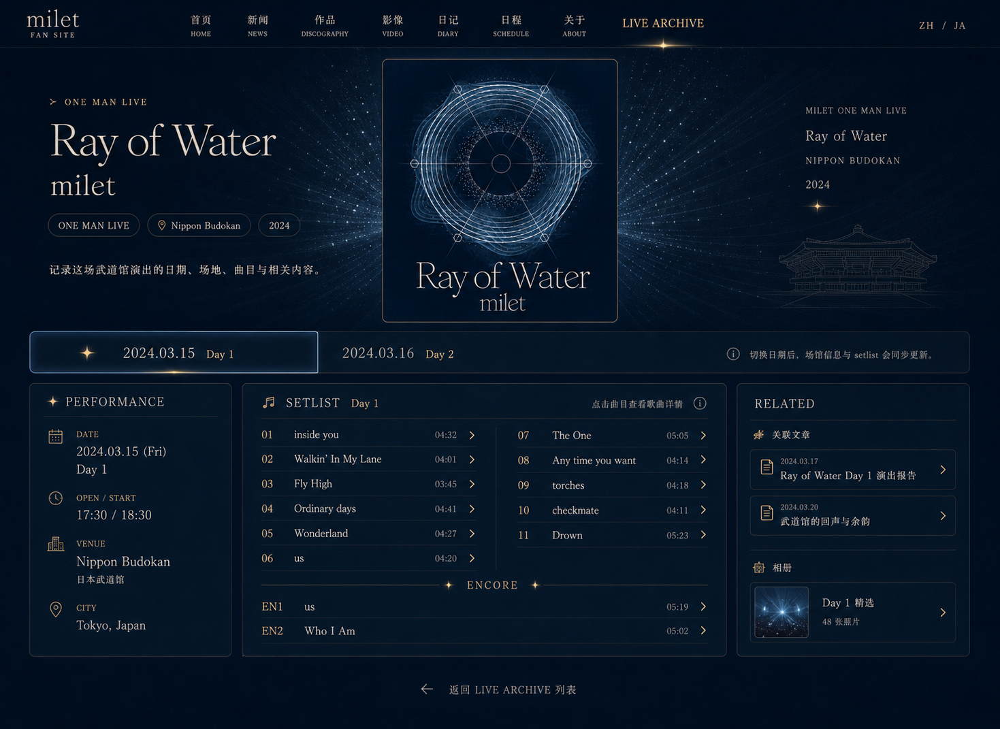
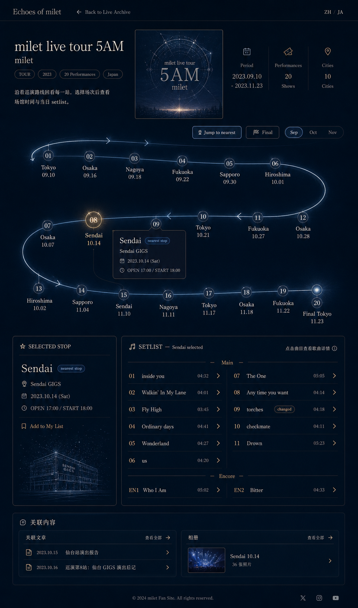

# Live Archive 实现方案

## 背景

当前公开端已有 timeline、release、gallery、article、pilgrimage 等内容模块，但演出相关内容仍分散在首页高亮、时间线、图集和文章中。下一步建议新增一个独立的 `Live Archive` 模块，用来承载 milet 的巡演、one man live、特别单场演出等档案内容。

本方案只描述可行实现，不包含代码落地。

## 目标

1. 公开端新增 `Live Archive` 模块。
2. 模块默认展示演出列表，列表展示主视觉图和基本信息。
3. 点击演出进入演出详情页。
4. 详情页不沿用公开端现有内容页布局，而是使用浏览器窗口整体空间，形成更沉浸的演出档案页面。
5. 详情页仍保留必要的公开端能力：
   - 公开端标题。
   - 语言切换。
   - 返回演出列表按钮。
6. 支持 one man live 和 tour 两类核心详情体验：
   - one man live：强调单场或两场演出的日期、场馆、setlist 和关联内容。
   - tour：强调巡演历程、站点切换、每站场馆时间和每站 setlist。
7. 管理端新增对应数据管理入口。
8. 演出信息和显示效果配置独立维护：
   - 先录入演出基础数据。
   - 再为已有演出配置公开端展示效果。

## 涉及工程

- `echoes-of-milet`
  - 公开端。
  - 新增 Live Archive 列表页、详情页、组件体系、SSR 数据读取。
- `data-admin`
  - 管理端。
  - 新增演出档案管理页面、演出信息弹窗、场次弹窗、setlist 关联弹窗、显示效果配置入口。
- `milet-worker-ts`
  - Worker/API。
  - 新增 D1 表、管理端 API、公开端 API、权限声明、缓存和数据聚合。

## 总体原则

1. 公开端列表页基于当前公开端整体布局，只添加新模块入口，不重做全站框架。
2. 演出详情页使用独立的全窗口档案布局，但不能脱离语言、标题和返回路径。
3. 演出数据和显示配置分离，避免内容维护被视觉配置拖复杂。
4. one man live 和 tour 使用相同的基础组件，只通过不同 blueprint 组合。
5. `theme / motif` 只作为显示配置，不作为页面可见内容字段展示。
6. 关联内容只保留关联文章和相册，默认以轻量入口展示。
7. setlist 曲目从现有歌曲库中搜索并关联，点击曲目复用公开端现有歌曲详情弹窗。
8. 巡演详情不做复杂地图组件，优先使用巡演主视觉图 + 站点历程交互，降低实现和维护成本。
9. 公开端 SSR 首屏数据必须稳定、可序列化，组件选择必须来自静态 registry。

## 公开端信息架构

### 新增入口

建议新增：

```text
/:lang/milet/live
/:lang/milet/live/:slug
```

列表页：

```text
Live Archive
  - 演出列表
  - 类型筛选：All / Tour / One Man Live / Special Live
  - 年份筛选
  - 关键词搜索
```

详情页：

```text
Live Event Detail
  - 独立全窗口布局
  - 顶部保留：
    - 公开端标题
    - 语言切换
    - 返回 Live Archive
```

### 列表页

列表页基于当前公开端布局，作为 `milet` 体系中的新模块。

每个演出卡片建议展示：

- 主视觉图。
- 演出名称。
- 演出类型。
- 年份。
- 日期范围。
- 场馆或城市数量。
- 场次数量。
- 简短描述。

示例：

```text
Ray of Water
ONE MAN LIVE / 2024
2024.03.15 - 2024.03.16
Nippon Budokan / 2 performances
```

巡演示例：

```text
milet live tour 5AM
TOUR / 2023
2023.09.10 - 2023.11.23
8 cities / 12 performances
```

列表页组件建议：

```text
LiveArchiveListPage
LiveArchiveFilterBar
LiveArchiveCard
LiveArchiveYearGroup
```

### 详情页 Shell

详情页不使用当前公开端常规页面布局，但需要保留轻量全局能力：

```text
LiveDetailShell
  - site title
  - language switch
  - back button
  - page content
```

顶部不需要完整主站导航，否则会削弱演出详情页的沉浸感。建议只保留：

```text
Echoes of milet
ZH / JA
Back to Live Archive
```

## 公开端详情页布局

### 第一版视觉基准

第一版先做一组演出详情页，用于验证内容模型、交互和显示配置能力。视觉基准使用以下两张效果图。

One Man Live 详情页基准：



巡演详情页基准：



第一版以这两种页面为目标：

- one man live 使用紧凑档案布局，重点验证日期切换、场次事实、setlist、轻量关联入口。
- tour 使用纵向蛇形巡演路线布局，重点验证 20 场以内的场次可视化导航、当前场次详情、setlist 联动。

### 共用组件

不同详情页布局应尽量复用同一批组件：

```text
MainVisualPanel
DateStrip
TourRouteNavigator
SelectedPerformanceFacts
SelectedStopDrawer
ProgressStrip
ClickableSetlist
CompactRelatedLinks
```

组件职责：

- `MainVisualPanel`
  - 展示演出主视觉图。
  - 支持 one man live、tour、special live。
- `DateStrip`
  - 适合 one man live 的 Day 1 / Day 2 切换。
- `TourRouteNavigator`
  - 适合巡演的场次导航。
  - 第一版使用 `serpentine` 形态，用纵向蛇形路线承载最多 20 个左右的紧凑场次节点。
- `SelectedPerformanceFacts`
  - 展示当前选中场次的日期、开场、开演、城市、场馆。
- `SelectedStopDrawer`
  - 巡演站点详情抽屉或侧栏。
- `ProgressStrip`
  - 巡演历程的轻量进度表达。
- `ClickableSetlist`
  - 展示当前选中场次的有效 setlist。
  - 有效 setlist 由演出级默认 setlist 和场次级调整合成。
  - 按 `Main / Encore / Double Encore` 分组展示。
  - 曲目行可点击，打开现有歌曲详情弹窗。
- `CompactRelatedLinks`
  - 轻量展示关联文章和相册。
  - 默认只展示 1-2 篇文章、1-2 个相册。

### One Man Live 布局

适用于单场或两场演出。

推荐 blueprint：

```text
one-man-magazine
```

结构：

```text
LiveDetailShell
  MainVisualHeader
  DateStrip
  ContentGrid
    SelectedPerformanceFacts
    ClickableSetlist
    CompactRelatedLinks
```

交互：

1. 用户进入详情页，默认选中第一场。
2. 如果只有一场，不显示或弱化 `DateStrip`。
3. 如果有两场，显示 Day 1 / Day 2。
4. 切换日期后：
   - 场次事实更新。
   - setlist 按该场次的差异配置更新。
   - 关联文章和相册保持 event 级。
5. 点击 setlist 中的曲目：
   - 如果已关联歌曲库 track，打开现有歌曲详情弹窗。
   - 如果只是文本曲目，显示不可点击或弱提示。

### Tour 布局

适用于多城市、多场次巡演。

推荐 blueprint：

```text
tour-serpentine-route
```

结构：

```text
LiveDetailShell
  TourDashboardHeader
  TourConsole
    TourRouteNavigator.serpentine
    MainVisualPanel
    SelectedStopDrawer
  ProgressStrip
  LowerGrid
    ClickableSetlist
    CompactRelatedLinks
```

交互：

1. 用户进入巡演详情页，默认选中场次由 API 返回：
   - 巡演未结束时，选中距离当前时间最近的场次。
   - 巡演已结束时，选中最后一场。
2. 蛇形路线节点展示日期、城市和场馆摘要。
3. 中间使用纵向蛇形路线展示全部场次节点，不做复杂地图。
4. 右侧展示当前站点详情。
5. 切换站点后：
   - 当前站点详情更新。
   - setlist 按该站点的差异配置更新。
   - 进度条高亮更新。
6. setlist 曲目同样支持点击打开歌曲详情弹窗。

## 内容模型

建议把演出拆成两层：

```text
Live Event 演出企划
Live Performance 具体场次
```

### Live Event

演出企划字段：

```text
id
slug
type: one_man | tour | special_live | festival
artist
year
dateStart
dateEnd
mainVisualImageId
mainVisualAlt
mainVisualFocalPoint
mainVisualFitMode: cover | contain
mainVisualCredit
status: draft | published | archived
eventStateOverride: upcoming | ongoing | ended | null
defaultLang: zh | ja
draftRevision
deletedFlag
deletedAt
sortNo
createdAt
updatedAt
```

说明：

- `type` 决定管理端表单和默认 blueprint。
- `mainVisualImageId` 是演出主视觉图。
- 主视觉需要保存 alt、焦点、适配模式和来源信息，列表页和详情页都依赖它。
- 列表页和详情页都使用主视觉图。
- `summary` 是内容字段，不包含 theme / motif 文案。
- `status` 是内容发布状态。
- `eventStateOverride` 是可选手动覆盖值，不直接作为最终演出时间状态。
- API 返回时根据场次日期和固定 JST 计算 `computedEventState`；如果存在 `eventStateOverride`，由 service 层按明确优先级覆盖计算结果。
- 默认选中场次、缓存策略和公开端状态展示都使用 API 返回的 `computedEventState`，避免存储状态过期。
- `draftRevision` 在演出草稿相关数据保存时更新，用于让旧 preview token 失效。
- 删除采用软删除，公开端列表和详情必须过滤 `deletedFlag`。
- 多语言标题、简介和 SEO 文案不放在主表，使用 `live_event_i18n` 维护。

演出多语言字段：

```text
eventId
lang: zh | ja
title
summary
seoTitle
seoDescription
```

多语言规则：

- URL 的 `:lang` 决定公开端优先语言。
- 缺失目标语言时 fallback 到 `defaultLang`。
- 管理端发布时至少要求 `defaultLang` 的标题和简介完整。
- 城市和场馆名称第一阶段可直接使用原始名称；如后续需要翻译，再增加 performance i18n，而不是提前把字段塞进主表。

### Live Performance

具体场次字段：

```text
id
eventId
performanceNo
label
date
openTime
startTime
city
region
venueName
venueAddress
venueOfficialUrl
venueLineArtImageId
notesZh
notesJa
sortNo
```

one man live：

```text
Day 1
Day 2
```

tour：

```text
Tokyo
Osaka
Nagoya
...
Final Tokyo
```

### Setlist

setlist 建议采用“演出级默认配置 + 场次级差异调整”。

原因：

- 巡演中不同场次的 setlist 通常差异不大。
- 如果每个场次都完整维护一份 setlist，管理端输入量和后续修正成本都会很高。
- 公开端仍然按当前选中场次展示 setlist，但数据由服务端或前端合成得到。

演出级 setlist：

```text
id
eventId
title
setlistState: upcoming_hidden | not_announced | not_recorded | published
emptyMessageZh
emptyMessageJa
notes
```

`setlistState` 用于处理 setlist 未录入、演出未开始或信息未公开的情况，不等同于 event 的发布状态。第一阶段按 event 级维护状态，巡演所有场次共用同一 setlist 公开状态。

建议枚举：

```text
upcoming_hidden
not_announced
not_recorded
published
```

setlist items：

```text
id
setlistId
itemKey
sortNo
section: main | encore | double_encore
songWorkId
songTrackId
displayTitle
notes
```

场次级 setlist override：

```text
id
performanceId
operation: add | remove | replace | move | note
baseItemKey
overrideItemKey
sortNo
section
songWorkId
songTrackId
displayTitle
notes
```

规则：

- setlist 选择曲目时按 track 级别关联，和发布物中的曲目关系保持一致。
- 每个默认 setlist item 必须有稳定 `itemKey`，用于场次差异定位。
- 场次级 override 不依赖 `sortNo` 定位默认曲目，`remove / replace / move / note` 必须通过 `baseItemKey` 指向默认曲目。
- `add` 操作使用 `overrideItemKey` 标识新增曲目，避免同一场多次添加时无法稳定排序。
- `section` 是 setlist 的结构字段，用于区分正篇、encore、double encore，不只作为备注。
- 公开端按 `section` 分组展示；没有 encore 时不显示空分组。
- 排序先按 `section` 顺序，再按 `sortNo`。
- `songWorkId` 和 `songTrackId` 是公开端打开歌曲详情弹窗所需的完整标识，管理端保存 setlist 和场次 override 时需要同时保存。
- 曲目选择参照发布物曲目关联的现有做法，复用相同的歌曲库搜索和 track 选择。
- 管理端歌曲搜索接口需要返回纯数字 `work_id` 和 `track_id`，不要返回 `trackId_123` 这类仅用于旧表单的临时展示标识。
- 公开端需要的歌曲弹窗入参应由 API 直接返回，避免前端在 live 模块中根据不完整 ID 猜测或拼接 track 标识。
- 如果歌曲库中没有，可以临时保存 `displayTitle`。
- 公开端点击曲目时，只有存在可映射到现有歌曲详情弹窗的数据，才打开弹窗。
- 具体场次只维护差异项，例如追加 encore、替换某首歌、调整顺序、补充备注。
- Worker 详情接口只返回演出默认 setlist 和每场差异数据，不返回所有场次完整 setlist。
- 公开端提供一个 SSR/CSR 共用的纯函数合成当前场次有效 setlist。
- SSR 首屏使用同一个合成函数生成默认选中场次的 setlist，客户端切换场次时复用该函数。
- 这样 20 场左右的巡演也只需要传输一份默认 setlist 和少量差异数据。
- setlist 允许为空，但 API 需要返回明确的 `setlistState`，供公开端展示空状态。
- 如果 `setlistState = published`，则必须至少存在一个有效曲目；否则不能发布为“已公开 setlist”。
- 如果演出未开始且未公开 setlist，公开端文案优先提示“演出日期未到，setlist 暂未公开”。
- 如果演出已结束但仍未录入，公开端文案提示“setlist 信息暂未公开”或使用管理端配置的空状态文案。

合成顺序：

1. 读取演出级默认 setlist。
2. 按 `section` 和 `sortNo` 得到默认顺序。
3. 对当前场次应用 `remove`。
4. 对当前场次应用 `replace`。
5. 对当前场次应用 `move`。
6. 对当前场次应用 `note`。
7. 对当前场次应用 `add`。
8. 最后再次按 `section` 和 `sortNo` 输出有效 setlist。

override 约束：

- 同一 `performanceId + baseItemKey` 只能存在一个 `remove / replace / move / note` 主操作，避免同一默认曲目同时 remove 和 replace。
- `note` 如果需要和 `move` 或 `replace` 同时存在，优先作为字段合并到同一 override 记录，不拆成多条。
- `add` 使用 `overrideItemKey`，并要求同一 `performanceId + overrideItemKey` 唯一。
- `sortNo` 是 section 内排序，不是全局排序。
- 默认 setlist item 删除时，对应 `baseItemKey` 的 override 视为 orphan，管理端需要在保存默认 setlist 后提示清理或自动禁用。
- 默认 setlist item 的 `itemKey` 一旦生成不随排序、section、曲目替换而变化；真正删除后不能复用旧 key。

测试要求：

- setlist 合成纯函数必须补单测。
- 覆盖 add、remove、replace、move、note、跨 section move、orphan override、无 override 等场景。

### 关联文章和相册

关联内容只考虑：

```text
related_articles
related_galleries
```

关联采用“按内容类型拆分的通用关联表”设计，不为 live 单独建立文章/相册专用关联表。

```text
文章 -> article_relations
相册 -> gallery_relations
```

这样文章继续复用现有文章关联体系；相册新增一张和 `article_relations` 类似的通用关联表，后续也可以扩展到其他 target。

关联目标层级：

```text
event 级
```

第一阶段建议：

- 文章：只做 event 级关联。
- 相册：从现有 gallery 模块中选择，不新增 live 专属相册类型。
- 相册只做 event 级关联。
- 单次巡演公开照片数量通常不会多到需要为每个场次单独组织相册，因此不考虑 performance 级相册。

文章关联规则：

```text
article_relations.article_id
article_relations.target_type = live_event
article_relations.target_id = live_events.id
article_relations.sort_no
```

相册关联字段建议：

```text
gallery_relations.gallery_id
gallery_relations.target_type = live_event
gallery_relations.target_id = live_events.id
gallery_relations.sort_no
```

约束：

- 第一阶段 `article_relations.target_type` 增加 `live_event`。
- 第一阶段 `gallery_relations.target_type` 只开放 `live_event`。
- 第一阶段不支持 `live_performance` 级关联。
- 后续如有需要，可以继续给两张关联表扩展 `target_type`，例如其他公开内容对象。

公开端展示规则：

- 默认显示最多 2 篇文章。
- 默认显示最多 2 个相册。
- 无关联内容时隐藏 `CompactRelatedLinks`。
- 关联内容区域永远是辅助模块，不作为页面主视觉区。

## 显示效果配置

演出信息和显示效果配置必须独立。

### 演出信息

演出信息是内容事实：

```text
标题
类型
年份
日期
场次
场馆
setlist
关联文章
相册
```

### 显示效果

显示效果是公开端渲染策略：

```text
blueprint
themePreset
component settings
main visual treatment
```

建议配置字段：

```text
eventId
status: draft | published
blueprint
themePreset
updatedAt
```

第一版范围：

- 第一阶段只支持 `blueprint + themePreset`。
- `blueprint` 用于选择不同详情页面布局，当前支持 `one-man-compact-related`、`one-man-visual-cards`、`tour-balanced-stops`、`tour-serpentine-route`。
- `themePreset` 用于选择不同详情页主题，当前支持 `default`、`echo-blue`、`stairs-colors`。其中 `default` 是 Midnight Gold，`echo-blue` 使用网站整体天空蓝风格，`stairs-colors` 参考 stairs 2024 周边图的粉橙晚霞背景。
- 管理端可选 `blueprint / themePreset` 不写死在页面中，统一从现有 `system_config` 功能读取。
- 组件级启用/隐藏、组件顺序和局部参数不进入当前落地范围，文档中标记为 Phase 5 deferred。
- 页面组件组合由 blueprint 固定决定，降低管理端和 SSR 复杂度。

显示效果配置需要区分草稿和发布状态：

- `draft` 用于管理端编辑和公开端 preview。
- `published` 用于正式公开页面 SSR。
- 当显示配置未发布时，公开端详情页使用系统默认 blueprint。
- 管理端可以先完成演出信息和 setlist，再逐步调整显示效果草稿，最后发布显示配置。

发布前需要进行必要校验：

- 演出标题、类型、年份、日期范围必须完整。
- 必须设置主视觉图。
- 至少存在一个场次。
- 场次必须有日期、开场/开演时间、城市和场馆。
- 场馆官网如填写，必须是合法 `http(s)` URL。
- setlist 可以未公开或未录入，但必须有明确的 `setlistState`。
- 当 setlist 状态为 `published` 时，才要求至少包含一个 `main` section 曲目。
- 当 setlist 状态为 `published` 时，已关联曲目必须能映射到发布物曲目关联使用的 track 标识。
- 显示配置未发布时允许发布演出，但公开端使用默认 blueprint。
- 第一版显示配置发布时只校验 blueprint 和 themePreset 均在系统配置的可用项中存在，且 blueprint 与演出类型兼容。
- Phase 5 deferred 的组件级配置暂不校验 componentKey。

可用项配置规则：

- 系统配置新增两个 `code`：`live_detail_blueprints` 和 `live_detail_themes`。
- 每个可选项使用一条 `system_config` 记录，`ckey` 是公开端识别的稳定 key，`order_no` 控制管理端下拉排序。
- `cvalue` 使用 JSON。布局项包含 `label`、`description`、`group`、`supportedTypes`、`enabled`；主题项包含 `label`、`description`、`enabled`。
- 管理端显示效果弹窗从 `system_config` 读取可选项，并按演出类型过滤布局：`tour` 只能选择 tour 布局，其他演出只能选择 one-man 布局。
- Worker 保存、发布和预览 token 覆盖时读取同一份系统配置做校验；配置缺失时使用内置 fallback，避免测试库未初始化时阻断功能。
- 公开端仍保留本地 registry / catalog 负责实际渲染实现。新增主题或布局时，公开端先实现渲染能力，再到管理端系统配置中添加或启用对应 `ckey`。
- 稳定 key 不应随组件文件重构变化；系统配置只控制“可选择”，不承载 Vue 组件实现。

`blueprint` 示例：

```text
one-man-magazine
tour-serpentine-route
```

Phase 5 deferred 组件级配置示例，本轮不落地：

```text
mainVisual.default
dateStrip.default
performanceFacts.default
setlist.clickable
related.compact
tourRouteNavigator.serpentine
selectedStopDrawer.default
progressStrip.default
```

### componentKey

`componentKey` 是公开端组件 registry 的唯一编号，不是文件路径。

管理端保存：

```text
setlist.clickable
related.compact
mainVisual.default
```

公开端根据 registry 渲染：

```text
componentKey -> Vue component
```

这样可以保证：

- SSR 可分析。
- 管理端不用知道公开端文件路径。
- 组件重构不影响已保存配置。
- one man live 和 tour 可以复用同一个组件，只改变组合位置。

## 公开端 SSR 约束

详情页需要 SSR 友好。

要求：

1. API 返回 event、performances、eventSetlist、setlistOverrides、relations、displayConfig。
2. 首屏默认选中场次由服务端确定：
   - one man live：第一场。
   - tour 未结束：距离当前时间最近的场次。
   - tour 已结束：最后一场。
3. 初始选中状态注入 SSR initial state。
4. 组件选择来自静态 registry，不使用任意字符串动态 import。
5. 不在 SSR 阶段访问 `window`、`document`、`localStorage`、DOM 尺寸。
6. 歌曲详情弹窗只在客户端交互后打开。
7. 详情页全窗口布局仍通过当前 `src/server/render.ts` 和 Pages Function 管线渲染。

进行中的巡演需要特别处理缓存：

- 演出详情页仍采用 SSR。
- 进行中巡演的场次、setlist、关联内容可能持续调整，不建议做长期 SSG。
- Worker 公开详情接口应按演出状态控制缓存时间：
  - 已结束且稳定的演出可以使用较长缓存。
  - 进行中或草稿预览数据使用短缓存或不缓存。
- 管理端更新演出、场次、setlist、关联内容或显示配置发布后，需要清理对应 live event detail 缓存。
- 缓存只保存演出、场次、默认 setlist、场次差异和关联内容等原始数据。
- `initialPerformanceId` 不进入缓存，每次请求读取缓存数据后即时计算。
- 默认场次计算固定使用 JST，避免服务端和客户端时区差异导致结果不一致。
- SSR 默认选中场次要由稳定规则决定，不随客户端环境变化：
  - one man live：第一场。
  - tour 未结束：距离当前时间最近的场次。
  - tour 已结束：最后一场。
  - 默认选中结果必须由 API 明确返回为 `initialPerformanceId`。

动态 SEO 链路：

- `RouteMeta.seoKey` 使用当前代码中的 `liveEvent`。
- SSR 初始状态需要增加 `miletLiveDetailData`，保存 live 详情页首屏数据。
- `LiveDetailView` 或对应 composable 在 `onServerPrefetch` 中拉取 live detail，并写入 AppState 的 `miletLiveDetailData`。
- `src/server/render.ts` 保持现有模式：`renderToString` 后读取 AppState，再交给 SEO 生成逻辑。
- `src/server/seo.ts` 的 `renderSeoTags` 读取 `miletLiveDetailData`：
  - title 使用演出标题。
  - description 使用演出简介。
  - OG image 使用演出主视觉图。
- 管理端已经提供多语言 `seoTitle / seoDescription` 输入，但当前保存时自动以标题和简介补齐，和 event 展示数据保持一致；第一阶段公开端 SEO 不再单独读取这两个字段，后续如果需要独立 SEO 文案，再调整为优先读取 `seoTitle / seoDescription`。
- 客户端 hydrate 后不得重新计算出不同的 title/OG 数据，避免 SSR head 与客户端状态不一致。

缓存 key 建议：

```text
live:list:{lang}:{type}:{year}:{keyword}:{page}:{pageSize}
live:detail:{lang}:{slug}
live:display:{eventId}:published
live-preview:{previewId}
```

缓存失效：

- 演出基础信息发布、归档、删除：清理对应详情缓存和全部 live list 缓存。
- 场次更新：清理对应详情缓存和全部 live list 缓存。
- setlist 或场次差异更新：清理对应详情缓存。
- 显示配置发布：清理对应详情缓存和 `live:display:{eventId}:published`。
- preview 草稿更新：清理对应 `live-preview:{previewId}`。

管理端需要提供 cache clear 能力：

```text
POST /admin/live/events/:id/cache/clear
POST /admin/live/cache/clear-list
```

## 草稿预览与跨域安全

管理端和公开端可能部署在不同域名下，预览不能依赖跨域 cookie，也不能让公开端读取管理端登录态。第一阶段采用 KV 暂存 preview token 和草稿快照。

### 预览流程

```text
管理端已登录用户
  -> 在显示效果配置弹窗中选择 blueprint / themePreset
  -> 管理端从 system_config 读取公开端域名 public_site_origin / echoes-of-milet
  -> POST /admin/live/events/:id/preview-token，body 可携带本次预览的 displayConfig 和 publicBaseUrl
  -> Worker 校验 live.view / live.update 权限
  -> Worker 聚合当前草稿数据，将 body.displayConfig 覆盖到本次 snapshot，并写入 KV
  -> 返回 previewId、previewToken、previewUrl、expiresAt
  -> 管理端使用 previewUrl 与公开端域名构建完整 URL
  -> 新标签页打开完整公开端 preview URL
  -> 公开端 SSR 请求 /api/milet/live/preview/:previewId?token=...
  -> Worker 校验 KV 中 token 后返回草稿快照
```

说明：

- 第一阶段不使用 iframe 嵌入预览，避免跨域 iframe、postMessage、高度自适应和 CSP frame-ancestors 配置复杂度。
- `system_config` 建议新增：
  - `code = public_site_origin`
  - `ckey = echoes-of-milet`
  - `cvalue = {"origin":"https://miles-dml.org"}`
- 管理端打开预览时统一使用新标签页。preview token 仍保持短期有效、一次性读取、noindex 和 no-store。

公开端预览 URL：

```text
/:lang/milet/live-preview/:previewId?token=...
```

公开端预览 API：

```text
GET /api/milet/live/preview/:previewId?token=...
```

### KV 数据设计

KV binding 使用现有 `miletkv`，不为 Live Archive 额外新增 KV binding。通过 key prefix 隔离不同用途。

KV key：

```text
live-preview:{previewId}
live-preview-index:{eventId}:{previewId}
```

KV value：

```ts
type LivePreviewSnapshot = {
  previewId: string
  eventId: number
  draftRevision: string
  lang: 'zh' | 'ja'
  tokenHash: string
  consumedAt: string | null
  createdBy: string
  createdAt: string
  expiresAt: string
  payload: {
    event: LiveEventDetail
    performances: LivePerformance[]
    eventSetlist: LiveSetlist
    setlistOverridesByPerformanceId: Record<string, LiveSetlistOverride[]>
    relatedArticles: RelatedArticleSummary[]
    relatedGalleries: RelatedGallerySummary[]
    displayConfig: LiveDisplayConfig
    initialPerformanceId: string
  }
}
```

KV TTL：

- 默认有效期 10-30 分钟。
- 第一版建议 15 分钟。
- KV 写入时设置 expirationTtl。
- `expiresAt` 也写入 value，作为服务端二次校验。

token 规则：

- `previewToken` 使用高随机值。
- preview token 是临时生成的一次性 token。
- KV 中只保存 `tokenHash`，不保存明文 token。
- API 请求时对 query token 做 hash 后常量时间比较。
- token 绑定 `previewId`、`eventId`、`draftRevision`、`lang`、`createdBy` 和过期时间。
- Worker 成功读取预览后，应将 KV 中 `consumedAt` 写入或删除该 key，使同一 token 不能重复使用。
- 如果刷新预览页或需要再次查看，管理端应重新生成 preview token。

### 安全响应头

preview 页面和 preview API 必须禁用索引和缓存：

```text
Cache-Control: no-store
X-Robots-Tag: noindex, nofollow
Referrer-Policy: no-referrer
```

注意：

- 预览使用新标签页打开，不需要为公开端放开 iframe 嵌入。
- 不使用 postMessage 联动，降低跨域维护成本。

### 失效规则

- KV TTL 到期自动失效。
- 演出重新保存草稿后，`draftRevision` 变化，管理端需要重新生成 preview token。
- 保存新草稿时应通过 `live-preview-index:{eventId}:*` 主动删除该 event 旧的 preview KV key，避免旧 snapshot 在 TTL 前仍可访问。
- 演出发布、归档、删除后，已有 preview token 视为无效。
- Worker 校验 preview 时，如果 snapshot 中 event 状态或 `draftRevision` 与当前 event 不一致，应拒绝或提示重新生成预览。

### SSR 注意事项

- preview 路由仍走公开端 SSR 管线，但数据源为 KV snapshot。
- preview SSR 不写入普通 `live:detail:*` 缓存。
- preview 不读取管理端 cookie，不依赖跨域登录态。
- preview 的 `initialPerformanceId` 来自 snapshot，确保服务端和客户端水合一致。
- preview token 是一次性的，SSR 成功读取后客户端 hydrate 必须复用 SSR initial state，不再二次请求 preview API。
- 如果 preview 页面以 CSR fallback 方式直接请求 preview API，成功后也要避免刷新式重复请求；刷新页面应提示重新生成预览。

## Worker API

### 公开端 API

建议新增：

```text
GET /api/milet/live/events
GET /api/milet/live/events/:slug
GET /api/milet/live/preview/:previewId?token=...
```

列表接口 query：

```text
lang=zh|ja
type=all|one_man|tour|special_live|festival
year=2024
keyword=...
page=1
pageSize=12
```

`keyword` 第一阶段覆盖演出标题、简介、slug、场次城市、地区、场馆名称和场馆地址。由于列表接口本身已经聚合 performances 用于 `cityCount / venueSummary`，扩展城市和场馆搜索不需要新增 API。

列表接口分页返回：

```text
items[]
page
pageSize
total
totalPages
filters
```

列表接口返回：

```text
id
slug
type
title
year
dateStart
dateEnd
mainVisual
performanceCount
cityCount
venueSummary
summary
```

详情接口返回：

```text
event
performances[]
eventSetlist
setlistOverridesByPerformanceId
setlistState
setlistEmptyMessage
relatedArticles
relatedGalleries
displayConfig
initialPerformanceId
```

公开端新增 API 后需要更新：

```text
echoes-of-milet/api-proxy.config.json
```

代理白名单应使用 `/api/milet/live` 前缀，覆盖列表、详情和 preview：

```text
/api/milet/live
```

不要只登记 `/api/milet/live/events`，否则 `/api/milet/live/preview/:previewId` 可能无法通过 Pages Function 代理。

### 管理端 API

建议新增：

```text
GET  /admin/live/events
GET  /admin/live/events/:id
POST /admin/live/events/save
POST /admin/live/events/delete
POST /admin/live/events/:id/publish
POST /admin/live/events/:id/archive
POST /admin/live/events/:id/cache/clear
POST /admin/live/cache/clear-list

GET  /admin/live/events/:id/performances
POST /admin/live/performances/save
POST /admin/live/performances/delete
POST /admin/live/events/:id/performances/imports
GET  /admin/live/performance-imports/:importId/preview
POST /admin/live/performance-imports/:importId/confirm

GET  /admin/live/events/:id/setlist
POST /admin/live/events/:id/setlist/save

GET  /admin/live/performances/:id/setlist-overrides
POST /admin/live/performances/:id/setlist-overrides/save

GET  /admin/live/events/:id/display
POST /admin/live/events/:id/display/save
POST /admin/live/events/:id/display/publish

POST /admin/live/events/:id/preview-token   # body 可选 displayConfig，用于当前弹窗选择的即时预览
```

管理端新增 API 后需要更新：

```text
data-admin/public/_worker.js
```

Worker 中 `/admin` 路由需要显式配置权限。

删除语义：

- `POST /admin/live/events/delete` 第一阶段采用软删除，不做物理删除。
- 已发布或归档演出删除时标记 deleted，不直接移除关联表、setlist 和场次数据。
- 草稿演出如没有公开引用，可以允许物理清理，但第一阶段建议仍走软删除，降低误删风险。
- 公开端列表和详情接口必须过滤 deleted 数据。
- 如后续需要物理清理，单独增加管理员维护工具，不复用普通 delete 接口。

## 管理端设计

### 页面入口

新增管理页面：

```text
Live Archive 管理
```

默认展示已有演出列表。

列表字段：

```text
主视觉缩略图
标题
类型
年份
日期范围
场次数
状态
显示效果状态
更新时间
操作
```

操作：

```text
编辑信息
场次
导入场次
Setlist
关联内容
显示效果
预览
发布/下架
```

### 添加新演出

添加新演出使用弹窗。

弹窗只维护演出基础信息，不放入复杂场次和 setlist。

字段：

```text
类型
标题
年份
日期范围
主视觉图
简介
状态
```

保存后回到列表，并允许继续配置：

```text
添加场次
设置 setlist
关联文章/相册
设置显示效果
```

### 场次管理

场次信息使用弹窗维护。

one man live：

```text
添加 Day 1
添加 Day 2
```

tour：

```text
添加巡演站点
```

字段：

```text
标签
日期
开场时间
开演时间
城市
地区
场馆名称
场馆地址
场馆官网
场馆线条图
备注
排序
```

巡演场地信息不需要在演出主表里堆叠，全部进入 performance 层。

巡演场次数量较多时，管理端应提供“导入场次”弹窗，支持单段 TSV 粘贴、导入预览和确认写入。导入流程参照圣地巡礼地点导入，不能粘贴后直接写库。

### Setlist 设置

setlist 设置使用多个弹窗入口，避免单个表单过重。

建议拆分为：

```text
默认 Setlist 弹窗
场次差异弹窗
曲目选择弹窗
```

默认 Setlist 弹窗：

1. 维护演出级默认 setlist。
2. 维护 setlist 状态：已公开、未公布、演出前隐藏、未录入。
3. 当状态不是已公开时，允许不添加曲目，并可维护空状态文案。
4. 弹窗内按 section 分组显示曲目：
   - Main
   - Encore
   - Double Encore
5. 每个 section 内独立排序。
6. 移动曲目时允许跨 section 调整。
7. 添加曲目时打开“曲目选择弹窗”。

曲目选择弹窗：

1. 参照发布物曲目关联的做法。
2. 复用现有歌曲库搜索和 track 选择逻辑。
3. 选择结果回填到默认 setlist 或场次差异。

场次差异弹窗：

1. 选择具体场次。
2. 基于默认 setlist 展示差异状态。
3. 如果默认 setlist 尚未公开，提示先公开默认 setlist，第一版不允许配置场次差异。
4. 对该场次维护差异：
   - 添加曲目。
   - 移除曲目。
   - 替换曲目。
   - 调整顺序。
   - 调整 section。
   - 添加备注。
5. 支持复制其他场次的差异配置。

这样可以降低数据输入时表单的视觉复杂度，也避免一个弹窗同时承担默认 setlist、曲目搜索和场次覆盖三类任务。

### 关联文章和相册

关联也使用弹窗。

文章：

```text
搜索文章
选择文章
排序
移除
```

相册：

```text
从现有相册中搜索
选择已有相册
排序
移除
```

相册只在演出 event 级维护，不进入具体场次弹窗。

关联内容区不需要复杂布局，因为公开端预计只展示少量入口。

### 显示效果配置

显示效果配置在演出信息完成后进行。

管理入口：

```text
设置显示效果
```

字段：

```text
blueprint
themePreset
```

第一阶段只配置 `blueprint + themePreset`。组件启用状态、组件顺序和局部参数标记为 Phase 5 deferred，本轮不落地。

管理端不直接渲染公开端组件。建议使用 component catalog：

```text
componentKey
名称
说明
适用类型
预览缩略图
可配置参数
```

`blueprint / themePreset` 的管理端下拉数据来自系统配置：

```text
code: live_detail_blueprints
ckey: one-man-compact-related
cvalue: {"label":"One Man Compact Related","group":"one-man","supportedTypes":["one_man","special_live","festival"],"enabled":true}

code: live_detail_themes
ckey: echo-blue
cvalue: {"label":"Echo Blue","enabled":true}
```

真实预览通过公开端 preview 路由完成：

```text
/:lang/milet/live-preview/:previewId?token=...
```

预览入口放在显示效果配置弹窗内，不再作为 live 列表行内独立按钮。管理人在弹窗中选择 `blueprint + themePreset` 后，点击“生成预览”，管理端将当前表单中的显示配置随 `POST /admin/live/events/:id/preview-token` 一起传给 Worker。Worker 只把这份显示配置覆盖到本次 preview snapshot，不直接保存 draft；管理端根据系统配置中的公开端域名拼出完整 preview URL，并用新标签页打开。管理人确认效果后再点击“保存配置”持久化。

preview-token body 示例：

```json
{
  "lang": "zh",
  "publicBaseUrl": "https://miles-dml.org",
  "displayConfig": {
    "blueprint": "tour-serpentine-route",
    "themePreset": "echo-blue",
    "status": "draft"
  }
}
```

## 数据库建议

第一阶段可新增以下表：

```text
live_events
live_event_i18n
live_performances
live_setlists
live_setlist_items
live_performance_setlist_overrides
gallery_relations
live_display_configs
```

文章关联不新增表，复用现有 `article_relations`：

```text
article_relations.target_type 增加 live_event
article_relations.target_id = live_events.id
```

`article_relations` 迁移注意：

- 现有表存在 `CHECK (target_type IN (...))`。
- D1 / SQLite 不能简单 ALTER 已有 CHECK。
- 新迁移应重建 `article_relations` 表并复制旧数据。
- 重建后建议移除数据库层面的 target_type CHECK，改由 `ArticleUtil.TARGET_TYPES`、路由 validator 和 service 校验控制范围。
- 这样后续新增关联对象时，只需要更新服务端类型/校验和目标 provider，不必反复删表重建。
- `ArticleUtil.TARGET_TYPES` 和文章关联目标 provider 需要同步加入 `live_event`。

相册新增 `gallery_relations`，结构参考 `article_relations`：

```text
id
gallery_id
target_type
target_id
sort_no
created_at
updated_at
updated_by
```

约束建议：

```text
UNIQUE(target_type, target_id, gallery_id)
INDEX(target_type, target_id, sort_no, id)
INDEX(gallery_id, target_type, target_id)
```

规则：

- 第一阶段文章关联通过 `article_relations` 支持 `live_event`。
- 第一阶段相册关联通过 `gallery_relations` 支持 `live_event`。
- 相册从现有 gallery 模块中选择。
- `gallery_relations.target_type` 也不使用数据库 CHECK，统一由服务端 TARGET_TYPES / validator / service 校验。
- 后续如其他模块需要相册关联，只扩展服务端校验和目标 provider。
- Worker service 层对公开端统一聚合为 `relatedArticles` 和 `relatedGalleries`，前端不关心底层来自哪张表。

setlist 表关系：

```text
live_event_i18n.event_id -> live_events.id
live_setlists.event_id -> live_events.id
live_setlist_items.setlist_id -> live_setlists.id
live_performance_setlist_overrides.performance_id -> live_performances.id
```

`live_display_configs` 需要保存草稿和发布状态。第一阶段不考虑发布历史版本，只保留当前草稿和当前发布配置，并约束同一 event 同一 status 只有一条有效配置。

## Worker 绑定

草稿预览和场次导入预览使用现有 `miletkv` 暂存，不新增 D1 preview/import 临时表，也不新增 Live Archive 专用 KV binding。

`miletkv` 用途：

- 保存 `live-preview:{previewId}`。
- 保存 `live-preview-index:{eventId}:{previewId}`，用于保存新草稿时主动删除旧 preview snapshot。
- 保存 `live-performance-import:{importId}`。
- preview value 中包含草稿快照、tokenHash、expiresAt、createdBy。
- import value 中包含场次导入预览行、校验结果、eventId 和 createdBy。
- 写入时设置 `expirationTtl`。
- preview API 只读取 KV，不访问管理端 cookie。
- 场次导入 key 只允许管理端 API 读取，不暴露给公开端。

## 公开端路由和导航

公开端需要调整：

```text
src/router/routes.ts
src/composables/SideMenueData.ts
render.config.json
api-proxy.config.json
```

建议路由：

```text
/:lang/milet/live
/:lang/milet/live/:slug
```

路由层级必须明确：

- `/:lang/milet/live` 是列表页，放在现有 `LayoutApp` 的 `milet` children 下，沿用公开端现有布局和导航。
- `/:lang/milet/live/:slug` 是详情页，不能放在 `LayoutApp` children 下，否则会自动套主布局。
- 详情页应和现有文章详情页一样，作为 `/:lang` children 下、`milet` route 的 sibling route。
- 详情页内部使用 `LiveDetailShell` 提供 site title、语言切换和返回列表按钮。

示意：

```text
/:lang
  milet/articles/:slug      -> sibling route, 不套 LayoutApp
  milet/live/:slug          -> sibling route, 不套 LayoutApp
  milet                     -> LayoutApp
    live                    -> 列表页，套 LayoutApp
```

详情页 meta 中明确 SSR：

```text
renderMode: ssr
seoKey: liveEvent
```

详情页第一阶段统一 SSR，不做 SSG。进行中巡演数据可能变化，应依赖短缓存和管理端更新后的缓存失效保证内容及时性。

## 权限

Worker 新增管理权限：

```text
{ subject: 'live', action: 'view' }
{ subject: 'live', action: 'create' }
{ subject: 'live', action: 'update' }
{ subject: 'live', action: 'delete' }
{ subject: 'live', action: 'publish' }
{ subject: 'live', action: 'archive' }
{ subject: 'live', action: 'import' }
```

管理端按钮通过现有 `PermissionButton` 和权限 composable 控制。

说明：

- 权限命名保持和现有 Worker / Admin 权限系统一致。
- 不使用 `live:read`、`live:display:update` 这类字符串式权限。
- 保存显示效果草稿属于 live 更新能力，使用 `live.update`。
- 发布显示效果配置属于发布能力，使用 `live.publish`。
- 发布演出使用 `live.publish`，归档/下架使用 `live.archive`。
- 场次批量导入使用 `live.import`，和现有巡礼导入权限风格保持一致。
- 生成预览 token 需要 `live.view` 和 `live.update`，确保只有有权限维护演出的管理员可以查看草稿预览。

## 分阶段落地

### Phase 1：数据模型与 Worker API

- 新增 migration。
- 新增 `live_event_i18n`。
- 重建 `article_relations` 以移除数据库 CHECK，并在服务端校验中增加 `live_event`。
- 新增 `gallery_relations`，结构参考 `article_relations`，第一阶段支持 `live_event`。
- 新增 ORM / Repository。
- 新增 service。
- 新增管理端 API。
- 新增公开端列表和详情 API。
- 新增 display config 表和基础读写 API，保证详情页第一版可以读取固定 blueprint / themePreset。
- 复用现有 `miletkv` 暂存 preview snapshot 和场次导入预览，不新增 Live Archive 专用 KV binding。
- 新增 preview token 生成 API 和公开端 preview 读取 API。
- 新增场次导入解析、预览和确认 API。
- 更新管理端与公开端代理白名单。

### Phase 2：管理端基础数据维护

- 新增 Live Archive 管理页。
- 演出列表。
- 添加/编辑演出弹窗。
- 场次管理弹窗。
- 场次导入弹窗。
- setlist 管理弹窗。
- 歌曲库搜索关联。
- 关联文章/相册弹窗。

### Phase 3：公开端列表页

- 新增 Live Archive 入口。
- 新增演出列表页。
- 列表卡片展示主视觉和基础信息。
- 支持类型、年份、关键词筛选。

### Phase 4：公开端详情页

- 新增 `LiveDetailShell`。
- 实现 one man live blueprint。
- 实现 tour blueprint。
- 实现场次切换。
- 实现 setlist 曲目点击打开歌曲详情弹窗。
- 实现轻量关联文章和相册入口。
- 实现最小可用公开端 preview 路由，读取 KV snapshot 渲染草稿。

### Phase 5：显示配置收口

- 管理端显示效果配置支持选择详情页面布局 `blueprint`。
- 管理端显示效果配置支持选择主题 `themePreset`。
- 管理端详情布局和主题下拉从 `system_config` 的 `live_detail_blueprints / live_detail_themes` 读取。
- 管理端预览打开地址从 `system_config` 的 `public_site_origin / echoes-of-milet` 读取公开端域名。
- Worker 从同一份系统配置校验可用 blueprint 和 theme preset。
- 公开端详情页按已发布 / 预览 display config 选择布局和主题。
- 管理端使用新标签页打开预览链接，不做 iframe 嵌入和 postMessage 联动。
- Deferred：组件级启用/隐藏、组件顺序和局部参数不做。
- Deferred：component catalog、公开端 registry 和组件级配置变更后的 preview 交互增强不做。

### Phase 6：验证和优化

- Worker 跑 `npm run test`。
- 管理端跑 `npm run type-check` 和 `npm run build`。
- 公开端跑 `npm run type-check`、`npm run build:ssr`、`npm run verify:ssr:local`。
- 浏览器检查：
  - 列表页桌面和移动端。
  - one man live Day 1 / Day 2 切换。
  - tour 站点切换。
  - setlist 曲目弹窗。
  - setlist 未公开/未录入空状态。
  - 语言切换。
  - 返回列表。
  - 无关联内容时模块隐藏。
  - 场馆官网外链和场馆线条图展示。
  - 管理端场次导入预览和确认。
  - 管理端生成 preview token 后跨域打开公开端预览。
  - preview 过期、token 错误、发布后失效的提示。

### 2026-07-01 验证记录

| 项目 | 命令 / 检查 | 结果 | 备注 |
| --- | --- | --- | --- |
| Worker 单测 | `npm run test` | PASS | 10 个测试文件、123 个用例通过；包含 live setlist 8 个用例。首次沙箱运行因无法读取 `vitest.config.mts` 失败，非沙箱重跑通过。 |
| Setlist 测试矩阵 | `test/live-setlist.spec.ts` | PASS | 覆盖默认排序、replace 保留基准位置、add/remove 重排、note、跨分区 move、孤儿 override 忽略、section 顺序校验。 |
| 管理端类型检查 | `npm run type-check` | PASS | `vue-tsc --build` 通过。 |
| 管理端构建 | `npm run build` | PASS | `type-check` + `vite build` 通过。 |
| 公开端类型检查 | `npm run type-check` | PASS | `vue-tsc --noEmit -p tsconfig.json` 通过。 |
| 公开端 SSR 构建 | `npm run build:ssr` | PASS | client build、server build、prerender 通过。 |
| 公开端 SSR 本地 smoke | `npm run verify:ssr:local` + `GET /zh/milet/live` | PARTIAL | 构建和本地 SSR 服务启动成功，HTTP smoke 返回 200；随后数据请求访问生产 upstream 时因本地未设置 `MILET_SOURCE_GUARD_TOKEN` 被源站保护返回 403，数据源 smoke 需要带 token 的环境再复测。 |
| Preview token 权限 | 代码确认 | PASS | 路由层保持 `live.update`；由于路由权限数组是 anyOf，handler 内额外确认 `live.view + live.update` 后才允许生成 token。 |

## MVP 范围建议

第一版先做一组演出的详细页面，对齐本文“第一版视觉基准”中的两张效果图。建议控制范围：

1. 演出类型支持：
   - one man live
   - tour
2. 详情 blueprint 支持：
   - `one-man-magazine`
   - `tour-serpentine-route`
3. 关联内容：
   - event 级文章
   - event 级相册，从现有 gallery 中选择
4. setlist：
   - event 级默认 setlist
   - performance 级差异调整
   - 参照发布物曲目关联选择 track
   - 点击打开歌曲详情弹窗
   - 支持未公开 / 未录入空状态
5. 场次：
   - 单条维护
   - 单段 TSV 粘贴导入预览和确认
   - 场馆官网和场馆线条图
6. 显示配置：
   - blueprint
   - themePreset
   - 草稿 / 发布状态
   - 组件组合由 blueprint 固定决定
   - 组件级启用/隐藏、排序和局部参数不做

暂不做：

- 真实地图。
- 复杂自定义组件在线编辑。
- 组件级启用/隐藏、排序和局部参数。
- performance 级文章。
- performance 级相册。
- 多套完全不同的自定义页面。
- 下载主视觉图入口。

## 已确认决策

1. 相册从现有 gallery 模块中选择，不新增 live 专属相册类型。
2. setlist 选择曲目时按 track 级别关联，和发布物曲目关系保持一致。
3. setlist 采用演出级默认配置，具体场次只维护差异调整。
4. 显示效果配置需要草稿和发布状态区分。
5. 演出详情页采用 SSR。
6. 进行中巡演的数据可能调整，因此不作为第一阶段 SSG 对象，应使用短缓存和管理端更新后的缓存失效。
7. 演出与文章、相册的关联采用按内容类型拆分的通用关联表：
   - 文章复用 `article_relations`，新增 `target_type = live_event`。
   - 相册新增 `gallery_relations`，结构参考 `article_relations`。
8. 相册只做 event 级关联。
9. 文章也只做 event 级关联。
10. 显示效果发布不保留历史版本，只保留当前草稿和当前发布配置。
11. 巡演默认选中场次由 API 返回：
    - 巡演未结束时，选中距离当前时间最近的场次。
    - 巡演已结束时，选中最后一场。
12. `initialPerformanceId` 不进入缓存；缓存只保存原始数据，默认选中结果每次请求按 JST 即时计算。
13. setlist item 使用稳定 `itemKey`，场次差异通过 `baseItemKey` / `overrideItemKey` 定位。
14. setlist 有效结果在公开端通过 SSR/CSR 共用纯函数合成，接口不返回所有场次的完整 setlist。
15. setlist 管理拆分为默认 Setlist、场次差异、曲目选择多个弹窗，降低单个表单复杂度。
16. setlist 允许未公开或未录入，公开端 setlist 模块展示明确空状态，不直接隐藏模块。
17. 每个场次支持维护场馆官网和场馆线条图，公开端场馆名称可外链打开。
18. 巡演场次支持导入预览和确认写入，导入临时数据通过短 TTL KV 暂存。

## 追加内容：场馆、场次导入与 Setlist 空状态

本章节记录基于最新巡演详情效果图和管理端录入流程追加的需求，后续实现时需要和基础模型一起落地。

### 场馆官网

每个场次需要支持维护场馆官网地址：

```text
live_performances.venue_official_url
```

管理端：

- 在场次弹窗中增加“场馆官网”输入字段。
- 字段可为空。
- 保存时校验 URL 协议，只允许 `https://` 或 `http://`。
- 如果 URL 不合法，应在场次弹窗内提示，不进入发布校验阶段才暴露问题。

公开端：

- 演出信息模块展示场馆名称。
- 如果 `venue_official_url` 存在，服务端映射为公开端可用的 `venueOfficialUrl`，场馆名称渲染为外链。
- 点击场馆名称在新页面打开，对应 `<a target="_blank" rel="noopener noreferrer">`。
- 如果不存在官网地址，则保持普通文本。

### 场馆线条图

每个场次需要支持关联一张场馆线条图，用于演出信息展示模块的视觉补充。线条图只关联一张图片，但公开端不直接使用图片自带颜色，而是把图片作为 alpha mask 使用，由当前详情页主题决定线条颜色，从而兼容深色和浅色背景。

建议字段：

```text
live_performances.venue_line_art_image_id
```

说明：

- 图片本身继续使用现有图片/文件资源体系，不为 live 单独实现上传存储。
- 线条图关联在 performance 层维护，便于同一巡演不同场馆展示不同图。
- 第一阶段不抽独立 `venues` 主表；如果后续大量复用同一场馆，再考虑升级为场馆库。
- 同一场馆多次出现时，管理端可以通过复制场次或导入模板复用同一图片 ID。
- 服务端负责把 `venue_line_art_image_id` 转换为公开端可直接展示的图片 URL；公开端不再用图片 ID 自行二次查询。

素材规范：

- 图片必须是透明背景 PNG。
- 图片内容只表达“线条形状与透明度”，不依赖 RGB 颜色表达最终视觉。
- 推荐 RGB 使用黑色或中性深色，alpha 表达线条强弱和层次。
- 不允许包含大面积实色填充、背景、阴影、发光、渐变、文字、水印或场馆说明。
- 线条图应保留场馆最有识别度的建筑轮廓、入口、立面结构和台阶等元素。
- 宽度建议不小于 1200px，横向构图优先，便于在详情页信息模块内裁切和缩放。
- 管理端图片选择处需要提示“请上传 mask 友好的透明线稿图”，避免上传带背景的普通插画或照片。

公开端：

- 在 `SelectedPerformanceSummary` / 演出信息模块中展示场馆线条图。
- 线条图使用 CSS mask 渲染，不直接用 `` 的原始颜色作为最终显示效果。
- 线条图只展示建筑线稿，不额外展示 credit、说明文案或占位线框。
- 如果当前选中场次没有线条图，直接隐藏图片元素。
- SSR 返回的数据中应包含图片访问所需的 URL，避免公开端二次查询。

CSS 建议：

```css
.venue-line-art {
  width: 100%;
  aspect-ratio: 16 / 9;
  background: var(--live-venue-line-art-color);
  opacity: var(--live-venue-line-art-opacity, 0.72);
  mask-image: var(--live-venue-line-art-url);
  mask-repeat: no-repeat;
  mask-position: center;
  mask-size: contain;
  -webkit-mask-image: var(--live-venue-line-art-url);
  -webkit-mask-repeat: no-repeat;
  -webkit-mask-position: center;
  -webkit-mask-size: contain;
}

.live-detail-theme-dark {
  --live-venue-line-art-color: rgba(220, 235, 255, 0.86);
  --live-venue-line-art-opacity: 0.78;
}

.live-detail-theme-light {
  --live-venue-line-art-color: rgba(31, 55, 82, 0.82);
  --live-venue-line-art-opacity: 0.76;
}
```

Vue 绑定建议：

```vue
<div
  v-if="selectedPerformance.venueLineArtUrl"
  class="venue-line-art"
  :style="{ '--live-venue-line-art-url': `url(${selectedPerformance.venueLineArtUrl})` }"
  aria-hidden="true"
/>
```

兼容策略：

- 第一版优先使用 mask 渲染，保证同一张图片能在深色和浅色背景下通过主题变量换色。
- 如果少数浏览器不支持 mask，可降级为 `` 透明图展示；此时素材本身的 RGB 应保持中性深色，保证浅色背景下仍可读。
- 不建议用 `filter: invert()` 作为主要方案，因为复杂线稿的半透明细线和结构面反色后容易变脏。

### 场次导入

巡演场次数量可能达到 20 场左右，管理端需要提供场次导入能力，降低逐条录入成本。导入方式固定为单段 TSV 粘贴，只导入场次数据，不导入 setlist、场馆库或其他分段数据。粘贴后先生成预览并完成校验，管理员确认后才追加写入。

导入入口：

- 演出详情管理页的“场次”区域增加“导入场次”按钮。
- 导入能力只针对已有 event，不负责创建 live event。
- 导入使用独立弹窗或抽屉，避免和单条场次编辑表单混在一起。
- 确认导入只追加 `live_performances` 新记录，不更新、不删除、不覆盖已有场次。
- 疑似重复的场次只标记为 `warning`，导入完成后交给管理员在场次列表中手动处理。

模板建议包含：

```text
performanceNo
label
date
openTime
startTime
city
region
venueName
venueAddress
venueOfficialUrl
venueLineArtImageId
notesZh
notesJa
sortNo
```

TSV 表头使用管理端字段名，写库时由 service 映射到 D1 的 snake_case 字段。

字段规则：

- `notesZh` / `notesJa` 可为空。
- `venueLineArtImageId` 推荐填写，但允许为空；为空时标记 `warning`，不阻断导入。
- 除备注和可选线条图以外，其他字段不能为空。
- `date` 只接受 `YYYY-MM-DD`。
- `openTime` / `startTime` 只接受 `HH:mm`。
- `venueOfficialUrl` 如填写，只允许 `https://` 或 `http://`。
- `venueLineArtImageId` 如填写，必须能映射到现有图片资源；服务端保存 ID，公开端数据由服务端转换为 URL。

导入流程：

```text
粘贴单段 TSV
  -> 前端逐行解析日期、时间、场馆官网和图片 ID
  -> 前端校验必填字段、日期时间格式、URL 格式和图片 ID 格式
  -> 服务端重复执行关键校验
  -> 检查同一 event 下的日期、场馆、performanceNo 是否疑似重复
  -> 生成导入预览
  -> 标记可导入 / 需确认 / 失败
  -> 如果存在 error，禁止整批导入并提示问题行
  -> 如果只有 ready / warning，管理员确认后批量追加写入 live_performances
  -> 清理 live detail cache 和 live list cache
```

导入结果状态：

- `ready`：可直接导入。
- `warning`：可导入但需要人工确认，例如疑似重复、缺少可选图片。
- `error`：不可导入，例如日期格式错误、必填字段缺失、官网 URL 非法、图片 ID 格式错误。

导入确认：

- 只要预览中存在任意 `error`，确认按钮禁用，整批不写入。
- `warning` 不阻断确认，但预览中需要突出显示对应行和原因。
- 确认时服务端再次校验 import 记录状态，避免绕过前端直接确认错误数据。

接口建议：

```text
POST /admin/live/events/:id/performances/imports
GET  /admin/live/performance-imports/:importId/preview
POST /admin/live/performance-imports/:importId/confirm
```

临时数据：

- `POST /imports` 解析 TSV 粘贴内容后生成 `importId`，并把导入预览短期写入现有 `MILET_KV`（即现有 `milet_kv` 绑定）。
- KV key 建议为 `live-performance-import:{importId}`。
- TTL 建议 30-60 分钟，过期后管理员需要重新粘贴 TSV。
- KV value 只保存解析后的行、校验结果、eventId、createdBy 和 createdAt，不保存原始粘贴文本。
- `confirm` 时必须校验 import 记录的 eventId、createdBy 和权限，避免确认其他人的导入预览。

权限：

- 解析、预览和确认导入需要 `live.import`。
- 导入确认写入仍属于 event 数据变更，service 层应复用场次保存的校验规则。

### 迁移和测试环境字段更新

live archive 尚未正式发布，新增字段不单独追加新 migration 文件，直接修改现有 live archive migration 中的表定义即可。实现时需要同步更新 ORM row 类型、列白名单、service 映射和公开端 DTO。

正式 migration 表定义需要包含：

```text
live_performances.venue_official_url
live_performances.venue_line_art_image_id
live_setlists.setlist_state
live_setlists.empty_message_zh
live_setlists.empty_message_ja
```

已经执行过旧 migration 的测试环境，需要先检查列是否存在，再对缺失字段执行：

```sql
PRAGMA table_info(live_performances);

ALTER TABLE live_performances ADD COLUMN venue_official_url TEXT;
ALTER TABLE live_performances ADD COLUMN venue_line_art_image_id INTEGER;

PRAGMA table_info(live_setlists);

ALTER TABLE live_setlists ADD COLUMN setlist_state TEXT NOT NULL DEFAULT 'not_recorded'
	CHECK (setlist_state IN ('upcoming_hidden', 'not_announced', 'not_recorded', 'published'));
ALTER TABLE live_setlists ADD COLUMN empty_message_zh TEXT;
ALTER TABLE live_setlists ADD COLUMN empty_message_ja TEXT;
```

### Setlist 空状态

setlist 模块在公开端始终作为演出详情的一部分存在，但不要求每个演出在发布时都已经有 setlist 曲目。

第一阶段 setlist 状态按 event 级维护。巡演通常在全部结束后才公开 setlist，不先做 performance 级 setlist 状态。

需要覆盖的场景：

```text
演出未开始，setlist 未公布
演出已结束，但资料暂未录入
官方或资料来源未公开 setlist
setlist 已配置并公开
```

管理端/服务端模型建议包含：

```text
setlistState: upcoming_hidden | not_announced | not_recorded | published
setlistEmptyMessageZh
setlistEmptyMessageJa
```

公开端详情接口建议返回：

```text
setlistState
setlistEmptyMessage
```

存储和接口口径：

- D1 字段建议使用 `live_setlists.setlist_state`、`live_setlists.empty_message_zh`、`live_setlists.empty_message_ja`。
- 管理端编辑时可以读取和保存 zh / ja 两套空状态文案。
- 公开端详情接口按 `lang` 返回当前语言可直接展示的 `setlistEmptyMessage`，与公开端现有数据获取方式保持一致。
- 如果目标语言文案为空，按 `defaultLang` fallback；仍为空时使用对应 `setlistState` 的系统默认文案。

公开端展示：

- `published`：正常展示合成后的 setlist，并支持点击曲目打开歌曲详情弹窗。
- `upcoming_hidden`：展示空状态，提示演出日期未到或 setlist 暂未公开。
- `not_announced`：展示空状态，提示相关信息尚未公布。
- `not_recorded`：展示空状态，提示资料暂未录入。
- 空状态仍保留模块标题、选中场次信息和基础说明，不直接隐藏整个 setlist 模块。

管理端：

- 默认 Setlist 弹窗允许不添加曲目。
- 需要提供 setlist 状态选择，而不是用“没有曲目”隐式表达原因。
- 当状态选择为 `published` 时，才要求至少有一个 `main` section 曲目。
- 当状态不是 `published` 时，场次差异弹窗可以禁用或提示“默认 setlist 尚未公开，暂不能设置场次差异”。
- 后续补录 setlist 后，只需要把状态切换为 `published` 并保存曲目，不需要重新创建演出。

### 管理端相关数据必填校验

管理端校验按入口拆分，不把所有校验都推迟到发布阶段：

- 演出基础信息弹窗保存前校验标题、类型、年份、日期范围、主视觉图等必填项。
- 单条场次弹窗保存前校验日期、开场时间、开演时间、城市、场馆、排序、官网 URL 和图片 ID 格式。
- 场次导入弹窗预览阶段校验 TSV 行数据；存在任意 `error` 时禁止整批确认导入。
- 默认 Setlist 弹窗允许无曲目保存，但必须保存明确的 `setlistState`。
- 当 `setlistState = published` 时，默认 Setlist 弹窗才要求至少存在一个 `main` section 曲目。
- 发布校验只检查跨模块完整性和公开端必要数据，不替代各弹窗自身的保存前校验。
