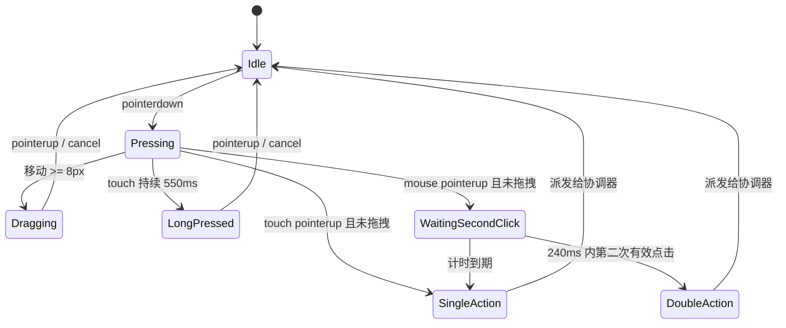

# 页面宠物直接交互实现方案

日期：2026-09-08。范围：桌面端双击与 Hover、移动端长按，以及这些手势和现有单击、拖拽、自动动作之间的协调。

本方案依据当前公开端宠物实现，以及 ChatGPT 会话“网站宠物功能”最新两次建议整理。现有宠物架构可以直接扩展，无需重写组件、引入 Canvas/骨骼动画、增加后端接口或改变页面路由。

## 1. 最终交互规则

| 场景 | 用户操作 | Jean 的响应 | 菜单行为 |
| --- | --- | --- | --- |
| 桌面 | 单击一次 | 沿用 `happy` | 菜单关闭时打开；已打开时关闭 |
| 桌面 | 240ms 内双击 | 从 `happy / curious / excited` 中抽取一次直接反应 | 不打开；已打开则先关闭 |
| 桌面 | 鼠标进入虚拟感应范围 | Jean 朝鼠标所在的五个方向之一看去 | 不改变 |
| 桌面 | 鼠标离开虚拟感应范围 | 当前注视动画倒放回默认待机姿态 | 不改变 |
| 手机/触屏 | 短按 | 沿用单击打开/关闭菜单 | 沿用现状 |
| 手机/触屏 | 持续按住 550ms | 从 `curious / happy / sit` 中抽取一次亲近反应 | 不打开；已打开则先关闭 |
| 全平台 | 移动超过拖拽阈值 | 立即进入现有 `drag` | 关闭；拖拽优先 |

双击只在支持精确指针的设备启用；触屏不增加双击，避免和浏览器双击缩放、短按菜单、长按及拖拽形成四重竞争。键盘对宠物按钮的 Enter/Space 激活保持即时单击语义，不等待双击窗口。

长按动作池使用偏温和的动作，建议权重为 `curious 45% / happy 40% / sit 15%`。双击动作池更活跃，建议为 `happy 50% / curious 30% / excited 20%`。两个池都避免连续抽到同一动作，并明确排除 `sleep`、`sniff`、`drag` 和页面事件使用的 `look`。

### 要求：

代码实现需要保证可扩展性，jean动作，每种交互的响应等需要确保可以后续追加新的动作，需要把最后相关的可扩展说明写入本文档

## 2. Hover 使用虚拟感应区

### 2.1 不增加透明覆盖层

现有 `PetHost.vue` 是全屏 fixed 宿主且 `pointer-events: none`，只有 Jean 自身按钮恢复为 `pointer-events: auto`。继续保留这个结构。

所谓“透明范围”只是一组坐标判断，不渲染 DOM 元素。客户端通过被动的全局 `pointermove` 保存最后一个鼠标坐标，每个动画帧最多计算一次该点是否位于 Jean 周围的虚拟椭圆内。代码不调用 `preventDefault()`、`stopPropagation()`，也不捕获目标元素，所以范围内的链接、按钮、滚动和文字选择仍按页面原有方式工作。

该能力只在以下媒体条件成立时启用：

```css
@media (hover: hover) and (pointer: fine) { /* 启用虚拟感应 */ }
```

运行时还要确认事件的 `pointerType === 'mouse'`。触屏和模拟鼠标不预加载也不执行五方向素材。

### 2.2 感应范围与五方向

以宠物可视区域中心为基准，感应椭圆中心向上偏移约 24px：

```ts
const lookSensor = {
  enterRadiusX: 220,
  enterRadiusY: 180,
  exitRadiusX: 248,
  exitRadiusY: 204,
  centerDeadZone: 28,
  directionStableMs: 110,
  angleHysteresisDeg: 12,
}
```

进入和离开采用不同半径。鼠标进入较小椭圆才唤醒 Jean，已进入后越过较大椭圆才退出，防止鼠标在边缘抖动时反复播放。上述数值按当前桌面 160px 宿主尺寸设置，最终以浏览器实测微调，并按宠物渲染尺寸等比计算，不能写死为屏幕绝对坐标。

Jean 默认身体朝左，因此五方向只改变头部、耳朵和视线，不翻转身体或衣服上的 Jean 文字：

| 方向 ID | 鼠标相对 Jean 的区域 | 表现要求 |
| --- | --- | --- |
| `left` | 左侧、左下侧 | 头部略向左下或左方靠近鼠标 |
| `leftUp` | 左上 | 抬头并偏左 |
| `up` | 正上方扇区 | 明确抬头 |
| `rightUp` | 右上 | 抬头并轻微转向右侧 |
| `right` | 右侧、右下侧 | 只转头，不转身、不镜像素材 |

下方不单独制作方向。鼠标处于 Jean 下方时，按水平符号归入 `left` 或 `right`；接近垂直正下方且落入中心死区时保持当前方向。方向分区用角度计算，跨区后需持续约 110ms 才切换，同时保留约 12° 的角度迟滞。

### 2.3 动画播放规则

每个方向只制作一段“默认 idle 姿态 → 看向目标”的 6 帧过渡：

1. 鼠标进入范围后正向播放一次。
2. 播放结束停留在最后一帧，不循环。
3. 鼠标离开后复用同一组帧倒放，回到第 1 帧，再切回 `idle`。
4. 鼠标从一个方向移动到另一个方向时，先倒放当前动作，再正向播放最后确认的方向；期间只保留最新方向，不堆积动作队列。
5. 指针靠近中心时保留当前注视，避免头部在五个方向间快速跳动。

这种方式使所有方向都从同一标准姿态进入和退出，只需五张图集，不需要另外制作五套离开动画。方向切换约为 0.7–1.0 秒的短过渡，最终帧可持续保持，因此不会像循环 `look` 一样不断抬头。

Hover 只从默认待机状态启动。自动随机动作、页面事件、点击反应、菜单、拖拽、页面不可见、暂停状态或 reduced-motion 生效时都不启动。若 Hover 被更高优先级动作打断，待该动作结束后仅在鼠标仍位于范围内且冷却结束时恢复当前方向。

## 3. 手势仲裁

当前 `usePetPointer.ts` 在无拖拽的 `pointerup` 上立即调用 `onActivate()`。加入双击后，需要让该文件成为单击、双击、长按和拖拽的统一判定入口，不能同时依赖浏览器 `click`、`dblclick` 与独立长按监听。

建议回调接口调整为：

```ts
interface PetPointerCallbacks {
  onPointerDown(point: PetPoint): void
  onSingleActivate(input: 'mouse' | 'touch' | 'keyboard'): void
  onDoubleActivate(): void
  onLongPress(): void
  onDragStart(point: PetPoint): void
  onDragMove(point: PetPoint): void
  onDragEnd(commit: boolean): void
}
```

### 3.1 桌面单击与双击

- 第一次鼠标抬起且未拖拽：记录时间、位置，启动 240ms 单击计时器。
- 计时器到期且没有第二次有效点击：触发单击。
- 240ms 内再次完成主键点击，且两次落点距离不超过 18px：取消单击计时器，只触发一次双击。
- 第二次点击超时或距离过大：结算第一次单击，并把第二次作为新的第一次点击。
- 第一次按下时立即退出或倒放 Hover，避免注视动作与点击反应同时占用播放器。
- 现有菜单额外 80ms 延迟应缩短为 0–40ms；否则 240ms 仲裁后再等待会让单击显得迟钝。
- 浏览器派生的 `click`/`dblclick` 只做抑制，不承担业务触发。

### 3.2 移动端长按

- `pointerdown` 且 `pointerType === 'touch'` 时启动 550ms 计时器。
- 在计时器到期前移动超过现有 8px 拖拽阈值：取消长按并由拖拽接管。
- 计时器到期：触发一次长按，将本次手势锁定为 `longPress`；之后的移动不再转为拖拽。
- 长按后的 `pointerup` 不触发短按，也抑制浏览器派生 click。
- 短于 550ms 且没有拖拽时立即按现有短按规则打开/关闭菜单，不增加桌面双击所需的等待。
- `pointercancel`、`lostpointercapture`、窗口失焦、文档隐藏和 controller 卸载都要清除长按及单击计时器。

`touch-action: none` 继续只放在 Jean 自身按钮上。用户在周围透明感应范围滑动页面时不受影响。

### 3.3 判定状态



## 4. 动画状态与优先级

现有优先级是 idle 0、random 1、page 2、user 3、drag 4。新增注视后调整为：

| 优先级 | 来源 | 说明 |
| ---: | --- | --- |
| 0 | `idle` | 默认待机 |
| 1 | `random` | 10–30 秒自动动作 |
| 2 | `attention` | 桌面五方向 Hover |
| 3 | `page` | 页面业务事件 |
| 4 | `user` | 单击、双击、长按 |
| 5 | `drag` | 拖拽始终最高 |

虽然 `attention` 高于自动动作，Hover 入口仍只允许在当前动作是默认 `idle` 时启动，因此它不会粗暴截断已播放的随机动作。更高优先级动作可以中断 Hover。

协调器建议增加以下能力：

```ts
type PetLookDirection = 'left' | 'leftUp' | 'up' | 'rightUp' | 'right'
type PetDirectReaction = 'single' | 'double' | 'longPress'

beginAttention(direction: PetLookDirection): void
updateAttention(direction: PetLookDirection): void
endAttention(): void
playDirectReaction(trigger: PetDirectReaction): void
```

动画实例还要记录播放阶段，而不只记录动作名：

```ts
type PetPlayback = 'loop' | 'once' | 'forwardHold' | 'reverseOnce'

interface PetAttentionState {
  direction: PetLookDirection | null
  pendingDirection: PetLookDirection | null
  phase: 'inactive' | 'entering' | 'holding' | 'leaving'
}
```

`generation` 机制继续用于拒绝过期完成回调。`PetFramePlayer` 增加正向一次、停留最后一帧和从当前帧倒放的能力；图集已经可用时应停在当前 frame，静态图片只在图集不可用或显式降级时显示，防止非循环动作切换时闪回首帧。

## 5. 动作池必须显式配置

`petSchedulingCore.ts` 当前会把除 `idle` 外的已注册动作自动放入随机候选。新增五个方向后必须改成显式动作池，否则 Jean 会在无人操作时随机进入某个注视方向。

```ts
const PET_ACTION_POOLS = {
  idleRandom: ['sit', 'happy', 'curious', 'excited', 'sniff', 'look', 'sleep'],
  double: ['happy', 'curious', 'excited'],
  longPress: ['curious', 'happy', 'sit'],
  attention: ['lookLeft', 'lookLeftUp', 'lookUp', 'lookRightUp', 'lookRight'],
} as const
```

现有 `drag` 不应出现在自动动作池；拖拽图只由真实拖拽触发。抽取函数保持纯函数，接收随机值和上次动作，便于稳定测试权重与防重复逻辑。

## 6. 素材规格

新增五组动作：

```text
look-left.sheet.webp
look-left-up.sheet.webp
look-up.sheet.webp
look-right-up.sheet.webp
look-right.sheet.webp
```

每组建议 6 帧，单帧继续使用 256×256 透明 WebP。优先使用 3×2 布局，避免 6×1 产生过宽纹理。建议帧时长为 `90 / 70 / 70 / 80 / 90 / 110ms`，最后一帧由播放器保持，时长只用于正向和倒放。

制作与脚本处理必须满足：

- 五组第 1 帧与运行时 `idle` 标准姿态完全一致。生成图有轻微偏差时，处理脚本直接使用标准 idle 第 1 帧替换。
- 身体、前后脚、衣服和 Jean 文字位置固定，只调整头部、耳朵、眼睛与少量颈部过渡。
- 五组画布、地面锚点、视觉缩放和透明边缘一致。
- `lookRight` 不水平镜像整只狗，衣服文字始终保持正常方向。
- Alpha 边缘不能残留底色；导出后用现有素材处理脚本完成透明化、裁切、锚点对齐和 WebP 编码。
- 每组可增加一张以最终帧导出的 `.static.webp`，供加载失败或减少动画模式使用；运行时持帧不依赖该图片。

现有通用 `look` 继续用于照片打开等页面事件，不与五方向动作合并。

### 6.1 当前素材准备结果

五组方向素材已在 `designs/jean-motion/assets` 生成 3×2、6 帧透明 WebP 图集及最终帧静态图。角色规范直接引用 `docs/assets/pet/jean-shirt-concept-v1.md` 中的母图提示词；可复用的动作提示词保存在 `designs/jean-motion/prompts.md`。

处理脚本会把每组第 1 帧替换成当前 `idle.static.webp`，再统一透明背景、衣服锚点、视觉缩放和地面基线。新图通过母图参考约束身体、四肢、尾巴、衣服、蜜蜂与 “Jean” 字样保持一致，并保留完整连续的头颈与身体，避免局部拼接产生颈部断层。演示页已按“正向进入—最终帧停留—反向返回”播放，便于在 60px、80px 与逐帧视图中验收。

## 7. 加载与性能

首屏核心预加载仍为 `idle / drag / happy`，不把五张方向图集加入移动端或所有页面的初始请求。

桌面满足精确指针媒体条件后，在以下任一时机加载方向素材：

1. 浏览器空闲且 Jean 处于 idle；或
2. 鼠标首次进入 Jean 外围约 340px 的预热范围。

为了让第一次靠近也有响应，可先加载当前方向及相邻方向，再补齐其余素材。方向图集未就绪时保持 `idle`，不借用错误方向。素材加载失败沿用现有失败记录与静态降级，不阻塞页面。

全局 `pointermove` 只更新坐标，几何计算经 `requestAnimationFrame` 合并；方向没有变化时不触发 Vue 状态更新。鼠标离开窗口、页面隐藏或组件卸载时停止 rAF 并移除监听。

## 8. 与现有功能的冲突处理

| 当前状态 | 新输入 | 处理 |
| --- | --- | --- |
| Hover 注视中 | 宠物 `pointerdown` | 开始倒放或立即清理 attention，再进入手势判定 |
| Hover 注视中 | 页面事件 | 页面动作打断；结束后按当前鼠标位置决定是否恢复 |
| 自动动作播放中 | 鼠标进入范围 | 记录位置但不打断；回 idle 后再判断 |
| 菜单打开 | 鼠标进入范围 | 不响应 Hover |
| 菜单打开 | 双击/长按 | 关闭菜单并播放直接反应 |
| 双击等待窗口 | 开始拖拽 | 取消待结算单击，拖拽接管 |
| 长按计时中 | 移动超过 8px | 取消长按，拖拽接管 |
| reduced-motion | 鼠标进入范围 | 不监听、不加载方向素材 |
| reduced-motion | 双击/长按 | 执行业务语义，可显示对应静态最终姿态后回 idle |
| 文档隐藏/暂停 | 任意计时中 | 清理计时器、attention 和指针状态 |

直接交互结束后建议设置约 800ms 的 Hover 抑制期，避免用户刚单击、双击或拖放完，Jean 立即又被仍停留在附近的鼠标拉入注视。单纯离开再进入的冷却约 600ms。

## 9. 代码改动位置

| 文件 | 改动 |
| --- | --- |
| `src/config/pet.ts` | 增加双击、长按、感应区、迟滞、冷却和显式动作池配置 |
| `src/composables/pet/petTypes.ts` | 注册五个方向动作、方向类型、播放阶段和 API 类型 |
| `src/composables/pet/petSchedulingCore.ts` | 从自动推导候选改为按触发来源的显式动作池 |
| `src/composables/pet/petLookGeometryCore.ts` | 新增纯函数：椭圆命中、五方向、死区和迟滞 |
| `src/composables/pet/usePetProximity.ts` | 新增桌面全局 pointermove、rAF 合并、媒体能力与生命周期清理 |
| `src/composables/pet/usePetPointer.ts` | 统一仲裁单击、双击、长按和拖拽 |
| `src/composables/pet/createPetCoordinator.ts` | attention 状态、六级优先级、直接反应池、恢复与冷却 |
| `src/components/pet/PetHost.vue` | 接入 proximity 与新增 pointer 回调，按设备预加载素材 |
| `src/components/pet/PetAvatar.vue` | 传入播放模式和反向起始帧，保持最终帧 |
| `src/composables/pet/petFramePlayer.ts` | 支持 forward-hold、reverse-once 和从当前帧继续 |
| `src/assets/pet/index.ts` 与 manifest | 注册五组 sheet/static WebP 及帧配置 |
| `tests/pet/*` | 增加几何、手势仲裁、协调器和帧播放器验证 |

所有 `window`、`document`、媒体查询、Pointer Events 与 rAF 监听仍只在 `onMounted` 后创建并在卸载时释放。协调器初始状态保持确定且可序列化，不改变 SSR 首屏结构。

## 10. 实施顺序

1. 先加入五方向类型、显式动作池和纯几何函数，并完成边界测试。
2. 扩展帧播放器，使一套素材可以正向、持帧和倒放。
3. 改造 Pointer Controller，完成单击/双击/长按/拖拽仲裁。
4. 扩展协调器优先级与 attention 状态，先用现有占位图验证状态切换。
5. 接入 `usePetProximity` 和桌面按需加载。
6. 按统一 idle 首帧制作五组透明 WebP，更新 manifest 和资源入口。
7. 在静态演示页先检查锚点和往返过渡，再在真实页面验证交互。

素材可以与第 1–4 步并行准备，但正式替换前要先锁定标准 idle 首帧和地面锚点。

## 11. 验收标准

自动测试至少覆盖：

- 椭圆进入/退出半径、五方向边界、中心死区、角度和距离迟滞。
- 桌面单击延迟结算；有效第二击只触发双击；超时或远距离第二击不误判。
- 触屏短按即时触发；550ms 长按只触发一次；移动超过阈值时拖拽获胜。
- cancel、lost capture、blur、visibility change 和 dispose 后没有遗留计时器或动作。
- Hover 只能从 idle 启动，能正向持帧、离开倒放，快速跨方向只执行最新目标。
- page/user/drag 能打断 attention；菜单、暂停、reduced-motion 禁止自动注视。
- 五方向不进入 10–30 秒自动动作池；直接反应不会连续重复同一动作。
- 帧播放器原有 loop/once 行为不回归，新模式能保持最后帧和从当前帧倒放。

浏览器验收同时检查：

- 在透明感应范围内点击页面链接、按钮、选择文字和滚动，页面操作不受阻挡。
- 桌面五方向切换无明显抖动，离开后自然回到 idle；双击不闪开菜单。
- 手机短按、长按和拖拽三者互斥，长按周围区域仍可正常滚动页面。
- 首次加载、素材失败、后台恢复、路由切换、菜单开关和 reduced-motion 均可恢复到稳定状态。
- 五组素材在 160px、120px、80px 和 60px 显示尺寸下，头部未被裁切、衣服文字未镜像、身体锚点无跳动。

实现完成后运行公开端 `npm run type-check`、`npm run build:ssr` 和 `npm run verify:ssr:local`，并在桌面与移动视口做浏览器交互检查。

## 12. 工程边界

本功能完全位于公开端本地交互层，不新增 API、路由或持久化：

- `data-admin` 不需要修改，因为没有管理配置或管理接口。
- `milet-worker-ts` 不需要修改，因为没有服务端数据、权限或资源代理变化。
- `echoes of milet/api-proxy.config.json` 不需要修改，因为方向素材随公开端静态资源构建发布，不经过 API 代理。

## 13. 实施结果与扩展约定

本方案已在 `feat/desktop-pet` 分支落地。桌面鼠标单击使用 240ms 窗口与双击互斥，双击只触发直接反应；触屏短按即时执行，550ms 长按与 8px 拖拽阈值互斥。桌面 Hover 使用全局被动 `pointermove` 和虚拟椭圆，不创建遮挡页面的感应 DOM；五方向动作正向进入、保持最终帧，离开或换向时从当前帧倒放。菜单、页面事件、用户反应和拖拽继续由同一个协调器按六级优先级仲裁。

### 13.1 扩展动作与素材

1. 在 `src/composables/pet/petTypes.ts` 的 `PET_ACTIONS` 注册稳定动作 ID。该注册表只声明动作存在，不会让动作自动进入任何触发池。
2. 在 `src/assets/pet` 增加同名 sheet/static WebP，在 `manifest.json` 写入帧数、布局、durations、loop、anchor 和 bytes，并在 `index.ts` 显式导入两份资源。Record 和 manifest 遍历会在类型检查或启动时暴露遗漏。
3. 在 `src/config/pet.ts` 的 `PET_ACTION_POOLS` 按触发来源显式加入动作。普通待机、单击、双击、长按和 attention 相互独立，新增方向动作不会意外进入 10–30 秒待机池。
4. 新增方向时，同时扩展 `PetLookDirection`、`PET_LOOK_ACTION_BY_DIRECTION`、相邻方向预热表和 `petLookGeometryCore.ts` 的扇区规则。仅调整素材而不增加方向 ID 时，无需改 proximity 生命周期。
5. 通过 `PetPlayback` 选择 `loop`、`once`、`forwardHold` 或 `reverseOnce`。需要持姿势和自然返回的动作复用 forwardHold/reverseOnce，避免在组件内另建计时器。

素材从设计示例进入运行时后由 `scripts/test_jean_motion_assets.py` 比较五方向 manifest 元数据与文件 SHA-256，确保工程发布的图集与已验收设计素材一致。

### 13.2 扩展直接交互

直接反应由 `PetDirectReaction` 和 `PET_DIRECT_REACTION_POOLS` 组成。只需调整已有交互的动作或权重时修改配置池；权重无需合计为 1，抽取函数按有效权重归一化，并在存在替代项时排除上一次动作。资源 sheet 和 static 都失败的动作会从候选中排除。

新增一种手势时，在 `usePetPointer.ts` 完成唯一一次判定并新增语义回调，再由 `PetHost.vue` 映射到协调器；不要在组件上叠加独立 click、dblclick 或长按监听。协调器负责关闭菜单、取消页面待处理动作、打断 attention 和重启待机等待，页面组件不直接选择动画。

### 13.3 扩展快捷菜单

菜单继续使用 `PET_QUICK_MENU_ROUTES` 作为唯一入口清单。新增项时增加稳定 key、命名路由和已有颜色，再在 `src/composables/lang/pet.ts` 的 zh/jp Record 中补同名文案。`PetQuickMenuKey` 会随配置推导，缺失语言文案会使类型检查失败。

`resolvePetRadialMenuLayout` 接收实际 `itemCount`，按数量计算可用垂直跨度并均匀分配，不保存四项菜单的固定坐标。桌面与移动端分别使用 8px/6px 宠物水平间距及 12px/10px 项间距；增加菜单项后会自动向视口内侧展开和约束，只有视觉密度需要变化时才调整这些参数。

### 13.4 验证记录与遗留复查

- `npm run type-check` 通过，追加气泡行为后 `npm run test:pet` 72/72 通过，素材回归 7/7 通过，`npm run build:ssr` 的客户端、服务端和预渲染通过。
- 真实桌面页面验证了五方向进入、离开倒放、鼠标单击延迟、双击不打开菜单和四项均匀展开；390×844 视口验证了 120px 宠物和四项菜单均在可见区域内。触屏长按与拖拽竞争由可控计时器单测覆盖。
- 本地 SSR 原始 HTML 中 PetHost 和宠物按钮数量均为 0，客户端挂载后两者均为 1；页面没有 hydration 警告或失败图片。浏览器控制台只有普通 Vite 启动时因未配置 API 代理产生的既有 Axios 错误，SSR 验证入口通过实际代理加载时没有该问题。
- `test/pet-browser` 与 `tests/pet-browser` 均不存在，浏览器验证直接使用工程路由；未发现宠物实现中的 TODO、FIXME、临时调试输出或未完成接线。
